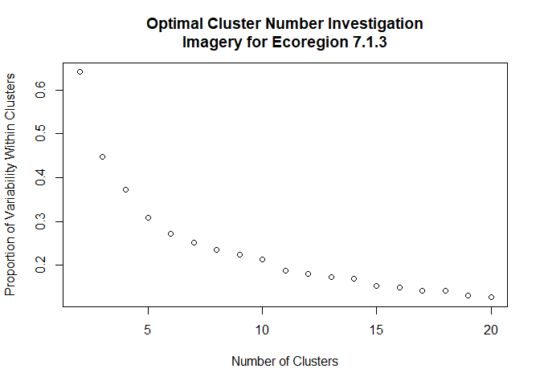
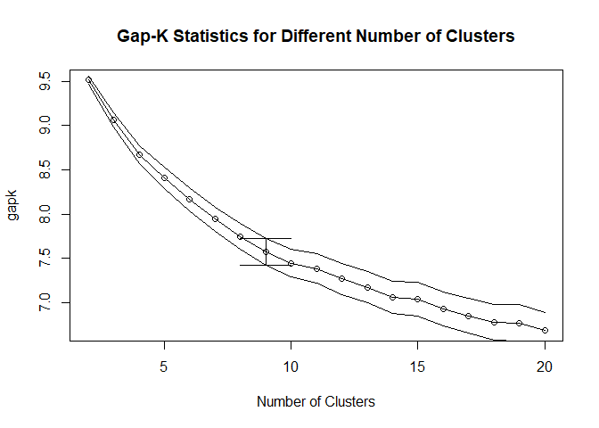
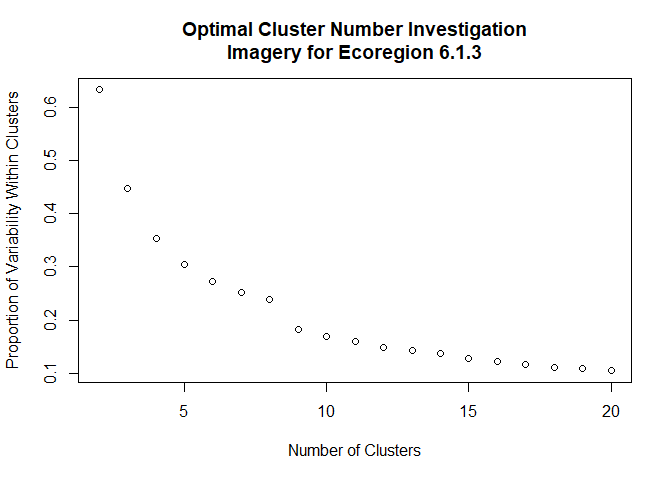
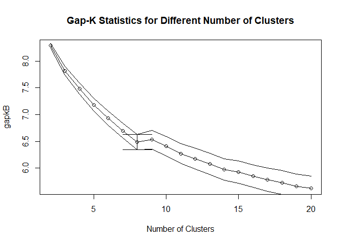
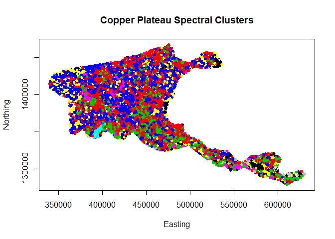

## Imagery Analysis - Cook Inlet


```r
gee1 <- read.csv("C:\\Users\\Owner\\Dropbox\\GQ3\\Cook_Inlet\\Git01\\ECO_7_1_3\\pts20190104_gee.csv",header=TRUE)
gee2 <- read.csv("C:\\Users\\Owner\\Dropbox\\GQ3\\Cook_Inlet\\Git01\\ECO_7_1_3\\pts20190103out_500m_gee.csv",header=TRUE)
numSims <- 100
gee <- rbind(gee1,gee2)
gee <- gee[!is.na(gee[,7]),]
result <- numeric(0)
for (i in seq(2,20)) {
x <- kmeans(gee[,seq(6,23)],i)
result <- c(result,x$tot.withinss/x$totss)
}
result <- cbind(seq(2,20),result)
plot(result,xlab="Number of Clusters",ylab="Proportion of Variability Within Clusters",main="Optimal Cluster Number Investigation\nImagery for Ecoregion 7.1.3")
```

<!-- -->

```r
wb <- matrix(nrow=0,ncol=19)
for (n in seq(1,numSims)) {
  temp <- runif(dim(gee)[1]*18)
  wbi <- numeric(0)
  for (i in seq(2,20)) {
    x <- kmeans(temp,i)
    wbi <- c(wbi,x$tot.withinss)
    #wbi <- c(wbi,x$tot.withinss/x$totss)
    #print(wbi)
  }
  wb <- rbind(wb,wbi)
  #print(wb)
}
result <- log(result[,2])
wb <- log(wb)
gapk <- numeric(0)
for (i in seq(1,19)) { gapk <- c(gapk,sum(wb[,i])/numSims-result[i]) }
gapksd <- numeric(0)
for (i in seq(1,19)) { gapksd <- c(gapksd,sqrt(sum((wb[,i]-gapk[i])^2))/(numSims-1))}
```

## Plotting Results - Cook Inlet


```r
cbind(gapk-gapksd,gapk,gapk+gapksd)
```

```
##                    gapk         
##  [1,] 9.467166 9.512155 9.557143
##  [2,] 8.979908 9.061245 9.142582
##  [3,] 8.568154 8.667899 8.767645
##  [4,] 8.292222 8.411053 8.529884
##  [5,] 8.038229 8.169547 8.300865
##  [6,] 7.801211 7.940523 8.079834
##  [7,] 7.600256 7.746347 7.892437
##  [8,] 7.420097 7.570872 7.721647
##  [9,] 7.287194 7.443943 7.600692
## [10,] 7.217028 7.385932 7.554835
## [11,] 7.092723 7.266293 7.439863
## [12,] 6.994674 7.172340 7.350006
## [13,] 6.874507 7.054896 7.235286
## [14,] 6.845501 7.035199 7.224898
## [15,] 6.735805 6.928408 7.121010
## [16,] 6.652650 6.850139 7.047629
## [17,] 6.579496 6.777000 6.974503
## [18,] 6.564174 6.770436 6.976697
## [19,] 6.473227 6.682421 6.891616
```

```r
plot(seq(2,20),gapk,xlab="Number of Clusters",main="Gap-K Statistics for Different Number of Clusters")
lines(seq(2,20),gapk)
lines(seq(2,20),gapk+gapksd)
lines(seq(2,20),gapk-gapksd)
segments(8,7.721647,10,7.721647)
segments(8,7.420097,10,7.420097)
segments(9,7.420097,9,7.721647)
```

<!-- -->

## Spectral Map - Cook Inlet


```r
x <- kmeans(gee[,seq(6,23)],9)
gee$cluster <- x$cluster
geeplot <- cbind(gee$x,gee$y,x$cluster)
plot(geeplot[,c(1,2)],col=geeplot[,3],pch=20,xlab="Easting",ylab="Northing",main="Cook Inlet Spectral Clusters")
```

<!-- -->

## Imagery Analysis - Copper Plateau


```r
gee1b <- read.csv("C:\\Users\\Owner\\Dropbox\\GQ3\\Cook_Inlet\\Git01\\ECO_6_1_3\\pts20190103_gee.csv",header=TRUE)
gee2b <- read.csv("C:\\Users\\Owner\\Dropbox\\GQ3\\Cook_Inlet\\Git01\\ECO_6_1_3\\pts20190103out_500m_gee.csv",header=TRUE)
numSimsB <- 100
geeb <- rbind(gee1b,gee2b)
geeb <- geeb[!is.na(geeb[,7]),]
resultB <- numeric(0)
for (iB in seq(2,20)) {
xB <- kmeans(geeb[,seq(6,23)],iB)
resultB <- c(resultB,xB$tot.withinss/xB$totss)
}
resultB <- cbind(seq(2,20),resultB)
plot(resultB,xlab="Number of Clusters",ylab="Proportion of Variability Within Clusters",main="Optimal Cluster Number Investigation\nImagery for Ecoregion 6.1.3")
```

<!-- -->

```r
wbB <- matrix(ncol=19,nrow=0)
for (nB in seq(1,numSimsB)) {
  temp <- runif(dim(geeb)[1]*18)
  wbiB <- numeric(0)
  for (iB in seq(2,20)) {
    xB <- kmeans(temp,iB)
    wbiB <- c(wbiB,xB$tot.withinss)
    #wbiB <- c(wbiB,xB$tot.withinss/xB$totss)
  }
  wbB <- rbind(wbB,wbiB)
}
resultB <- log(resultB[,2])
wbB <- log(wbB)
gapkB <- numeric(0)
for (i in seq(1,19)) { gapkB <- c(gapkB,sum(wbB[,i])/numSimsB-resultB[i]) }
gapksdB <- numeric(0)
for (i in seq(1,19)) { gapksdB <- c(gapksdB,sqrt(sum((wbB[,i]-gapkB[i])^2))/(numSimsB-1))}
```

## Plotting Results - Copper Plateau


```r
cbind(gapkB-gapksdB,gapkB,gapkB+gapksdB)
```

```
##                   gapkB         
##  [1,] 8.240405 8.286686 8.332966
##  [2,] 7.739135 7.820202 7.901269
##  [3,] 7.375816 7.480759 7.585701
##  [4,] 7.064767 7.184884 7.305001
##  [5,] 6.800161 6.931547 7.062933
##  [6,] 6.560986 6.700079 6.839173
##  [7,] 6.342662 6.487229 6.631795
##  [8,] 6.358334 6.530335 6.702336
##  [9,] 6.227953 6.407506 6.587059
## [10,] 6.084379 6.269302 6.454224
## [11,] 5.985645 6.178229 6.370813
## [12,] 5.881351 6.078574 6.275797
## [13,] 5.771989 5.973195 6.174401
## [14,] 5.717374 5.925447 6.133521
## [15,] 5.640631 5.852662 6.064693
## [16,] 5.569892 5.787771 6.005649
## [17,] 5.509261 5.731906 5.954552
## [18,] 5.436823 5.661704 5.886586
## [19,] 5.391642 5.620108 5.848574
```

```r
plot(seq(2,20),gapkB,xlab="Number of Clusters",main="Gap-K Statistics for Different Number of Clusters")
lines(seq(2,20),gapkB)
lines(seq(2,20),gapkB+gapksdB)
lines(seq(2,20),gapkB-gapksdB)
segments(7,6.631795,9,6.631795)
segments(7,6.342662,9,6.342662)
segments(8,6.342662,8,6.631795)
```

<!-- -->

## Spectral Map - Copper Plateau


```r
x <- kmeans(geeb[,seq(6,23)],8)
geeplotb <- cbind(geeb$x,geeb$y,x$cluster)
plot(geeplotb[,c(1,2)],col=geeplotb[,3],pch=20,xlab="Easting",ylab="Northing",main="Copper Plateau Spectral Clusters")
```

<!-- -->

## Data Headers

```r
dem1Order <- c("FullID","elevation","b10240713","b11240713","b19240713","b42240713","b71240713","b90240713","b94713","b94240713","b95713","b95240713","b98713","b98240713","b108240713","b231240713","b242240713","b263713","b263240713","b264240713","b264713","b351240713","b375713","b375240713","b741713","b741240713","b746713","b746240713","b747713","b747240713","b751240713")
dem1Zero <- c(NA,NA,rep(0,29))
dem1Type <- c("f",rep("n",length(dem1Order)-1))
dem2Order <- c("FullID","nlcdak","gsmsoilmu71","mergedSoils","hansen101","hansen102","hansen103","hansen104","hansen105","hansen106","hansen107","hansen108","hansen109","hansen1010","hansen1011","hansen1012","hansen1013","hansen111","hansen112","hansen113","hansen114","hansen115","hansen116","hansen117","hansen118","hansen119","hansen1110","hansen1111","hansen1112","hansen1113","hansen121","hansen122","hansen123","hansen124","hansen125","hansen126","hansen127","hansen128","hansen129","hansen1210","hansen1211","hansen1212","hansen1213","hansen131","hansen132","hansen133","hansen134","hansen135","hansen136","hansen137","hansen138","hansen139","hansen1310","hansen1311","hansen1312","hansen1313","hansen141","hansen142","hansen143","hansen144","hansen145","hansen146","hansen147","hansen148","hansen149","hansen1410","hansen1411","hansen1412","hansen1413","hansen151","hansen152","hansen153","hansen154","hansen155","hansen156","hansen157","hansen158","hansen159","hansen1510","hansen1511","hansen1512","hansen1513")
dem2Zero <- rep(NA,length(dem2Order))
dem2Type <- rep("f",length(dem2Order))
gdcOrder <- c("FullID","gdc199630","gdc199660","gdc199690","gdc1996120","gdc1996150","gdc1996180","gdc1996210","gdc1996240","gdc1996270","gdc1996300","gdc1996330","gdc199730","gdc199760","gdc199790","gdc1997120","gdc1997150","gdc1997180","gdc1997210","gdc1997240","gdc1997270","gdc1997300","gdc1997330","gdc199830","gdc199860","gdc199890","gdc1998120","gdc1998150","gdc1998180","gdc1998210","gdc1998240","gdc1998270","gdc1998300","gdc1998330","gdc199930","gdc199960","gdc199990","gdc1999120","gdc1999150","gdc1999180","gdc1999210","gdc1999240","gdc1999270","gdc1999300","gdc1999330","gdc200030","gdc200060","gdc200090","gdc2000120","gdc2000150","gdc2000180","gdc2000210","gdc2000240","gdc2000270","gdc2000300","gdc2000330","gdc200130","gdc200160","gdc200190","gdc2001120","gdc2001150","gdc2001180","gdc2001210","gdc2001240","gdc2001270","gdc2001300","gdc2001330","gdc200230","gdc200260","gdc200290","gdc2002120","gdc2002150","gdc2002180","gdc2002210","gdc2002240","gdc2002270","gdc2002300","gdc2002330","gdc200330","gdc200360","gdc200390","gdc2003120","gdc2003150","gdc2003180","gdc2003210","gdc2003240","gdc2003270","gdc2003300","gdc2003330","gdc200430","gdc200460","gdc200490","gdc2004120","gdc2004150","gdc2004180","gdc2004210","gdc2004240","gdc2004270","gdc2004300","gdc2004330","gdc200530","gdc200560","gdc200590","gdc2005120","gdc2005150","gdc2005180","gdc2005210","gdc2005240","gdc2005270","gdc2005300","gdc2005330","gdc200630","gdc200660","gdc200690","gdc2006120","gdc2006150","gdc2006180","gdc2006210","gdc2006240","gdc2006270","gdc2006300","gdc2006330","gdc200730","gdc200760","gdc200790","gdc2007120","gdc2007150","gdc2007180","gdc2007210","gdc2007240","gdc2007270","gdc2007300","gdc2007330","gdc200830","gdc200860","gdc200890","gdc2008120","gdc2008150","gdc2008180","gdc2008210","gdc2008240","gdc2008270","gdc2008300","gdc2008330","gdc200930","gdc200960","gdc200990","gdc2009120","gdc2009150","gdc2009180","gdc2009210","gdc2009240","gdc2009270","gdc2009300","gdc2009330","gdc201030","gdc201060","gdc201090","gdc2010120","gdc2010150","gdc2010180","gdc2010210","gdc2010240","gdc2010270","gdc2010300","gdc2010330","gdc201130","gdc201160","gdc201190","gdc2011120","gdc2011150","gdc2011180","gdc2011210","gdc2011240","gdc2011270","gdc2011300","gdc2011330","gdc201230","gdc201260","gdc201290","gdc2012120","gdc2012150","gdc2012180","gdc2012210","gdc2012240","gdc2012270","gdc2012300","gdc2012330","gdc201330","gdc201360","gdc201390","gdc2013120","gdc2013150","gdc2013180","gdc2013210","gdc2013240","gdc2013270","gdc2013300","gdc2013330","gdc201430","gdc201460","gdc201490","gdc2014120","gdc2014150","gdc2014180","gdc2014210","gdc2014240","gdc2014270","gdc2014300","gdc2014330","gdc201530","gdc201560","gdc201590","gdc2015120","gdc2015150","gdc2015180","gdc2015210","gdc2015240","gdc2015270","gdc2015300","gdc2015330","gdc201630","gdc201660","gdc201690","gdc2016120","gdc2016150","gdc2016180","gdc2016210","gdc2016240","gdc2016270","gdc2016300","gdc2016330")
gdcZero <- c(NA,rep(0,length(gdcOrder)-1))
gdcType <- c("f",rep("n",length(gdcOrder)-1))
geeOrder <- c("FullID","hybrid1","hybrid2","hybrid3","hybrid4","hybrid5","hybrid6","hybrid7","hybrid8","hybrid9","modis1","modis2","modis3","modis4","modis5","modis6","modis7","modis8","modis9","cluster")
geeZero <- c(NA,rep(0,length(geeOrder)-1))
geeType <- c("f",rep("n",length(geeOrder)-1))
idsOrder <- c("FullID","InOut","x","y","dmg1997","dmg19971km","dmg19972km","dmg19973km","dmg19974km","dmg19975km","dmg1998","dmg19981km","dmg19982km","dmg19983km","dmg19984km","dmg19985km","dmg1999","dmg19991km","dmg19992km","dmg19993km","dmg19994km","dmg19995km","dmg2000","dmg20001km","dmg20002km","dmg20003km","dmg20004km","dmg20005km","dmg2001","dmg20011km","dmg20012km","dmg20013km","dmg20014km","dmg20015km","dmg2002","dmg20021km","dmg20022km","dmg20023km","dmg20024km","dmg20025km","dmg2003","dmg20031km","dmg20032km","dmg20033km","dmg20034km","dmg20035km","dmg2004","dmg20041km","dmg20042km","dmg20043km","dmg20044km","dmg20045km","dmg2005","dmg20051km","dmg20052km","dmg20053km","dmg20054km","dmg20055km","dmg2006","dmg20061km","dmg20062km","dmg20063km","dmg20064km","dmg20065km","dmg2007","dmg20071km","dmg20072km","dmg20073km","dmg20074km","dmg20075km","dmg2008","dmg20081km","dmg20082km","dmg20083km","dmg20084km","dmg20085km","dmg2009","dmg20091km","dmg20092km","dmg20093km","dmg20094km","dmg20095km","dmg2010","dmg20101km","dmg20102km","dmg20103km","dmg20104km","dmg20105km","dmg2011","dmg20111km","dmg20112km","dmg20113km","dmg20114km","dmg20115km","dmg2012","dmg20121km","dmg20122km","dmg20123km","dmg20124km","dmg20125km","dmg2013","dmg20131km","dmg20132km","dmg20133km","dmg20134km","dmg20135km","dmg2014","dmg20141km","dmg20142km","dmg20143km","dmg20144km","dmg20145km","dmg2015","dmg20151km","dmg20152km","dmg20153km","dmg20154km","dmg20155km","dmg2016","dmg20161km","dmg20162km","dmg20163km","dmg20164km","dmg20165km","dmg2017","dmg20171km","dmg20172km","dmg20173km","dmg20174km","dmg20175km","flown1999","flown2000","flown2001","flown2002","flown2003","flown2004","flown2005","flown2006","flown2007","flown2008","flown2009","flown2010","flown2011","flown2012","flown2013","flown2014","flown2015","flown2016","flown2017")
idsZero <- rep(NA,length(idsOrder))
idsType <- rep("f",length(idsOrder))
pcpOrder <- c("FullID","prcp199601","prcp199602","prcp199603","prcp199604","prcp199605","prcp199606","prcp199607","prcp199608","prcp199609","prcp199610","prcp199611","prcp199612","prcp199701","prcp199702","prcp199703","prcp199704","prcp199705","prcp199706","prcp199707","prcp199708","prcp199709","prcp199710","prcp199711","prcp199712","prcp199801","prcp199802","prcp199803","prcp199804","prcp199805","prcp199806","prcp199807","prcp199808","prcp199809","prcp199810","prcp199811","prcp199812","prcp199901","prcp199902","prcp199903","prcp199904","prcp199905","prcp199906","prcp199907","prcp199908","prcp199909","prcp199910","prcp199911","prcp199912","prcp200001","prcp200002","prcp200003","prcp200004","prcp200005","prcp200006","prcp200007","prcp200008","prcp200009","prcp200010","prcp200011","prcp200012","prcp200101","prcp200102","prcp200103","prcp200104","prcp200105","prcp200106","prcp200107","prcp200108","prcp200109","prcp200110","prcp200111","prcp200112","prcp200201","prcp200202","prcp200203","prcp200204","prcp200205","prcp200206","prcp200207","prcp200208","prcp200209","prcp200210","prcp200211","prcp200212","prcp200301","prcp200302","prcp200303","prcp200304","prcp200305","prcp200306","prcp200307","prcp200308","prcp200309","prcp200310","prcp200311","prcp200312","prcp200401","prcp200402","prcp200403","prcp200404","prcp200405","prcp200406","prcp200407","prcp200408","prcp200409","prcp200410","prcp200411","prcp200412","prcp200501","prcp200502","prcp200503","prcp200504","prcp200505","prcp200506","prcp200507","prcp200508","prcp200509","prcp200510","prcp200511","prcp200512","prcp200601","prcp200602","prcp200603","prcp200604","prcp200605","prcp200606","prcp200607","prcp200608","prcp200609","prcp200610","prcp200611","prcp200612","prcp200701","prcp200702","prcp200703","prcp200704","prcp200705","prcp200706","prcp200707","prcp200708","prcp200709","prcp200710","prcp200711","prcp200712","prcp200801","prcp200802","prcp200803","prcp200804","prcp200805","prcp200806","prcp200807","prcp200808","prcp200809","prcp200810","prcp200811","prcp200812","prcp200901","prcp200902","prcp200903","prcp200904","prcp200905","prcp200906","prcp200907","prcp200908","prcp200909","prcp200910","prcp200911","prcp200912","prcp201001","prcp201002","prcp201003","prcp201004","prcp201005","prcp201006","prcp201007","prcp201008","prcp201009","prcp201010","prcp201011","prcp201012","prcp201101","prcp201102","prcp201103","prcp201104","prcp201105","prcp201106","prcp201107","prcp201108","prcp201109","prcp201110","prcp201111","prcp201112","prcp201201","prcp201202","prcp201203","prcp201204","prcp201205","prcp201206","prcp201207","prcp201208","prcp201209","prcp201210","prcp201211","prcp201212","prcp201301","prcp201302","prcp201303","prcp201304","prcp201305","prcp201306","prcp201307","prcp201308","prcp201309","prcp201310","prcp201311","prcp201312","prcp201401","prcp201402","prcp201403","prcp201404","prcp201405","prcp201406","prcp201407","prcp201408","prcp201409","prcp201410","prcp201411","prcp201412","prcp201501","prcp201502","prcp201503","prcp201504","prcp201505","prcp201506","prcp201507","prcp201508","prcp201509","prcp201510","prcp201511","prcp201512","prcp201601","prcp201602","prcp201603","prcp201604","prcp201605","prcp201606","prcp201607","prcp201608","prcp201609","prcp201610","prcp201611","prcp201612")
pcpZero <- c(NA,rep(0,length(pcpOrder)-1))
pcpType <- c("f",rep("n",length(pcpOrder)-1))
vprOrder <- c("FullID","vp199601","vp199602","vp199603","vp199604","vp199605","vp199606","vp199607","vp199608","vp199609","vp199610","vp199611","vp199612","vp199701","vp199702","vp199703","vp199704","vp199705","vp199706","vp199707","vp199708","vp199709","vp199710","vp199711","vp199712","vp199801","vp199802","vp199803","vp199804","vp199805","vp199806","vp199807","vp199808","vp199809","vp199810","vp199811","vp199812","vp199901","vp199902","vp199903","vp199904","vp199905","vp199906","vp199907","vp199908","vp199909","vp199910","vp199911","vp199912","vp200001","vp200002","vp200003","vp200004","vp200005","vp200006","vp200007","vp200008","vp200009","vp200010","vp200011","vp200012","vp200101","vp200102","vp200103","vp200104","vp200105","vp200106","vp200107","vp200108","vp200109","vp200110","vp200111","vp200112","vp200201","vp200202","vp200203","vp200204","vp200205","vp200206","vp200207","vp200208","vp200209","vp200210","vp200211","vp200212","vp200301","vp200302","vp200303","vp200304","vp200305","vp200306","vp200307","vp200308","vp200309","vp200310","vp200311","vp200312","vp200401","vp200402","vp200403","vp200404","vp200405","vp200406","vp200407","vp200408","vp200409","vp200410","vp200411","vp200412","vp200501","vp200502","vp200503","vp200504","vp200505","vp200506","vp200507","vp200508","vp200509","vp200510","vp200511","vp200512","vp200601","vp200602","vp200603","vp200604","vp200605","vp200606","vp200607","vp200608","vp200609","vp200610","vp200611","vp200612","vp200701","vp200702","vp200703","vp200704","vp200705","vp200706","vp200707","vp200708","vp200709","vp200710","vp200711","vp200712","vp200801","vp200802","vp200803","vp200804","vp200805","vp200806","vp200807","vp200808","vp200809","vp200810","vp200811","vp200812","vp200901","vp200902","vp200903","vp200904","vp200905","vp200906","vp200907","vp200908","vp200909","vp200910","vp200911","vp200912","vp201001","vp201002","vp201003","vp201004","vp201005","vp201006","vp201007","vp201008","vp201009","vp201010","vp201011","vp201012","vp201101","vp201102","vp201103","vp201104","vp201105","vp201106","vp201107","vp201108","vp201109","vp201110","vp201111","vp201112","vp201201","vp201202","vp201203","vp201204","vp201205","vp201206","vp201207","vp201208","vp201209","vp201210","vp201211","vp201212","vp201301","vp201302","vp201303","vp201304","vp201305","vp201306","vp201307","vp201308","vp201309","vp201310","vp201311","vp201312","vp201401","vp201402","vp201403","vp201404","vp201405","vp201406","vp201407","vp201408","vp201409","vp201410","vp201411","vp201412","vp201501","vp201502","vp201503","vp201504","vp201505","vp201506","vp201507","vp201508","vp201509","vp201510","vp201511","vp201512","vp201601","vp201602","vp201603","vp201604","vp201605","vp201606","vp201607","vp201608","vp201609","vp201610","vp201611","vp201612")
vprZero <- c(NA,rep(0,length(vprOrder)-1))
vprType <- c("f",rep("n",length(vprOrder)-1))
```

## Soils Subset Determination - Cook Inlet


```r
library(data.table)
dem2_1 <- read.csv("C:\\Users\\Owner\\Dropbox\\GQ3\\Cook_Inlet\\Git01\\ECO_7_1_3\\pts20190104_dem2.csv",header=TRUE)
dem2_2 <- read.csv("C:\\Users\\Owner\\Dropbox\\GQ3\\Cook_Inlet\\Git01\\ECO_7_1_3\\pts20190103out_500m_dem2.csv",header=TRUE)
dem2_1 <- dem2_1[,dem2Order]
dem2_2 <- dem2_2[,dem2Order]
dem2 <- rbind(dem2_1,dem2_2)
```

## Load and Connect Data

```r
library(data.table)
dem1_1 <- read.csv("C:\\Users\\Owner\\Dropbox\\GQ3\\Cook_Inlet\\Git01\\ECO_7_1_3\\pts20190104_dem1.csv",header=TRUE)
dem1_2 <- read.csv("C:\\Users\\Owner\\Dropbox\\GQ3\\Cook_Inlet\\Git01\\ECO_7_1_3\\pts20190103out_500m_dem1.csv",header=TRUE)
dem2_1 <- read.csv("C:\\Users\\Owner\\Dropbox\\GQ3\\Cook_Inlet\\Git01\\ECO_7_1_3\\pts20190104_dem2.csv",header=TRUE)
dem2_2 <- read.csv("C:\\Users\\Owner\\Dropbox\\GQ3\\Cook_Inlet\\Git01\\ECO_7_1_3\\pts20190103out_500m_dem2.csv",header=TRUE)
gdc_1 <- read.csv("C:\\Users\\Owner\\Dropbox\\GQ3\\Cook_Inlet\\Git01\\ECO_7_1_3\\pts20190104_gdc.csv",header=TRUE)
gdc_2 <- read.csv("C:\\Users\\Owner\\Dropbox\\GQ3\\Cook_Inlet\\Git01\\ECO_7_1_3\\pts20190103out_500m_gdc.csv",header=TRUE)
gee_1 <- read.csv("C:\\Users\\Owner\\Dropbox\\GQ3\\Cook_Inlet\\Git01\\ECO_7_1_3\\pts20190104_gee.csv",header=TRUE)
gee_2 <- read.csv("C:\\Users\\Owner\\Dropbox\\GQ3\\Cook_Inlet\\Git01\\ECO_7_1_3\\pts20190103out_500m_gee.csv",header=TRUE)
ids_1 <- read.csv("C:\\Users\\Owner\\Dropbox\\GQ3\\Cook_Inlet\\Git01\\ECO_7_1_3\\pts20190104_ids.csv",header=TRUE)
ids_2 <- read.csv("C:\\Users\\Owner\\Dropbox\\GQ3\\Cook_Inlet\\Git01\\ECO_7_1_3\\pts20190103out_500m_ids.csv",header=TRUE)
pcp_1 <- read.csv("C:\\Users\\Owner\\Dropbox\\GQ3\\Cook_Inlet\\Git01\\ECO_7_1_3\\pts20190104_pcp.csv",header=TRUE)
pcp_2 <- read.csv("C:\\Users\\Owner\\Dropbox\\GQ3\\Cook_Inlet\\Git01\\ECO_7_1_3\\pts20190103out_500m_pcp.csv",header=TRUE)
vpr_1 <- read.csv("C:\\Users\\Owner\\Dropbox\\GQ3\\Cook_Inlet\\Git01\\ECO_7_1_3\\pts20190104_vpr.csv",header=TRUE)
vpr_2 <- read.csv("C:\\Users\\Owner\\Dropbox\\GQ3\\Cook_Inlet\\Git01\\ECO_7_1_3\\pts20190103out_500m_vpr.csv",header=TRUE)

loadInOrder <- function(x,xOrd,xZero,xType) {
  temp <- numeric(0)
  for (i in seq(1,length(xOrd))) {
    # print(xOrd[i])
    # print(colnames(x))
    if (xOrd[i] %in% colnames(x)) {
      tempSub <- x[,xOrd[i]]
      if (class(tempSub)=="logical") { tempSub <- as.numeric(tempSub) }
      # print(paste(xOrd[i],xType[i],xZero[i],class(tempSub)))
      if (xType[i]=="n") {
        if (class(tempSub)=="factor") {
          tempSub <- levels(tempSub)[tempSub]
        } 
        if (class(tempSub)=="character") {tempSub <- as.numeric(tempSub)}
      }
      tempSub[is.na(tempSub)] <- rep(xZero[i],sum(is.na(tempSub)))
      tempSub[is.null(tempSub)] <- rep(xZero[i],sum(is.null(tempSub)))
      } else {
      tempSub <- rep(xZero[i],length(x$FullID))
    }
    #print(tempSub)
    temp <- cbind(temp,tempSub)
  }
  colnames(temp) <- xOrd
  temp
}
dem1_1 <- loadInOrder(dem1_1,dem1Order,dem1Zero,dem1Type)
dem1_2 <- loadInOrder(dem1_2,dem1Order,dem1Zero,dem1Type)
dem2_1 <- loadInOrder(dem2_1,dem2Order,dem2Zero,dem2Type)
dem2_2 <- loadInOrder(dem2_2,dem2Order,dem2Zero,dem2Type)
gdc_1 <- loadInOrder(gdc_1,gdcOrder,gdcZero,gdcType)
gdc_2 <- loadInOrder(gdc_2,gdcOrder,gdcZero,gdcType)
gee_1 <- loadInOrder(gee_1,geeOrder,geeZero,geeType)
gee_2 <- loadInOrder(gee_2,geeOrder,geeZero,geeType)
ids_1 <- loadInOrder(ids_1,idsOrder,idsZero,idsType)
ids_2 <- loadInOrder(ids_2,idsOrder,idsZero,idsType)
pcp_1 <- loadInOrder(pcp_1,pcpOrder,pcpZero,pcpType)
pcp_2 <- loadInOrder(pcp_2,pcpOrder,pcpZero,pcpType)
vpr_1 <- loadInOrder(vpr_1,vprOrder,vprZero,vprType)
vpr_2 <- loadInOrder(vpr_2,vprOrder,vprZero,vprType)

dem1 <- data.table(rbind(dem1_1,dem1_2))
dem2 <- data.table(rbind(dem2_1,dem2_2))
gdc <- data.table(rbind(gdc_1,gdc_2))
gee <- data.table(rbind(gee_1,gee_2))
ids <- data.table(rbind(ids_1,ids_2))
pcp <- data.table(rbind(pcp_1,pcp_2))
vpr <- data.table(rbind(vpr_1,vpr_2))

gee$cluster <- kmeans(gee[,c(2,3,4,5,6,7,8,9,10,11,12,13,14,15,16,17,18,19)],9)$cluster
```

```
## Warning: did not converge in 10 iterations
```

```r
ids[is.na(ids)] <- 0
ids[is.null(ids)] <- 0
ids <- round(ids)

setkey(dem1,FullID)
setkey(dem2,FullID)
setkey(gdc,FullID)
setkey(gee,FullID)
setkey(ids,FullID)
setkey(pcp,FullID)
setkey(vpr,FullID)

fullData713 <- merge(merge(merge(merge(merge(merge(ids,dem1),dem2),gdc),gee),pcp),vpr)
fullData713$group <- as.integer(10*runif(dim(fullData713)[1])) + 1
```


```r
genVector <- function(x,y,z) { paste(paste(x,y,sep=""),z,sep="") }
gdcVector <- function(x) { genVector("gdc",x,c("30","60","90","120","150","180","210","240","270","300","330"))}
pcpVector <- function(x) { genVector("prcp",x,c("01","02","03","04","05","06","07","08","09","10","11","12"))}
vprVector <- function(x) { genVector("vp",x,c("01","02","03","04","05","06","07","08","09","10","11","12"))}
idsVector <- function(x) { genVector("dmg",x,c("","1km","2km","3km","4km","5km"))}

ordTimeIndependent <- c(dem1Order,dem2Order[-1],"cluster")

generateOrd <- function(n){c(paste("dmg",n,sep=""),paste("dmg",n,"1km",sep=""),ordTimeIndependent,idsVector(n-2),idsVector(n-1),gdcVector(n-2),gdcVector(n-1),pcpVector(n-2),pcpVector(n-1),vprVector(n-2),vprVector(n-1))}

ord1999 <- generateOrd(1999)
ord2000 <- generateOrd(2000)
ord2001 <- generateOrd(2001)
ord2002 <- generateOrd(2002)
ord2003 <- generateOrd(2003)
ord2004 <- generateOrd(2004)
ord2005 <- generateOrd(2005)
ord2006 <- generateOrd(2006)
ord2007 <- generateOrd(2007)
ord2008 <- generateOrd(2008)
ord2009 <- generateOrd(2009)
ord2010 <- generateOrd(2010)
ord2011 <- generateOrd(2011)
ord2012 <- generateOrd(2012)
ord2013 <- generateOrd(2013)
ord2014 <- generateOrd(2014)
ord2015 <- generateOrd(2015)
ord2016 <- generateOrd(2016)
ord2017 <- generateOrd(2017)

setColNames <- c("idsdmg","idsdmg_1km",ordTimeIndependent,idsVector("_LY2_"),idsVector("_LY_"),gdcVector("_LY2_"),gdcVector("_LY_"),pcpVector("_LY2_"),pcpVector("_LY_"),vprVector("_LY2_"),vprVector("_LY_"),"year") 

set1999 <- fullData713[fullData713$flown1999==1,..ord1999]
set2000 <- fullData713[fullData713$flown2000==1,..ord2000]
set2001 <- fullData713[fullData713$flown2001==1,..ord2001]
set2002 <- fullData713[fullData713$flown2002==1,..ord2002]
set2003 <- fullData713[fullData713$flown2003==1,..ord2003]
set2004 <- fullData713[fullData713$flown2004==1,..ord2004]
set2005 <- fullData713[fullData713$flown2005==1,..ord2005]
set2006 <- fullData713[fullData713$flown2006==1,..ord2006]
set2007 <- fullData713[fullData713$flown2007==1,..ord2007]
set2008 <- fullData713[fullData713$flown2008==1,..ord2008]
set2009 <- fullData713[fullData713$flown2009==1,..ord2009]
set2010 <- fullData713[fullData713$flown2010==1,..ord2010]
set2011 <- fullData713[fullData713$flown2011==1,..ord2011]
set2012 <- fullData713[fullData713$flown2012==1,..ord2012]
set2013 <- fullData713[fullData713$flown2013==1,..ord2013]
set2014 <- fullData713[fullData713$flown2014==1,..ord2014]
set2015 <- fullData713[fullData713$flown2015==1,..ord2015]
set2016 <- fullData713[fullData713$flown2016==1,..ord2016]
set2017 <- fullData713[fullData713$flown2017==1,..ord2017]

set1999 <- cbind(set1999,rep(1999,dim(set1999)[1]))
set2000 <- cbind(set2000,rep(2000,dim(set2000)[1]))
set2001 <- cbind(set2001,rep(2001,dim(set2001)[1]))
set2002 <- cbind(set2002,rep(2002,dim(set2002)[1]))
set2003 <- cbind(set2003,rep(2003,dim(set2003)[1]))
set2004 <- cbind(set2004,rep(2004,dim(set2004)[1]))
set2005 <- cbind(set2005,rep(2005,dim(set2005)[1]))
set2006 <- cbind(set2006,rep(2006,dim(set2006)[1]))
set2007 <- cbind(set2007,rep(2007,dim(set2007)[1]))
set2008 <- cbind(set2008,rep(2008,dim(set2008)[1]))
set2009 <- cbind(set2009,rep(2009,dim(set2009)[1]))
set2010 <- cbind(set2010,rep(2010,dim(set2010)[1]))
set2011 <- cbind(set2011,rep(2011,dim(set2011)[1]))
set2012 <- cbind(set2012,rep(2012,dim(set2012)[1]))
set2013 <- cbind(set2013,rep(2013,dim(set2013)[1]))
set2014 <- cbind(set2014,rep(2014,dim(set2014)[1]))
set2015 <- cbind(set2015,rep(2015,dim(set2015)[1]))
set2016 <- cbind(set2016,rep(2016,dim(set2016)[1]))
set2017 <- cbind(set2017,rep(2017,dim(set2017)[1]))

colnames(set1999) <- setColNames
colnames(set2000) <- setColNames
colnames(set2001) <- setColNames
colnames(set2002) <- setColNames
colnames(set2003) <- setColNames
colnames(set2004) <- setColNames
colnames(set2005) <- setColNames
colnames(set2006) <- setColNames
colnames(set2007) <- setColNames
colnames(set2008) <- setColNames
colnames(set2009) <- setColNames
colnames(set2010) <- setColNames
colnames(set2011) <- setColNames
colnames(set2012) <- setColNames
colnames(set2013) <- setColNames
colnames(set2014) <- setColNames
colnames(set2015) <- setColNames
colnames(set2016) <- setColNames
colnames(set2017) <- setColNames

fullData713b <- rbind(set1999,set2000,set2001,set2002,set2003,set2004,set2005,set2006,set2007,set2008,set2009,set2010,set2011,set2012,set2013,set2014,set2015,set2016,set2017)
```


```r
depVarsFull <- c("elevation","b10240713","b11240713","b19240713","b42240713","b71240713","b90240713","b94713","b94240713","b95713","b95240713","b98713","b98240713","b108240713","b231240713","b242240713","b263713","b263240713","b264240713","b264713","b351240713","b375713","b375240713","b741713","b741240713","b746713","b746240713","b747713","b747240713","b751240713","nlcdak","gsmsoilmu71","mergedSoils","hansen101","hansen102","hansen103","hansen104" ,"hansen105","hansen106","hansen107","hansen108","hansen109","hansen1010","hansen1011","hansen1012","hansen1013","hansen111","hansen112","hansen113", "hansen114","hansen115","hansen116","hansen117","hansen118","hansen119","hansen1110","hansen1111","hansen1112","hansen1113","hansen121","hansen122","hansen123","hansen124","hansen125","hansen126","hansen127","hansen128","hansen129","hansen1210","hansen1211","hansen1212","hansen1213","hansen131","hansen132","hansen133","hansen134","hansen135","hansen136","hansen137","hansen138","hansen139","hansen1310","hansen1311","hansen1312","hansen1313","hansen141","hansen142","hansen143","hansen144","hansen145","hansen146","hansen147","hansen148","hansen149","hansen1410","hansen1411","hansen1412","hansen1413","hansen151","hansen152","hansen153","hansen154","hansen155","hansen156","hansen157","hansen158","hansen159","hansen1510","hansen1511","hansen1512","hansen1513","cluster","dmg_LY2_","dmg_LY2_1km","dmg_LY2_2km","dmg_LY2_3km","dmg_LY2_4km","dmg_LY2_5km","dmg_LY_","dmg_LY_1km","dmg_LY_2km","dmg_LY_3km","dmg_LY_4km","dmg_LY_5km","gdc_LY2_30","gdc_LY2_60","gdc_LY2_90","gdc_LY2_120","gdc_LY2_150","gdc_LY2_180","gdc_LY2_210","gdc_LY2_240","gdc_LY2_270","gdc_LY2_300","gdc_LY2_330","gdc_LY_30","gdc_LY_60","gdc_LY_90","gdc_LY_120","gdc_LY_150","gdc_LY_180","gdc_LY_210","gdc_LY_240","gdc_LY_270","gdc_LY_300","gdc_LY_330","prcp_LY2_01","prcp_LY2_02","prcp_LY2_03","prcp_LY2_04","prcp_LY2_05","prcp_LY2_06","prcp_LY2_07","prcp_LY2_08","prcp_LY2_09","prcp_LY2_10","prcp_LY2_11","prcp_LY2_12","prcp_LY_01","prcp_LY_02","prcp_LY_03","prcp_LY_04","prcp_LY_05","prcp_LY_06","prcp_LY_07","prcp_LY_08","prcp_LY_09","prcp_LY_10","prcp_LY_11","prcp_LY_12","vp_LY2_01","vp_LY2_02","vp_LY2_03","vp_LY2_04","vp_LY2_05","vp_LY2_06","vp_LY2_07","vp_LY2_08","vp_LY2_09","vp_LY2_10","vp_LY2_11","vp_LY2_12","vp_LY_01","vp_LY_02","vp_LY_03","vp_LY_04","vp_LY_05","vp_LY_06","vp_LY_07","vp_LY_08","vp_LY_09","vp_LY_10","vp_LY_11","vp_LY_12")
depVars <- c("elevation","b10240713","b11240713","b19240713","b42240713","b71240713","b90240713","b94713","b94240713","b95713","b95240713","b98713","b98240713","b108240713","b231240713","b242240713","b263713","b263240713","b264240713","b264713","b351240713","b375713","b375240713","b741713","b741240713","b746713","b746240713","b747713","b747240713","b751240713","factor(nlcdak)","factor(gsmsoilmu71)","factor(mergedSoils)","hansen101","hansen102","hansen103","hansen104" ,"hansen105","hansen106","hansen107","hansen108","hansen109","hansen1010","hansen1011","hansen1012","hansen1013","cluster","dmg_LY2_","dmg_LY2_1km","dmg_LY2_2km","dmg_LY2_3km","dmg_LY2_4km","dmg_LY2_5km","dmg_LY_","dmg_LY_1km","dmg_LY_2km","dmg_LY_3km","dmg_LY_4km","dmg_LY_5km","gdc_LY2_30","gdc_LY2_60","gdc_LY2_90","gdc_LY2_120","gdc_LY2_150","gdc_LY2_180","gdc_LY2_210","gdc_LY2_240","gdc_LY2_270","gdc_LY2_300","gdc_LY2_330","gdc_LY_30","gdc_LY_60","gdc_LY_90","gdc_LY_120","gdc_LY_150","gdc_LY_180","gdc_LY_210","gdc_LY_240","gdc_LY_270","gdc_LY_300","gdc_LY_330","prcp_LY2_01","prcp_LY2_02","prcp_LY2_03","prcp_LY2_04","prcp_LY2_05","prcp_LY2_06","prcp_LY2_07","prcp_LY2_08","prcp_LY2_09","prcp_LY2_10","prcp_LY2_11","prcp_LY2_12","prcp_LY_01","prcp_LY_02","prcp_LY_03","prcp_LY_04","prcp_LY_05","prcp_LY_06","prcp_LY_07","prcp_LY_08","prcp_LY_09","prcp_LY_10","prcp_LY_11","prcp_LY_12","vp_LY2_01","vp_LY2_02","vp_LY2_03","vp_LY2_04","vp_LY2_05","vp_LY2_06","vp_LY2_07","vp_LY2_08","vp_LY2_09","vp_LY2_10","vp_LY2_11","vp_LY2_12","vp_LY_01","vp_LY_02","vp_LY_03","vp_LY_04","vp_LY_05","vp_LY_06","vp_LY_07","vp_LY_08","vp_LY_09","vp_LY_10","vp_LY_11","vp_LY_12")
# vars <- character(0)
# pval <- numeric(0)
# for (item in depVars) {
#   print(item)
#   x <- glm(paste("idsdmg~",item,sep=""),data=fullData713b,family="binomial")
#   if (!is.na(x$coef[item])) {
#     vars <- c(vars,item)
#     pval <- c(pval,summary(x)$coef[item,4])
#   }
# }
# cbind(vars,pval)
# #Adding "gdc_LY2_180"
# vars <- character(0)
# pval <- numeric(0)
# for (item in depVars) {
#   print(item)
#   x <- glm(paste("idsdmg~gdc_LY2_180+",item,sep=""),data=fullData713b,family="binomial")
#   if (!is.na(x$coef[item])) {
#     vars <- c(vars,item)
#     pval <- c(pval,summary(x)$coef[item,4])
#   }
# }
# cbind(vars,pval)
# #Adding gdc_LY_150
# vars <- character(0)
# pval <- numeric(0)
# for (item in depVars) {
#   print(item)
#   x <- glm(paste("idsdmg~gdc_LY2_180+gdc_LY_150+",item,sep=""),data=fullData713b,family="binomial")
#   if (!is.na(x$coef[item])) {
#     vars <- c(vars,item)
#     pval <- c(pval,summary(x)$coef[item,4])
#   }
# }
# cbind(vars,pval)
```


```r
library(data.table)
dem1_1 <- read.csv("C:\\Users\\Owner\\Dropbox\\GQ3\\Cook_Inlet\\Git01\\ECO_6_1_3\\pts20190103_dem1.csv",header=TRUE)
dem1_2 <- read.csv("C:\\Users\\Owner\\Dropbox\\GQ3\\Cook_Inlet\\Git01\\ECO_6_1_3\\pts20190103out_500m_dem1.csv",header=TRUE)
dem2_1 <- read.csv("C:\\Users\\Owner\\Dropbox\\GQ3\\Cook_Inlet\\Git01\\ECO_6_1_3\\pts20190103_dem2.csv",header=TRUE)
dem2_2 <- read.csv("C:\\Users\\Owner\\Dropbox\\GQ3\\Cook_Inlet\\Git01\\ECO_6_1_3\\pts20190103out_500m_dem2.csv",header=TRUE)
gdc_1 <- read.csv("C:\\Users\\Owner\\Dropbox\\GQ3\\Cook_Inlet\\Git01\\ECO_6_1_3\\pts20190103_gdc.csv",header=TRUE)
gdc_2 <- read.csv("C:\\Users\\Owner\\Dropbox\\GQ3\\Cook_Inlet\\Git01\\ECO_6_1_3\\pts20190103out_500m_gdc.csv",header=TRUE)
gee_1 <- read.csv("C:\\Users\\Owner\\Dropbox\\GQ3\\Cook_Inlet\\Git01\\ECO_6_1_3\\pts20190103_gee.csv",header=TRUE)
gee_2 <- read.csv("C:\\Users\\Owner\\Dropbox\\GQ3\\Cook_Inlet\\Git01\\ECO_6_1_3\\pts20190103out_500m_gee.csv",header=TRUE)
ids_1 <- read.csv("C:\\Users\\Owner\\Dropbox\\GQ3\\Cook_Inlet\\Git01\\ECO_6_1_3\\pts20190103_ids.csv",header=TRUE)
ids_2 <- read.csv("C:\\Users\\Owner\\Dropbox\\GQ3\\Cook_Inlet\\Git01\\ECO_6_1_3\\pts20190103out_500m_ids.csv",header=TRUE)
pcp_1 <- read.csv("C:\\Users\\Owner\\Dropbox\\GQ3\\Cook_Inlet\\Git01\\ECO_6_1_3\\pts20190103_pcp.csv",header=TRUE)
pcp_2 <- read.csv("C:\\Users\\Owner\\Dropbox\\GQ3\\Cook_Inlet\\Git01\\ECO_6_1_3\\pts20190103out_500m_pcp.csv",header=TRUE)
vpr_1 <- read.csv("C:\\Users\\Owner\\Dropbox\\GQ3\\Cook_Inlet\\Git01\\ECO_6_1_3\\pts20190103_vpr.csv",header=TRUE)
vpr_2 <- read.csv("C:\\Users\\Owner\\Dropbox\\GQ3\\Cook_Inlet\\Git01\\ECO_6_1_3\\pts20190103out_500m_vpr.csv",header=TRUE)
dem2Order <- c("FullID","nlcdak","gsmsoilmu71","hansen101","hansen102","hansen103","hansen104","hansen105","hansen106","hansen107","hansen108","hansen109","hansen1010","hansen1011","hansen1012","hansen1013","hansen111","hansen112","hansen113","hansen114","hansen115","hansen116","hansen117","hansen118","hansen119","hansen1110","hansen1111","hansen1112","hansen1113","hansen121","hansen122","hansen123","hansen124","hansen125","hansen126","hansen127","hansen128","hansen129","hansen1210","hansen1211","hansen1212","hansen1213","hansen131","hansen132","hansen133","hansen134","hansen135","hansen136","hansen137","hansen138","hansen139","hansen1310","hansen1311","hansen1312","hansen1313","hansen141","hansen142","hansen143","hansen144","hansen145","hansen146","hansen147","hansen148","hansen149","hansen1410","hansen1411","hansen1412","hansen1413","hansen151","hansen152","hansen153","hansen154","hansen155","hansen156","hansen157","hansen158","hansen159","hansen1510","hansen1511","hansen1512","hansen1513")
loadInOrder <- function(x,xOrd,xZero,xType) {
  temp <- numeric(0)
  for (i in seq(1,length(xOrd))) {
    if (xOrd[i] %in% colnames(x)) {
      tempSub <- x[,xOrd[i]]
      if (class(tempSub)=="logical") { tempSub <- as.numeric(tempSub) }
      #print(paste(xOrd[i],xType[i],xZero[i],class(tempSub)))
      if (xType[i]=="n") {
        if (class(tempSub)=="factor") {
          tempSub <- levels(tempSub)[tempSub]
        } 
        if (class(tempSub)=="character") {tempSub <- as.numeric(tempSub)}
      }
      tempSub[is.na(tempSub)] <- rep(xZero[i],sum(is.na(tempSub)))
      tempSub[is.null(tempSub)] <- rep(xZero[i],sum(is.null(tempSub)))
      } else {
      tempSub <- rep(xZero[i],length(x$FullID))
    }
    #print(tempSub)
    temp <- cbind(temp,tempSub)
  }
  colnames(temp) <- xOrd
  temp
}
dem1_1 <- loadInOrder(dem1_1,dem1Order,dem1Zero,dem1Type)
dem1_2 <- loadInOrder(dem1_2,dem1Order,dem1Zero,dem1Type)
dem2_1 <- loadInOrder(dem2_1,dem2Order,dem2Zero,dem2Type)
dem2_2 <- loadInOrder(dem2_2,dem2Order,dem2Zero,dem2Type)
gdc_1 <- loadInOrder(gdc_1,gdcOrder,gdcZero,gdcType)
gdc_2 <- loadInOrder(gdc_2,gdcOrder,gdcZero,gdcType)
gee_1 <- loadInOrder(gee_1,geeOrder,geeZero,geeType)
gee_2 <- loadInOrder(gee_2,geeOrder,geeZero,geeType)
ids_1 <- loadInOrder(ids_1,idsOrder,idsZero,idsType)
ids_2 <- loadInOrder(ids_2,idsOrder,idsZero,idsType)
pcp_1 <- loadInOrder(pcp_1,pcpOrder,pcpZero,pcpType)
pcp_2 <- loadInOrder(pcp_2,pcpOrder,pcpZero,pcpType)
vpr_1 <- loadInOrder(vpr_1,vprOrder,vprZero,vprType)
vpr_2 <- loadInOrder(vpr_2,vprOrder,vprZero,vprType)

dem1 <- data.table(rbind(dem1_1,dem1_2))
dem2 <- data.table(rbind(dem2_1,dem2_2))
gdc <- data.table(rbind(gdc_1,gdc_2))
gee <- data.table(rbind(gee_1,gee_2))
ids <- data.table(rbind(ids_1,ids_2))
pcp <- data.table(rbind(pcp_1,pcp_2))
vpr <- data.table(rbind(vpr_1,vpr_2))
head(gee[,c(2,3,4,5,6,7,8,9,10,11,12,13,14,15,16,17,18,19)])
```

```
##      hybrid1    hybrid2   hybrid3    hybrid4    hybrid5    hybrid6
## 1: 0.3891168 0.04171936 0.2848091 0.09156294 0.06687687 0.05648823
## 2: 0.4265670 0.21681153 0.5086060 0.08613098 0.05935851 0.04050055
## 3: 0.2724764 0.12817792 0.3387307 0.13173248 0.10317030 0.08831074
## 4: 0.2744348 0.24289047 0.4109193 0.13476718 0.10774147 0.08825074
## 5: 0.6885494 0.37641552 0.6751656 0.08426625 0.07514663 0.05042762
## 6: 0.3610989 0.17559022 0.3798430 0.10811921 0.08363712 0.06883692
##      hybrid7    hybrid8    hybrid9    modis1     modis2    modis3   modis4
## 1: 0.1302261 0.11878852 0.07167812 0.6232558 0.09461579 0.4254595 218.0000
## 2: 0.1007818 0.06484378 0.03280591 0.6924489 0.16472097 0.5118595  80.0000
## 3: 0.1546645 0.11952924 0.07628767 0.5943795 0.06647107 0.3801926 189.0612
## 4: 0.1550869 0.09444623 0.06471928 0.6161746 0.18829636 0.4699358 177.0000
## 5: 0.2763385 0.12433049 0.05307289 0.6075388 0.09599395 0.3875598 245.0000
## 6: 0.1446096 0.10166916 0.06512297 0.5894389 0.08419631 0.3333333 229.0000
##    modis5   modis6   modis7  modis8   modis9
## 1:    333 243.0000 1047.000  866.00 422.0000
## 2:    177 185.7678 1022.215  733.00 330.0000
## 3:    252 300.3812 1176.665 1023.43 523.1098
## 4:    254 299.0000 1259.000  860.00 454.0000
## 5:    324 354.0000 1450.000 1196.00 640.0000
## 6:    309 311.0000 1204.000 1017.00 602.0000
```

```r
gee$cluster <- kmeans(gee[,c(2,3,4,5,6,7,8,9,10,11,12,13,14,15,16,17,18,19)],9)$cluster
ids[is.na(ids)] <- 0
ids[is.null(ids)] <- 0
ids <- round(ids)

setkey(dem1,FullID)
setkey(dem2,FullID)
setkey(gdc,FullID)
setkey(gee,FullID)
setkey(ids,FullID)
setkey(pcp,FullID)
setkey(vpr,FullID)

fullData613 <- merge(merge(merge(merge(merge(merge(ids,dem1),dem2),gdc),gee),pcp),vpr)
fullData613$group <- as.integer(10*runif(dim(fullData613)[1])) + 1
```


```r
genVector <- function(x,y,z) { paste(paste(x,y,sep=""),z,sep="") }
gdcVector <- function(x) { genVector("gdc",x,c("30","60","90","120","150","180","210","240","270","300","330"))}
pcpVector <- function(x) { genVector("prcp",x,c("01","02","03","04","05","06","07","08","09","10","11","12"))}
vprVector <- function(x) { genVector("vp",x,c("01","02","03","04","05","06","07","08","09","10","11","12"))}
idsVector <- function(x) { genVector("dmg",x,c("","1km","2km","3km","4km","5km"))}

ordTimeIndependent <- c(dem1Order,dem2Order[-1],"cluster")

generateOrd <- function(n){c(paste("dmg",n,sep=""),paste("dmg",n,"1km",sep=""),ordTimeIndependent,idsVector(n-2),idsVector(n-1),gdcVector(n-2),gdcVector(n-1),pcpVector(n-2),pcpVector(n-1),vprVector(n-2),vprVector(n-1))}

ord1999 <- generateOrd(1999)
ord2000 <- generateOrd(2000)
ord2001 <- generateOrd(2001)
ord2002 <- generateOrd(2002)
ord2003 <- generateOrd(2003)
ord2004 <- generateOrd(2004)
ord2005 <- generateOrd(2005)
ord2006 <- generateOrd(2006)
ord2007 <- generateOrd(2007)
ord2008 <- generateOrd(2008)
ord2009 <- generateOrd(2009)
ord2010 <- generateOrd(2010)
ord2011 <- generateOrd(2011)
ord2012 <- generateOrd(2012)
ord2013 <- generateOrd(2013)
ord2014 <- generateOrd(2014)
ord2015 <- generateOrd(2015)
ord2016 <- generateOrd(2016)
ord2017 <- generateOrd(2017)

setColNames <- c("idsdmg","idsdmg_1km",ordTimeIndependent,idsVector("_LY2_"),idsVector("_LY_"),gdcVector("_LY2_"),gdcVector("_LY_"),pcpVector("_LY2_"),pcpVector("_LY_"),vprVector("_LY2_"),vprVector("_LY_"),"year") 

set1999 <- fullData613[fullData613$flown1999==1,..ord1999]
set2000 <- fullData613[fullData613$flown2000==1,..ord2000]
set2001 <- fullData613[fullData613$flown2001==1,..ord2001]
set2002 <- fullData613[fullData613$flown2002==1,..ord2002]
set2003 <- fullData613[fullData613$flown2003==1,..ord2003]
set2004 <- fullData613[fullData613$flown2004==1,..ord2004]
set2005 <- fullData613[fullData613$flown2005==1,..ord2005]
set2006 <- fullData613[fullData613$flown2006==1,..ord2006]
set2007 <- fullData613[fullData613$flown2007==1,..ord2007]
set2008 <- fullData613[fullData613$flown2008==1,..ord2008]
set2009 <- fullData613[fullData613$flown2009==1,..ord2009]
set2010 <- fullData613[fullData613$flown2010==1,..ord2010]
set2011 <- fullData613[fullData613$flown2011==1,..ord2011]
set2012 <- fullData613[fullData613$flown2012==1,..ord2012]
set2013 <- fullData613[fullData613$flown2013==1,..ord2013]
set2014 <- fullData613[fullData613$flown2014==1,..ord2014]
set2015 <- fullData613[fullData613$flown2015==1,..ord2015]
set2016 <- fullData613[fullData613$flown2016==1,..ord2016]
set2017 <- fullData613[fullData613$flown2017==1,..ord2017]

set1999 <- cbind(set1999,rep(1999,dim(set1999)[1]))
set2000 <- cbind(set2000,rep(2000,dim(set2000)[1]))
set2001 <- cbind(set2001,rep(2001,dim(set2001)[1]))
set2002 <- cbind(set2002,rep(2002,dim(set2002)[1]))
set2003 <- cbind(set2003,rep(2003,dim(set2003)[1]))
set2004 <- cbind(set2004,rep(2004,dim(set2004)[1]))
set2005 <- cbind(set2005,rep(2005,dim(set2005)[1]))
set2006 <- cbind(set2006,rep(2006,dim(set2006)[1]))
set2007 <- cbind(set2007,rep(2007,dim(set2007)[1]))
set2008 <- cbind(set2008,rep(2008,dim(set2008)[1]))
set2009 <- cbind(set2009,rep(2009,dim(set2009)[1]))
set2010 <- cbind(set2010,rep(2010,dim(set2010)[1]))
set2011 <- cbind(set2011,rep(2011,dim(set2011)[1]))
set2012 <- cbind(set2012,rep(2012,dim(set2012)[1]))
set2013 <- cbind(set2013,rep(2013,dim(set2013)[1]))
set2014 <- cbind(set2014,rep(2014,dim(set2014)[1]))
set2015 <- cbind(set2015,rep(2015,dim(set2015)[1]))
set2016 <- cbind(set2016,rep(2016,dim(set2016)[1]))
set2017 <- cbind(set2017,rep(2017,dim(set2017)[1]))

colnames(set1999) <- setColNames
colnames(set2000) <- setColNames
colnames(set2001) <- setColNames
colnames(set2002) <- setColNames
colnames(set2003) <- setColNames
colnames(set2004) <- setColNames
colnames(set2005) <- setColNames
colnames(set2006) <- setColNames
colnames(set2007) <- setColNames
colnames(set2008) <- setColNames
colnames(set2009) <- setColNames
colnames(set2010) <- setColNames
colnames(set2011) <- setColNames
colnames(set2012) <- setColNames
colnames(set2013) <- setColNames
colnames(set2014) <- setColNames
colnames(set2015) <- setColNames
colnames(set2016) <- setColNames
colnames(set2017) <- setColNames

fullData613b <- rbind(set1999,set2000,set2001,set2002,set2003,set2004,set2005,set2006,set2007,set2008,set2009,set2010,set2011,set2012,set2013,set2014,set2015,set2016,set2017)
```


```r
#dataFull <- merge(merge(merge(merge(merge(merge(ids,gdc),gee),pcp),vpr),dem2),dem1)
```

## Test


