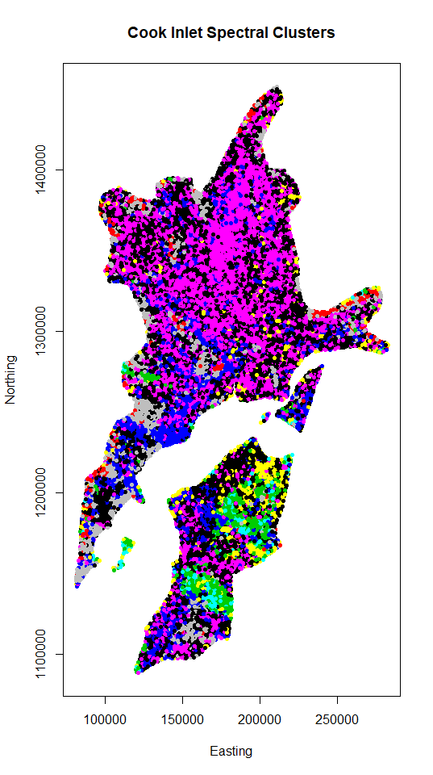

## Imagery Analysis - Cook Inlet


```r
gee1 <- read.csv("C:\\Users\\Owner\\Dropbox\\GQ3\\Cook_Inlet\\Git01\\ECO_7_1_3\\pts20190104_gee.csv",header=TRUE)
gee2 <- read.csv("C:\\Users\\Owner\\Dropbox\\GQ3\\Cook_Inlet\\Git01\\ECO_7_1_3\\pts20190103out_500m_gee.csv",header=TRUE)
numSims <- 100
gee <- rbind(gee1,gee2)
gee <- gee[!is.na(gee[,7]),]
result <- numeric(0)
for (i in seq(2,20)) {
x <- kmeans(gee[,seq(6,23)],i)
result <- c(result,x$tot.withinss/x$totss)
}
result <- cbind(seq(2,20),result)
plot(result,xlab="Number of Clusters",ylab="Proportion of Variability Within Clusters",main="Optimal Cluster Number Investigation\nImagery for Ecoregion 7.1.3")
```

<!-- -->

```r
wb <- matrix(nrow=0,ncol=19)
for (n in seq(1,numSims)) {
  temp <- runif(dim(gee)[1]*18)
  wbi <- numeric(0)
  for (i in seq(2,20)) {
    x <- kmeans(temp,i)
    wbi <- c(wbi,x$tot.withinss)
    #wbi <- c(wbi,x$tot.withinss/x$totss)
    #print(wbi)
  }
  wb <- rbind(wb,wbi)
  #print(wb)
}
result <- log(result[,2])
wb <- log(wb)
gapk <- numeric(0)
for (i in seq(1,19)) { gapk <- c(gapk,sum(wb[,i])/numSims-result[i]) }
gapksd <- numeric(0)
for (i in seq(1,19)) { gapksd <- c(gapksd,sqrt(sum((wb[,i]-gapk[i])^2))/(numSims-1))}
```

## Plotting Results - Cook Inlet


```r
cbind(gapk-gapksd,gapk,gapk+gapksd)
```

```
##                    gapk         
##  [1,] 9.467166 9.512155 9.557143
##  [2,] 8.979908 9.061245 9.142582
##  [3,] 8.568154 8.667899 8.767645
##  [4,] 8.292222 8.411053 8.529884
##  [5,] 8.038229 8.169547 8.300865
##  [6,] 7.801211 7.940523 8.079834
##  [7,] 7.600256 7.746347 7.892437
##  [8,] 7.420097 7.570872 7.721647
##  [9,] 7.287194 7.443943 7.600692
## [10,] 7.217028 7.385932 7.554835
## [11,] 7.092723 7.266293 7.439863
## [12,] 6.994674 7.172340 7.350006
## [13,] 6.874507 7.054896 7.235286
## [14,] 6.845501 7.035199 7.224898
## [15,] 6.735805 6.928408 7.121010
## [16,] 6.652650 6.850139 7.047629
## [17,] 6.579496 6.777000 6.974503
## [18,] 6.564174 6.770436 6.976697
## [19,] 6.473227 6.682421 6.891616
```

```r
plot(seq(2,20),gapk,xlab="Number of Clusters",main="Gap-K Statistics for Different Number of Clusters")
lines(seq(2,20),gapk)
lines(seq(2,20),gapk+gapksd)
lines(seq(2,20),gapk-gapksd)
segments(8,7.721647,10,7.721647)
segments(8,7.420097,10,7.420097)
segments(9,7.420097,9,7.721647)
```

<!-- -->

## Spectral Map - Cook Inlet


```r
x <- kmeans(gee[,seq(6,23)],9)
gee$cluster <- x$cluster
geeplot <- cbind(gee$x,gee$y,x$cluster)
plot(geeplot[,c(1,2)],col=geeplot[,3],pch=20,xlab="Easting",ylab="Northing",main="Cook Inlet Spectral Clusters")
```

<!-- -->

## Imagery Analysis - Copper Plateau


```r
gee1b <- read.csv("C:\\Users\\Owner\\Dropbox\\GQ3\\Cook_Inlet\\Git01\\ECO_6_1_3\\pts20190103_gee.csv",header=TRUE)
gee2b <- read.csv("C:\\Users\\Owner\\Dropbox\\GQ3\\Cook_Inlet\\Git01\\ECO_6_1_3\\pts20190103out_500m_gee.csv",header=TRUE)
numSimsB <- 100
geeb <- rbind(gee1b,gee2b)
geeb <- geeb[!is.na(geeb[,7]),]
resultB <- numeric(0)
for (iB in seq(2,20)) {
xB <- kmeans(geeb[,seq(6,23)],iB)
resultB <- c(resultB,xB$tot.withinss/xB$totss)
}
resultB <- cbind(seq(2,20),resultB)
plot(resultB,xlab="Number of Clusters",ylab="Proportion of Variability Within Clusters",main="Optimal Cluster Number Investigation\nImagery for Ecoregion 6.1.3")
```

<!-- -->

```r
wbB <- matrix(ncol=19,nrow=0)
for (nB in seq(1,numSimsB)) {
  temp <- runif(dim(geeb)[1]*18)
  wbiB <- numeric(0)
  for (iB in seq(2,20)) {
    xB <- kmeans(temp,iB)
    wbiB <- c(wbiB,xB$tot.withinss)
    #wbiB <- c(wbiB,xB$tot.withinss/xB$totss)
  }
  wbB <- rbind(wbB,wbiB)
}
resultB <- log(resultB[,2])
wbB <- log(wbB)
gapkB <- numeric(0)
for (i in seq(1,19)) { gapkB <- c(gapkB,sum(wbB[,i])/numSimsB-resultB[i]) }
gapksdB <- numeric(0)
for (i in seq(1,19)) { gapksdB <- c(gapksdB,sqrt(sum((wbB[,i]-gapkB[i])^2))/(numSimsB-1))}
```

## Plotting Results - Copper Plateau


```r
cbind(gapkB-gapksdB,gapkB,gapkB+gapksdB)
```

```
##                   gapkB         
##  [1,] 8.240405 8.286686 8.332966
##  [2,] 7.739135 7.820202 7.901269
##  [3,] 7.375816 7.480759 7.585701
##  [4,] 7.064767 7.184884 7.305001
##  [5,] 6.800161 6.931547 7.062933
##  [6,] 6.560986 6.700079 6.839173
##  [7,] 6.342662 6.487229 6.631795
##  [8,] 6.358334 6.530335 6.702336
##  [9,] 6.227953 6.407506 6.587059
## [10,] 6.084379 6.269302 6.454224
## [11,] 5.985645 6.178229 6.370813
## [12,] 5.881351 6.078574 6.275797
## [13,] 5.771989 5.973195 6.174401
## [14,] 5.717374 5.925447 6.133521
## [15,] 5.640631 5.852662 6.064693
## [16,] 5.569892 5.787771 6.005649
## [17,] 5.509261 5.731906 5.954552
## [18,] 5.436823 5.661704 5.886586
## [19,] 5.391642 5.620108 5.848574
```

```r
plot(seq(2,20),gapkB,xlab="Number of Clusters",main="Gap-K Statistics for Different Number of Clusters")
lines(seq(2,20),gapkB)
lines(seq(2,20),gapkB+gapksdB)
lines(seq(2,20),gapkB-gapksdB)
segments(7,6.631795,9,6.631795)
segments(7,6.342662,9,6.342662)
segments(8,6.342662,8,6.631795)
```

<!-- -->

## Spectral Map - Copper Plateau


```r
x <- kmeans(geeb[,seq(6,23)],8)
geeplotb <- cbind(geeb$x,geeb$y,x$cluster)
plot(geeplotb[,c(1,2)],col=geeplotb[,3],pch=20,xlab="Easting",ylab="Northing",main="Copper Plateau Spectral Clusters")
```

<!-- -->

## Data Headers

```r
dem1Order <- c("FullID","elevation","b10240713","b11240713","b19240713","b42240713","b71240713","b90240713","b94713","b94240713","b95713","b95240713","b98713","b98240713","b108240713","b231240713","b242240713","b263713","b263240713","b264240713","b264713","b351240713","b375713","b375240713","b741713","b741240713","b746713","b746240713","b747713","b747240713","b751240713")
dem1Zero <- c(NA,NA,rep(0,29))
dem1Type <- c("f",rep("n",length(dem1Order)-1))
dem2Order <- c("FullID","nlcdak","gsmsoilmu71","mergedSoils","hansen101","hansen102","hansen103","hansen104","hansen105","hansen106","hansen107","hansen108","hansen109","hansen1010","hansen1011","hansen1012","hansen1013","hansen111","hansen112","hansen113","hansen114","hansen115","hansen116","hansen117","hansen118","hansen119","hansen1110","hansen1111","hansen1112","hansen1113","hansen121","hansen122","hansen123","hansen124","hansen125","hansen126","hansen127","hansen128","hansen129","hansen1210","hansen1211","hansen1212","hansen1213","hansen131","hansen132","hansen133","hansen134","hansen135","hansen136","hansen137","hansen138","hansen139","hansen1310","hansen1311","hansen1312","hansen1313","hansen141","hansen142","hansen143","hansen144","hansen145","hansen146","hansen147","hansen148","hansen149","hansen1410","hansen1411","hansen1412","hansen1413","hansen151","hansen152","hansen153","hansen154","hansen155","hansen156","hansen157","hansen158","hansen159","hansen1510","hansen1511","hansen1512","hansen1513")
dem2Zero <- rep(NA,length(dem2Order))
dem2Type <- rep("f",length(dem2Order))
gdcOrder <- c("FullID","gdc199630","gdc199660","gdc199690","gdc1996120","gdc1996150","gdc1996180","gdc1996210","gdc1996240","gdc1996270","gdc1996300","gdc1996330","gdc199730","gdc199760","gdc199790","gdc1997120","gdc1997150","gdc1997180","gdc1997210","gdc1997240","gdc1997270","gdc1997300","gdc1997330","gdc199830","gdc199860","gdc199890","gdc1998120","gdc1998150","gdc1998180","gdc1998210","gdc1998240","gdc1998270","gdc1998300","gdc1998330","gdc199930","gdc199960","gdc199990","gdc1999120","gdc1999150","gdc1999180","gdc1999210","gdc1999240","gdc1999270","gdc1999300","gdc1999330","gdc200030","gdc200060","gdc200090","gdc2000120","gdc2000150","gdc2000180","gdc2000210","gdc2000240","gdc2000270","gdc2000300","gdc2000330","gdc200130","gdc200160","gdc200190","gdc2001120","gdc2001150","gdc2001180","gdc2001210","gdc2001240","gdc2001270","gdc2001300","gdc2001330","gdc200230","gdc200260","gdc200290","gdc2002120","gdc2002150","gdc2002180","gdc2002210","gdc2002240","gdc2002270","gdc2002300","gdc2002330","gdc200330","gdc200360","gdc200390","gdc2003120","gdc2003150","gdc2003180","gdc2003210","gdc2003240","gdc2003270","gdc2003300","gdc2003330","gdc200430","gdc200460","gdc200490","gdc2004120","gdc2004150","gdc2004180","gdc2004210","gdc2004240","gdc2004270","gdc2004300","gdc2004330","gdc200530","gdc200560","gdc200590","gdc2005120","gdc2005150","gdc2005180","gdc2005210","gdc2005240","gdc2005270","gdc2005300","gdc2005330","gdc200630","gdc200660","gdc200690","gdc2006120","gdc2006150","gdc2006180","gdc2006210","gdc2006240","gdc2006270","gdc2006300","gdc2006330","gdc200730","gdc200760","gdc200790","gdc2007120","gdc2007150","gdc2007180","gdc2007210","gdc2007240","gdc2007270","gdc2007300","gdc2007330","gdc200830","gdc200860","gdc200890","gdc2008120","gdc2008150","gdc2008180","gdc2008210","gdc2008240","gdc2008270","gdc2008300","gdc2008330","gdc200930","gdc200960","gdc200990","gdc2009120","gdc2009150","gdc2009180","gdc2009210","gdc2009240","gdc2009270","gdc2009300","gdc2009330","gdc201030","gdc201060","gdc201090","gdc2010120","gdc2010150","gdc2010180","gdc2010210","gdc2010240","gdc2010270","gdc2010300","gdc2010330","gdc201130","gdc201160","gdc201190","gdc2011120","gdc2011150","gdc2011180","gdc2011210","gdc2011240","gdc2011270","gdc2011300","gdc2011330","gdc201230","gdc201260","gdc201290","gdc2012120","gdc2012150","gdc2012180","gdc2012210","gdc2012240","gdc2012270","gdc2012300","gdc2012330","gdc201330","gdc201360","gdc201390","gdc2013120","gdc2013150","gdc2013180","gdc2013210","gdc2013240","gdc2013270","gdc2013300","gdc2013330","gdc201430","gdc201460","gdc201490","gdc2014120","gdc2014150","gdc2014180","gdc2014210","gdc2014240","gdc2014270","gdc2014300","gdc2014330","gdc201530","gdc201560","gdc201590","gdc2015120","gdc2015150","gdc2015180","gdc2015210","gdc2015240","gdc2015270","gdc2015300","gdc2015330","gdc201630","gdc201660","gdc201690","gdc2016120","gdc2016150","gdc2016180","gdc2016210","gdc2016240","gdc2016270","gdc2016300","gdc2016330")
gdcZero <- c(NA,rep(0,length(gdcOrder)-1))
gdcType <- c("f",rep("n",length(gdcOrder)-1))
geeOrder <- c("FullID","hybrid1","hybrid2","hybrid3","hybrid4","hybrid5","hybrid6","hybrid7","hybrid8","hybrid9","modis1","modis2","modis3","modis4","modis5","modis6","modis7","modis8","modis9","cluster")
geeZero <- c(NA,rep(0,length(geeOrder)-1))
geeType <- c("f",rep("n",length(geeOrder)-1))
idsOrder <- c("FullID","InOut","x","y","dmg1997","dmg19971km","dmg19972km","dmg19973km","dmg19974km","dmg19975km","dmg1998","dmg19981km","dmg19982km","dmg19983km","dmg19984km","dmg19985km","dmg1999","dmg19991km","dmg19992km","dmg19993km","dmg19994km","dmg19995km","dmg2000","dmg20001km","dmg20002km","dmg20003km","dmg20004km","dmg20005km","dmg2001","dmg20011km","dmg20012km","dmg20013km","dmg20014km","dmg20015km","dmg2002","dmg20021km","dmg20022km","dmg20023km","dmg20024km","dmg20025km","dmg2003","dmg20031km","dmg20032km","dmg20033km","dmg20034km","dmg20035km","dmg2004","dmg20041km","dmg20042km","dmg20043km","dmg20044km","dmg20045km","dmg2005","dmg20051km","dmg20052km","dmg20053km","dmg20054km","dmg20055km","dmg2006","dmg20061km","dmg20062km","dmg20063km","dmg20064km","dmg20065km","dmg2007","dmg20071km","dmg20072km","dmg20073km","dmg20074km","dmg20075km","dmg2008","dmg20081km","dmg20082km","dmg20083km","dmg20084km","dmg20085km","dmg2009","dmg20091km","dmg20092km","dmg20093km","dmg20094km","dmg20095km","dmg2010","dmg20101km","dmg20102km","dmg20103km","dmg20104km","dmg20105km","dmg2011","dmg20111km","dmg20112km","dmg20113km","dmg20114km","dmg20115km","dmg2012","dmg20121km","dmg20122km","dmg20123km","dmg20124km","dmg20125km","dmg2013","dmg20131km","dmg20132km","dmg20133km","dmg20134km","dmg20135km","dmg2014","dmg20141km","dmg20142km","dmg20143km","dmg20144km","dmg20145km","dmg2015","dmg20151km","dmg20152km","dmg20153km","dmg20154km","dmg20155km","dmg2016","dmg20161km","dmg20162km","dmg20163km","dmg20164km","dmg20165km","dmg2017","dmg20171km","dmg20172km","dmg20173km","dmg20174km","dmg20175km","flown1999","flown2000","flown2001","flown2002","flown2003","flown2004","flown2005","flown2006","flown2007","flown2008","flown2009","flown2010","flown2011","flown2012","flown2013","flown2014","flown2015","flown2016","flown2017")
idsZero <- rep(NA,length(idsOrder))
idsType <- rep("f",length(idsOrder))
pcpOrder <- c("FullID","prcp199601","prcp199602","prcp199603","prcp199604","prcp199605","prcp199606","prcp199607","prcp199608","prcp199609","prcp199610","prcp199611","prcp199612","prcp199701","prcp199702","prcp199703","prcp199704","prcp199705","prcp199706","prcp199707","prcp199708","prcp199709","prcp199710","prcp199711","prcp199712","prcp199801","prcp199802","prcp199803","prcp199804","prcp199805","prcp199806","prcp199807","prcp199808","prcp199809","prcp199810","prcp199811","prcp199812","prcp199901","prcp199902","prcp199903","prcp199904","prcp199905","prcp199906","prcp199907","prcp199908","prcp199909","prcp199910","prcp199911","prcp199912","prcp200001","prcp200002","prcp200003","prcp200004","prcp200005","prcp200006","prcp200007","prcp200008","prcp200009","prcp200010","prcp200011","prcp200012","prcp200101","prcp200102","prcp200103","prcp200104","prcp200105","prcp200106","prcp200107","prcp200108","prcp200109","prcp200110","prcp200111","prcp200112","prcp200201","prcp200202","prcp200203","prcp200204","prcp200205","prcp200206","prcp200207","prcp200208","prcp200209","prcp200210","prcp200211","prcp200212","prcp200301","prcp200302","prcp200303","prcp200304","prcp200305","prcp200306","prcp200307","prcp200308","prcp200309","prcp200310","prcp200311","prcp200312","prcp200401","prcp200402","prcp200403","prcp200404","prcp200405","prcp200406","prcp200407","prcp200408","prcp200409","prcp200410","prcp200411","prcp200412","prcp200501","prcp200502","prcp200503","prcp200504","prcp200505","prcp200506","prcp200507","prcp200508","prcp200509","prcp200510","prcp200511","prcp200512","prcp200601","prcp200602","prcp200603","prcp200604","prcp200605","prcp200606","prcp200607","prcp200608","prcp200609","prcp200610","prcp200611","prcp200612","prcp200701","prcp200702","prcp200703","prcp200704","prcp200705","prcp200706","prcp200707","prcp200708","prcp200709","prcp200710","prcp200711","prcp200712","prcp200801","prcp200802","prcp200803","prcp200804","prcp200805","prcp200806","prcp200807","prcp200808","prcp200809","prcp200810","prcp200811","prcp200812","prcp200901","prcp200902","prcp200903","prcp200904","prcp200905","prcp200906","prcp200907","prcp200908","prcp200909","prcp200910","prcp200911","prcp200912","prcp201001","prcp201002","prcp201003","prcp201004","prcp201005","prcp201006","prcp201007","prcp201008","prcp201009","prcp201010","prcp201011","prcp201012","prcp201101","prcp201102","prcp201103","prcp201104","prcp201105","prcp201106","prcp201107","prcp201108","prcp201109","prcp201110","prcp201111","prcp201112","prcp201201","prcp201202","prcp201203","prcp201204","prcp201205","prcp201206","prcp201207","prcp201208","prcp201209","prcp201210","prcp201211","prcp201212","prcp201301","prcp201302","prcp201303","prcp201304","prcp201305","prcp201306","prcp201307","prcp201308","prcp201309","prcp201310","prcp201311","prcp201312","prcp201401","prcp201402","prcp201403","prcp201404","prcp201405","prcp201406","prcp201407","prcp201408","prcp201409","prcp201410","prcp201411","prcp201412","prcp201501","prcp201502","prcp201503","prcp201504","prcp201505","prcp201506","prcp201507","prcp201508","prcp201509","prcp201510","prcp201511","prcp201512","prcp201601","prcp201602","prcp201603","prcp201604","prcp201605","prcp201606","prcp201607","prcp201608","prcp201609","prcp201610","prcp201611","prcp201612")
pcpZero <- c(NA,rep(0,length(pcpOrder)-1))
pcpType <- c("f",rep("n",length(pcpOrder)-1))
vprOrder <- c("FullID","vp199601","vp199602","vp199603","vp199604","vp199605","vp199606","vp199607","vp199608","vp199609","vp199610","vp199611","vp199612","vp199701","vp199702","vp199703","vp199704","vp199705","vp199706","vp199707","vp199708","vp199709","vp199710","vp199711","vp199712","vp199801","vp199802","vp199803","vp199804","vp199805","vp199806","vp199807","vp199808","vp199809","vp199810","vp199811","vp199812","vp199901","vp199902","vp199903","vp199904","vp199905","vp199906","vp199907","vp199908","vp199909","vp199910","vp199911","vp199912","vp200001","vp200002","vp200003","vp200004","vp200005","vp200006","vp200007","vp200008","vp200009","vp200010","vp200011","vp200012","vp200101","vp200102","vp200103","vp200104","vp200105","vp200106","vp200107","vp200108","vp200109","vp200110","vp200111","vp200112","vp200201","vp200202","vp200203","vp200204","vp200205","vp200206","vp200207","vp200208","vp200209","vp200210","vp200211","vp200212","vp200301","vp200302","vp200303","vp200304","vp200305","vp200306","vp200307","vp200308","vp200309","vp200310","vp200311","vp200312","vp200401","vp200402","vp200403","vp200404","vp200405","vp200406","vp200407","vp200408","vp200409","vp200410","vp200411","vp200412","vp200501","vp200502","vp200503","vp200504","vp200505","vp200506","vp200507","vp200508","vp200509","vp200510","vp200511","vp200512","vp200601","vp200602","vp200603","vp200604","vp200605","vp200606","vp200607","vp200608","vp200609","vp200610","vp200611","vp200612","vp200701","vp200702","vp200703","vp200704","vp200705","vp200706","vp200707","vp200708","vp200709","vp200710","vp200711","vp200712","vp200801","vp200802","vp200803","vp200804","vp200805","vp200806","vp200807","vp200808","vp200809","vp200810","vp200811","vp200812","vp200901","vp200902","vp200903","vp200904","vp200905","vp200906","vp200907","vp200908","vp200909","vp200910","vp200911","vp200912","vp201001","vp201002","vp201003","vp201004","vp201005","vp201006","vp201007","vp201008","vp201009","vp201010","vp201011","vp201012","vp201101","vp201102","vp201103","vp201104","vp201105","vp201106","vp201107","vp201108","vp201109","vp201110","vp201111","vp201112","vp201201","vp201202","vp201203","vp201204","vp201205","vp201206","vp201207","vp201208","vp201209","vp201210","vp201211","vp201212","vp201301","vp201302","vp201303","vp201304","vp201305","vp201306","vp201307","vp201308","vp201309","vp201310","vp201311","vp201312","vp201401","vp201402","vp201403","vp201404","vp201405","vp201406","vp201407","vp201408","vp201409","vp201410","vp201411","vp201412","vp201501","vp201502","vp201503","vp201504","vp201505","vp201506","vp201507","vp201508","vp201509","vp201510","vp201511","vp201512","vp201601","vp201602","vp201603","vp201604","vp201605","vp201606","vp201607","vp201608","vp201609","vp201610","vp201611","vp201612")
vprZero <- c(NA,rep(0,length(vprOrder)-1))
vprType <- c("f",rep("n",length(vprOrder)-1))
```

## Soils Subset Determination - Cook Inlet


```r
library(data.table)
dem2_1 <- read.csv("C:\\Users\\Owner\\Dropbox\\GQ3\\Cook_Inlet\\Git01\\ECO_7_1_3\\pts20190104_dem2.csv",header=TRUE)
dem2_2 <- read.csv("C:\\Users\\Owner\\Dropbox\\GQ3\\Cook_Inlet\\Git01\\ECO_7_1_3\\pts20190103out_500m_dem2.csv",header=TRUE)
dem2_1 <- dem2_1[,dem2Order]
dem2_2 <- dem2_2[,dem2Order]
dem2 <- rbind(dem2_1,dem2_2)
```

## Load and Connect Data

```r
library(data.table)
dem1_1 <- read.csv("C:\\Users\\Owner\\Dropbox\\GQ3\\Cook_Inlet\\Git01\\ECO_7_1_3\\pts20190104_dem1.csv",header=TRUE)
dem1_2 <- read.csv("C:\\Users\\Owner\\Dropbox\\GQ3\\Cook_Inlet\\Git01\\ECO_7_1_3\\pts20190103out_500m_dem1.csv",header=TRUE)
dem2_1 <- read.csv("C:\\Users\\Owner\\Dropbox\\GQ3\\Cook_Inlet\\Git01\\ECO_7_1_3\\pts20190104_dem2.csv",header=TRUE)
dem2_2 <- read.csv("C:\\Users\\Owner\\Dropbox\\GQ3\\Cook_Inlet\\Git01\\ECO_7_1_3\\pts20190103out_500m_dem2.csv",header=TRUE)
gdc_1 <- read.csv("C:\\Users\\Owner\\Dropbox\\GQ3\\Cook_Inlet\\Git01\\ECO_7_1_3\\pts20190104_gdc.csv",header=TRUE)
gdc_2 <- read.csv("C:\\Users\\Owner\\Dropbox\\GQ3\\Cook_Inlet\\Git01\\ECO_7_1_3\\pts20190103out_500m_gdc.csv",header=TRUE)
gee_1 <- read.csv("C:\\Users\\Owner\\Dropbox\\GQ3\\Cook_Inlet\\Git01\\ECO_7_1_3\\pts20190104_gee.csv",header=TRUE)
gee_2 <- read.csv("C:\\Users\\Owner\\Dropbox\\GQ3\\Cook_Inlet\\Git01\\ECO_7_1_3\\pts20190103out_500m_gee.csv",header=TRUE)
ids_1 <- read.csv("C:\\Users\\Owner\\Dropbox\\GQ3\\Cook_Inlet\\Git01\\ECO_7_1_3\\pts20190104_ids.csv",header=TRUE)
ids_2 <- read.csv("C:\\Users\\Owner\\Dropbox\\GQ3\\Cook_Inlet\\Git01\\ECO_7_1_3\\pts20190103out_500m_ids.csv",header=TRUE)
pcp_1 <- read.csv("C:\\Users\\Owner\\Dropbox\\GQ3\\Cook_Inlet\\Git01\\ECO_7_1_3\\pts20190104_pcp.csv",header=TRUE)
pcp_2 <- read.csv("C:\\Users\\Owner\\Dropbox\\GQ3\\Cook_Inlet\\Git01\\ECO_7_1_3\\pts20190103out_500m_pcp.csv",header=TRUE)
vpr_1 <- read.csv("C:\\Users\\Owner\\Dropbox\\GQ3\\Cook_Inlet\\Git01\\ECO_7_1_3\\pts20190104_vpr.csv",header=TRUE)
vpr_2 <- read.csv("C:\\Users\\Owner\\Dropbox\\GQ3\\Cook_Inlet\\Git01\\ECO_7_1_3\\pts20190103out_500m_vpr.csv",header=TRUE)

loadInOrder <- function(x,xOrd,xZero,xType) {
  temp <- numeric(0)
  for (i in seq(1,length(xOrd))) {
    # print(xOrd[i])
    # print(colnames(x))
    if (xOrd[i] %in% colnames(x)) {
      tempSub <- x[,xOrd[i]]
      if (class(tempSub)=="logical") { tempSub <- as.numeric(tempSub) }
      # print(paste(xOrd[i],xType[i],xZero[i],class(tempSub)))
      if (xType[i]=="n") {
        if (class(tempSub)=="factor") {
          tempSub <- levels(tempSub)[tempSub]
        } 
        if (class(tempSub)=="character") {tempSub <- as.numeric(tempSub)}
      }
      tempSub[is.na(tempSub)] <- rep(xZero[i],sum(is.na(tempSub)))
      tempSub[is.null(tempSub)] <- rep(xZero[i],sum(is.null(tempSub)))
      } else {
      tempSub <- rep(xZero[i],length(x$FullID))
    }
    #print(tempSub)
    temp <- cbind(temp,tempSub)
  }
  colnames(temp) <- xOrd
  temp
}
dem1_1 <- loadInOrder(dem1_1,dem1Order,dem1Zero,dem1Type)
dem1_2 <- loadInOrder(dem1_2,dem1Order,dem1Zero,dem1Type)
dem2_1 <- loadInOrder(dem2_1,dem2Order,dem2Zero,dem2Type)
dem2_2 <- loadInOrder(dem2_2,dem2Order,dem2Zero,dem2Type)
gdc_1 <- loadInOrder(gdc_1,gdcOrder,gdcZero,gdcType)
gdc_2 <- loadInOrder(gdc_2,gdcOrder,gdcZero,gdcType)
gee_1 <- loadInOrder(gee_1,geeOrder,geeZero,geeType)
gee_2 <- loadInOrder(gee_2,geeOrder,geeZero,geeType)
ids_1 <- loadInOrder(ids_1,idsOrder,idsZero,idsType)
ids_2 <- loadInOrder(ids_2,idsOrder,idsZero,idsType)
pcp_1 <- loadInOrder(pcp_1,pcpOrder,pcpZero,pcpType)
pcp_2 <- loadInOrder(pcp_2,pcpOrder,pcpZero,pcpType)
vpr_1 <- loadInOrder(vpr_1,vprOrder,vprZero,vprType)
vpr_2 <- loadInOrder(vpr_2,vprOrder,vprZero,vprType)

dem1 <- data.table(rbind(dem1_1,dem1_2))
dem2 <- data.table(rbind(dem2_1,dem2_2))
gdc <- data.table(rbind(gdc_1,gdc_2))
gee <- data.table(rbind(gee_1,gee_2))
ids <- data.table(rbind(ids_1,ids_2))
pcp <- data.table(rbind(pcp_1,pcp_2))
vpr <- data.table(rbind(vpr_1,vpr_2))

gee$cluster <- kmeans(gee[,c(2,3,4,5,6,7,8,9,10,11,12,13,14,15,16,17,18,19)],9)$cluster
```

```
## Warning: did not converge in 10 iterations
```

```r
ids[is.na(ids)] <- 0
ids[is.null(ids)] <- 0
ids <- round(ids)

setkey(dem1,FullID)
setkey(dem2,FullID)
setkey(gdc,FullID)
setkey(gee,FullID)
setkey(ids,FullID)
setkey(pcp,FullID)
setkey(vpr,FullID)

fullData713 <- merge(merge(merge(merge(merge(merge(ids,dem1),dem2),gdc),gee),pcp),vpr)
fullData713$group <- as.integer(10*runif(dim(fullData713)[1])) + 1
```


```r
genVector <- function(x,y,z) { paste(paste(x,y,sep=""),z,sep="") }
gdcVector <- function(x) { genVector("gdc",x,c("30","60","90","120","150","180","210","240","270","300","330"))}
pcpVector <- function(x) { genVector("prcp",x,c("01","02","03","04","05","06","07","08","09","10","11","12"))}
vprVector <- function(x) { genVector("vp",x,c("01","02","03","04","05","06","07","08","09","10","11","12"))}
idsVector <- function(x) { genVector("dmg",x,c("","1km","2km","3km","4km","5km"))}

ordTimeIndependent <- c(dem1Order,dem2Order[-1],"cluster")

generateOrd <- function(n){c(paste("dmg",n,sep=""),paste("dmg",n,"1km",sep=""),ordTimeIndependent,idsVector(n-2),idsVector(n-1),gdcVector(n-2),gdcVector(n-1),pcpVector(n-2),pcpVector(n-1),vprVector(n-2),vprVector(n-1),"group")}

ord1999 <- generateOrd(1999)
ord2000 <- generateOrd(2000)
ord2001 <- generateOrd(2001)
ord2002 <- generateOrd(2002)
ord2003 <- generateOrd(2003)
ord2004 <- generateOrd(2004)
ord2005 <- generateOrd(2005)
ord2006 <- generateOrd(2006)
ord2007 <- generateOrd(2007)
ord2008 <- generateOrd(2008)
ord2009 <- generateOrd(2009)
ord2010 <- generateOrd(2010)
ord2011 <- generateOrd(2011)
ord2012 <- generateOrd(2012)
ord2013 <- generateOrd(2013)
ord2014 <- generateOrd(2014)
ord2015 <- generateOrd(2015)
ord2016 <- generateOrd(2016)
ord2017 <- generateOrd(2017)

setColNames <- c("idsdmg","idsdmg_1km",ordTimeIndependent,idsVector("_LY2_"),idsVector("_LY_"),gdcVector("_LY2_"),gdcVector("_LY_"),pcpVector("_LY2_"),pcpVector("_LY_"),vprVector("_LY2_"),vprVector("_LY_"),"group","year") 

set1999 <- fullData713[fullData713$flown1999==1,..ord1999]
set2000 <- fullData713[fullData713$flown2000==1,..ord2000]
set2001 <- fullData713[fullData713$flown2001==1,..ord2001]
set2002 <- fullData713[fullData713$flown2002==1,..ord2002]
set2003 <- fullData713[fullData713$flown2003==1,..ord2003]
set2004 <- fullData713[fullData713$flown2004==1,..ord2004]
set2005 <- fullData713[fullData713$flown2005==1,..ord2005]
set2006 <- fullData713[fullData713$flown2006==1,..ord2006]
set2007 <- fullData713[fullData713$flown2007==1,..ord2007]
set2008 <- fullData713[fullData713$flown2008==1,..ord2008]
set2009 <- fullData713[fullData713$flown2009==1,..ord2009]
set2010 <- fullData713[fullData713$flown2010==1,..ord2010]
set2011 <- fullData713[fullData713$flown2011==1,..ord2011]
set2012 <- fullData713[fullData713$flown2012==1,..ord2012]
set2013 <- fullData713[fullData713$flown2013==1,..ord2013]
set2014 <- fullData713[fullData713$flown2014==1,..ord2014]
set2015 <- fullData713[fullData713$flown2015==1,..ord2015]
set2016 <- fullData713[fullData713$flown2016==1,..ord2016]
set2017 <- fullData713[fullData713$flown2017==1,..ord2017]

set1999 <- cbind(set1999,rep(1999,dim(set1999)[1]))
set2000 <- cbind(set2000,rep(2000,dim(set2000)[1]))
set2001 <- cbind(set2001,rep(2001,dim(set2001)[1]))
set2002 <- cbind(set2002,rep(2002,dim(set2002)[1]))
set2003 <- cbind(set2003,rep(2003,dim(set2003)[1]))
set2004 <- cbind(set2004,rep(2004,dim(set2004)[1]))
set2005 <- cbind(set2005,rep(2005,dim(set2005)[1]))
set2006 <- cbind(set2006,rep(2006,dim(set2006)[1]))
set2007 <- cbind(set2007,rep(2007,dim(set2007)[1]))
set2008 <- cbind(set2008,rep(2008,dim(set2008)[1]))
set2009 <- cbind(set2009,rep(2009,dim(set2009)[1]))
set2010 <- cbind(set2010,rep(2010,dim(set2010)[1]))
set2011 <- cbind(set2011,rep(2011,dim(set2011)[1]))
set2012 <- cbind(set2012,rep(2012,dim(set2012)[1]))
set2013 <- cbind(set2013,rep(2013,dim(set2013)[1]))
set2014 <- cbind(set2014,rep(2014,dim(set2014)[1]))
set2015 <- cbind(set2015,rep(2015,dim(set2015)[1]))
set2016 <- cbind(set2016,rep(2016,dim(set2016)[1]))
set2017 <- cbind(set2017,rep(2017,dim(set2017)[1]))

colnames(set1999) <- setColNames
colnames(set2000) <- setColNames
colnames(set2001) <- setColNames
colnames(set2002) <- setColNames
colnames(set2003) <- setColNames
colnames(set2004) <- setColNames
colnames(set2005) <- setColNames
colnames(set2006) <- setColNames
colnames(set2007) <- setColNames
colnames(set2008) <- setColNames
colnames(set2009) <- setColNames
colnames(set2010) <- setColNames
colnames(set2011) <- setColNames
colnames(set2012) <- setColNames
colnames(set2013) <- setColNames
colnames(set2014) <- setColNames
colnames(set2015) <- setColNames
colnames(set2016) <- setColNames
colnames(set2017) <- setColNames

fullData713b <- rbind(set1999,set2000,set2001,set2002,set2003,set2004,set2005,set2006,set2007,set2008,set2009,set2010,set2011,set2012,set2013,set2014,set2015,set2016,set2017)
```


```r
fullData713bTrain <- fullData713b[fullData713b$group<10,]
fullData713bTest <- fullData713b[fullData713b$group==10,]

depVarsFull <- c("elevation","b10240713","b11240713","b19240713","b42240713","b71240713","b90240713","b94713","b94240713","b95713","b95240713","b98713","b98240713","b108240713","b231240713","b242240713","b263713","b263240713","b264240713","b264713","b351240713","b375713","b375240713","b741713","b741240713","b746713","b746240713","b747713","b747240713","b751240713","nlcdak","gsmsoilmu71","mergedSoils","hansen101","hansen102","hansen103","hansen104" ,"hansen105","hansen106","hansen107","hansen108","hansen109","hansen1010","hansen1011","hansen1012","hansen1013","hansen111","hansen112","hansen113", "hansen114","hansen115","hansen116","hansen117","hansen118","hansen119","hansen1110","hansen1111","hansen1112","hansen1113","hansen121","hansen122","hansen123","hansen124","hansen125","hansen126","hansen127","hansen128","hansen129","hansen1210","hansen1211","hansen1212","hansen1213","hansen131","hansen132","hansen133","hansen134","hansen135","hansen136","hansen137","hansen138","hansen139","hansen1310","hansen1311","hansen1312","hansen1313","hansen141","hansen142","hansen143","hansen144","hansen145","hansen146","hansen147","hansen148","hansen149","hansen1410","hansen1411","hansen1412","hansen1413","hansen151","hansen152","hansen153","hansen154","hansen155","hansen156","hansen157","hansen158","hansen159","hansen1510","hansen1511","hansen1512","hansen1513","cluster","dmg_LY2_","dmg_LY2_1km","dmg_LY2_2km","dmg_LY2_3km","dmg_LY2_4km","dmg_LY2_5km","dmg_LY_","dmg_LY_1km","dmg_LY_2km","dmg_LY_3km","dmg_LY_4km","dmg_LY_5km","gdc_LY2_30","gdc_LY2_60","gdc_LY2_90","gdc_LY2_120","gdc_LY2_150","gdc_LY2_180","gdc_LY2_210","gdc_LY2_240","gdc_LY2_270","gdc_LY2_300","gdc_LY2_330","gdc_LY_30","gdc_LY_60","gdc_LY_90","gdc_LY_120","gdc_LY_150","gdc_LY_180","gdc_LY_210","gdc_LY_240","gdc_LY_270","gdc_LY_300","gdc_LY_330","prcp_LY2_01","prcp_LY2_02","prcp_LY2_03","prcp_LY2_04","prcp_LY2_05","prcp_LY2_06","prcp_LY2_07","prcp_LY2_08","prcp_LY2_09","prcp_LY2_10","prcp_LY2_11","prcp_LY2_12","prcp_LY_01","prcp_LY_02","prcp_LY_03","prcp_LY_04","prcp_LY_05","prcp_LY_06","prcp_LY_07","prcp_LY_08","prcp_LY_09","prcp_LY_10","prcp_LY_11","prcp_LY_12","vp_LY2_01","vp_LY2_02","vp_LY2_03","vp_LY2_04","vp_LY2_05","vp_LY2_06","vp_LY2_07","vp_LY2_08","vp_LY2_09","vp_LY2_10","vp_LY2_11","vp_LY2_12","vp_LY_01","vp_LY_02","vp_LY_03","vp_LY_04","vp_LY_05","vp_LY_06","vp_LY_07","vp_LY_08","vp_LY_09","vp_LY_10","vp_LY_11","vp_LY_12")
depVars <- c("elevation","b10240713","b11240713","b19240713","b42240713","b71240713","b90240713","b94713","b94240713","b95713","b95240713","b98713","b98240713","b108240713","b231240713","b242240713","b263713","b263240713","b264240713","b264713","b351240713","b375713","b375240713","b741713","b741240713","b746713","b746240713","b747713","b747240713","b751240713","factor(nlcdak)","factor(gsmsoilmu71)","factor(mergedSoils)","hansen101","hansen102","hansen103","hansen104" ,"hansen105","hansen106","hansen107","hansen108","hansen109","hansen1010","hansen1011","hansen1012","hansen1013","cluster","dmg_LY2_","dmg_LY2_1km","dmg_LY2_2km","dmg_LY2_3km","dmg_LY2_4km","dmg_LY2_5km","dmg_LY_","dmg_LY_1km","dmg_LY_2km","dmg_LY_3km","dmg_LY_4km","dmg_LY_5km","gdc_LY2_30","gdc_LY2_60","gdc_LY2_90","gdc_LY2_120","gdc_LY2_150","gdc_LY2_180","gdc_LY2_210","gdc_LY2_240","gdc_LY2_270","gdc_LY2_300","gdc_LY2_330","gdc_LY_30","gdc_LY_60","gdc_LY_90","gdc_LY_120","gdc_LY_150","gdc_LY_180","gdc_LY_210","gdc_LY_240","gdc_LY_270","gdc_LY_300","gdc_LY_330","prcp_LY2_01","prcp_LY2_02","prcp_LY2_03","prcp_LY2_04","prcp_LY2_05","prcp_LY2_06","prcp_LY2_07","prcp_LY2_08","prcp_LY2_09","prcp_LY2_10","prcp_LY2_11","prcp_LY2_12","prcp_LY_01","prcp_LY_02","prcp_LY_03","prcp_LY_04","prcp_LY_05","prcp_LY_06","prcp_LY_07","prcp_LY_08","prcp_LY_09","prcp_LY_10","prcp_LY_11","prcp_LY_12","vp_LY2_01","vp_LY2_02","vp_LY2_03","vp_LY2_04","vp_LY2_05","vp_LY2_06","vp_LY2_07","vp_LY2_08","vp_LY2_09","vp_LY2_10","vp_LY2_11","vp_LY2_12","vp_LY_01","vp_LY_02","vp_LY_03","vp_LY_04","vp_LY_05","vp_LY_06","vp_LY_07","vp_LY_08","vp_LY_09","vp_LY_10","vp_LY_11","vp_LY_12")

getFormula <- function(vbl,prev,depVar){
  if (length(prev)==1) {
    if (prev=="") { prev = character(0) }
  }
  fmla <- paste(depVar,"~",sep="")
  if (length(prev)>0) {
    for (j in seq(1,length(prev))) {
      fmla <- paste(fmla,prev[j],"+",sep="")
    }
  }
  paste(fmla,vbl,sep="")
}

scanVars <- function(vars,prev,data,depVar,glmFamily) {
  options(max.print=999999)
  pval <- rep(1,length(vars))
  for (i in seq(1,length(vars))) {
    fmla <- getFormula(vars[i],prev,depVar)
    x <- glm(fmla,data=data,family=glmFamily)
    if (substring(vars[i],1,6)=="factor") { print(summary(x)$coef) }
    #print(vars[i])
    #print(summary(x)$coef[vars[i]])
    #print(dim(summary(x)$coef))
    if (!is.na(x$coef[vars[i]])) {
      #print("got here")
      print(c(vars[i],summary(x)$coef[vars[i],]))
      pval[i] <- summary(x)$coef[vars[i],4]
    }
  }
  options(max.print=99999)
  print("The following lowest p value does not include values from factor variables.  Check those values manually against this result.")
  cbind(which(pval==min(pval)),vars[pval==min(pval)],pval[pval==min(pval)])
}


acc <- function(tp,tn,fp,fn) {
x <- list(tp,tn,fp,fn,(tp+fn),(tn+fp),(tp+fp),(tn+fn),tp/(tp+fn),tn/(tn+fp),tp/(tp+fp),tn/(tn+fn),fn/(fn+tp),fp/(fp+tn),fp/(fp+tp),fn/(fn+tn),(tp+tn)/(fp+tn+fp+fn))
names(x) <- c("tp","tn","fp","fn","p","n","predp","predn","tpr","tnr","ppv","npv","fnr","fpr","fdr","for","acc")
x$sensitivity <- x$tpr
x$specificity <- x$tnr
x
}

rocPlot <- function(roc,titleROC="",lineOnly=TRUE,ltyAUC=1) {
if (!lineOnly) { 
  plot(1-roc$result[,2],roc$result[,3],type="n",xlab="1-Specificity",ylab="Sensitivity",main=titleROC)
  abline(0,1)
  text(0.9,0.03,paste("AUC =",round(roc$auc,3)))
}
lines(1-roc$result[,2],roc$result[,3],lty=ltyAUC)
}

roc <- function(pred,actual) {
inputTemp <- cbind(pred,actual)
inputTemp <- na.omit(inputTemp)
pred <- inputTemp[,1]
actual <- inputTemp[,2]
result <- matrix(nrow=0,ncol=3)
for (x in seq(min(pred),max(pred),((max(pred)-min(pred))/100))) {
tp <- sum(actual[pred>=x]==1)
fp <- sum(actual[pred>=x]==0)
fn <- sum(actual[pred<x]==1)
tn <- sum(actual[pred<x]==0)
temp <- acc(tp,tn,fp,fn)
result <- rbind(result,c(x,temp$specificity,temp$sensitivity))
}
colnames(result) <- c("pred","specificity","sensitivity")
resultAUC <- cbind(1-result[,2],result[,3])
resultAUC <- resultAUC[order(resultAUC[,1]),]
n <- dim(resultAUC)[1]
auc <- 0.5*resultAUC[1,1]*resultAUC[1,2]
for (i in seq(1,n-1)) {
auc <- auc + 0.5*(resultAUC[i+1,1]-resultAUC[i,1])*(resultAUC[i+1,2]+resultAUC[i,2])
#print(paste(x0,x1,y0,y1,(y1-y0)*(x1-x0),auc))
}
auc <- auc + 0.5*(1-resultAUC[n,1])*(resultAUC[n,2]+1)
list(result=result,auc=auc)
}

cor(fullData713b[,c("elevation","b90240713","b94713","b94240713","b95240713","b98240713","b264240713","b375240713","b741240713","b746240713","b747240713","b751240713","nlcdak","gsmsoilmu71","mergedSoils","hansen1013","cluster","dmg_LY2_","dmg_LY2_2km","dmg_LY2_5km","dmg_LY_","dmg_LY_2km","dmg_LY_5km","gdc_LY2_120","gdc_LY2_150","gdc_LY2_180","gdc_LY2_210","gdc_LY2_240","gdc_LY2_270","gdc_LY2_300","gdc_LY2_330","gdc_LY_120","gdc_LY_150","gdc_LY_180","gdc_LY_210","gdc_LY_240","gdc_LY_270","gdc_LY_300","gdc_LY_330","prcp_LY2_01","prcp_LY2_02","prcp_LY2_03","prcp_LY2_04","prcp_LY2_05","prcp_LY2_06","prcp_LY2_07","prcp_LY2_08","prcp_LY2_09","prcp_LY2_10","prcp_LY2_11","prcp_LY2_12","prcp_LY_01","prcp_LY_02","prcp_LY_03","prcp_LY_04","prcp_LY_05","prcp_LY_06","prcp_LY_07","prcp_LY_08","prcp_LY_09","prcp_LY_10","prcp_LY_11","prcp_LY_12","vp_LY2_01","vp_LY2_02","vp_LY2_03","vp_LY2_04","vp_LY2_06","vp_LY2_07","vp_LY2_08","vp_LY2_09","vp_LY2_10","vp_LY2_11","vp_LY2_12","vp_LY_01","vp_LY_02","vp_LY_03","vp_LY_04","vp_LY_05","vp_LY_06","vp_LY_08","vp_LY_09","vp_LY_10","vp_LY_11","vp_LY_12","idsdmg","idsdmg_1km")], use="complete.obs")
```

```
##               elevation     b90240713        b94713     b94240713
## elevation    1.00000000 -0.0257758370  2.615575e-02  0.1497592623
## b90240713   -0.02577584  1.0000000000 -9.123847e-03  0.4236507945
## b94713       0.02615575 -0.0091238466  1.000000e+00 -0.0012526954
## b94240713    0.14975926  0.4236507945 -1.252695e-03  1.0000000000
## b95240713   -0.21235375  0.6678048184 -8.494937e-03  0.1279087260
## b98240713   -0.01113539 -0.0148017691 -2.966787e-04 -0.0134514837
## b264240713   0.06496777  0.1883751125 -9.588141e-04  0.0907488037
## b375240713  -0.16480660  0.0219293222 -1.262388e-02  0.1610253336
## b741240713   0.02289946 -0.0389230155  3.785008e-02 -0.0320524141
## b746240713  -0.08331297  0.1026639129 -2.593562e-03  0.0360442111
## b747240713  -0.07152023 -0.0607045832 -1.123860e-03 -0.0694293120
## b751240713  -0.07937083 -0.0794342212 -1.432035e-03 -0.0537082902
## nlcdak      -0.06033825 -0.0574844738  1.320806e-04 -0.1423764111
## gsmsoilmu71 -0.27072753  0.1088452439 -3.777691e-02  0.0878129663
## mergedSoils -0.17003266 -0.0746910562 -7.962049e-03  0.0021697418
## hansen1013  -0.08683294 -0.0531344942 -2.010236e-03 -0.0737646786
## cluster     -0.12000319  0.3433690007  1.074283e-02  0.2248407739
## dmg_LY2_    -0.04154858 -0.0497774935  9.111619e-05 -0.0306732087
## dmg_LY2_2km -0.05916953 -0.0348931570 -4.560988e-03 -0.0207201460
## dmg_LY2_5km -0.06748256 -0.0300812155 -5.345307e-03 -0.0294554464
## dmg_LY_     -0.03044238 -0.0371980642  7.168114e-04 -0.0258427427
## dmg_LY_2km  -0.03049444 -0.0167463384 -1.230327e-03 -0.0178492700
## dmg_LY_5km  -0.03718250 -0.0107368055 -2.285041e-03 -0.0197921863
## gdc_LY2_120 -0.04784290 -0.0421094850 -3.121499e-03 -0.0373574232
## gdc_LY2_150 -0.10840435 -0.0762065754 -5.414436e-03 -0.0873060347
## gdc_LY2_180 -0.11251032 -0.0370691126 -8.303774e-03 -0.0564061441
## gdc_LY2_210 -0.02975882 -0.0281361957 -3.319055e-03 -0.0534294914
## gdc_LY2_240 -0.15974444 -0.0212258816 -9.224827e-03 -0.0496137461
## gdc_LY2_270 -0.09547154  0.0058205166 -7.310627e-03 -0.0287390425
## gdc_LY2_300 -0.07089607 -0.0225194328 -3.190488e-03 -0.0158447733
## gdc_LY2_330 -0.08036072 -0.0397210105 -5.521630e-03 -0.0611627680
## gdc_LY_120  -0.03258578 -0.0198210302 -3.256602e-03 -0.0094572541
## gdc_LY_150  -0.08696295 -0.0456929738 -5.868383e-03 -0.0588314373
## gdc_LY_180  -0.13090301 -0.0270595276 -5.902287e-03 -0.0337153767
## gdc_LY_210  -0.08823810  0.0001600471 -6.362099e-03 -0.0375976389
## gdc_LY_240  -0.12515789 -0.0226771357 -8.981351e-03 -0.0502213723
## gdc_LY_270  -0.12114397 -0.0192095235 -8.528350e-03 -0.0629297325
## gdc_LY_300  -0.08698221 -0.0063708506 -7.478183e-03 -0.0230252809
## gdc_LY_330  -0.09092494 -0.0151250902 -6.698262e-03 -0.0362794556
## prcp_LY2_01  0.28453424  0.0125931692  9.078419e-03  0.0706678904
## prcp_LY2_02  0.26623332  0.0062477316  1.284908e-02  0.0760108440
## prcp_LY2_03  0.26749291 -0.0377775394  5.586398e-03  0.0307657079
## prcp_LY2_04  0.25596301  0.0051478955  4.427278e-03  0.0855113116
## prcp_LY2_05  0.22402937 -0.0565576801  1.223875e-02  0.0052443845
## prcp_LY2_06  0.10135843 -0.0654255848  8.134357e-03 -0.0266503272
## prcp_LY2_07  0.17618293 -0.0419951524  1.009635e-02 -0.0021020375
## prcp_LY2_08  0.20603958 -0.0696581512  1.420965e-02 -0.0195190244
## prcp_LY2_09  0.17200506 -0.0287100474  8.059850e-03  0.0082817660
## prcp_LY2_10  0.19865964  0.0210395335  1.099932e-02  0.0900939415
## prcp_LY2_11  0.18509708  0.0292313616  6.873548e-03  0.0943026098
## prcp_LY2_12  0.22330115 -0.0038853246  3.109634e-03  0.0888974790
## prcp_LY_01   0.26581473  0.0003787996  1.223376e-02  0.0850805727
## prcp_LY_02   0.26894986  0.0200961565  5.731132e-03  0.0788422151
## prcp_LY_03   0.24238239 -0.0266520425  4.797976e-03  0.0286755738
## prcp_LY_04   0.24331944  0.0133031667  1.164170e-02  0.0649633699
## prcp_LY_05   0.18426332 -0.0448054295  1.550299e-02 -0.0007105983
## prcp_LY_06   0.12450713 -0.0740703369  7.947328e-03 -0.0333819040
## prcp_LY_07   0.21785557 -0.0600460056  1.360963e-02 -0.0099203253
## prcp_LY_08   0.23168622 -0.0475303654  1.584615e-02  0.0056765139
## prcp_LY_09   0.14137199  0.0079959693  9.485993e-03  0.0548522017
## prcp_LY_10   0.16819717  0.0406108443  9.354780e-03  0.0910694180
## prcp_LY_11   0.16946439  0.0141245747  1.108867e-02  0.0537868611
## prcp_LY_12   0.22390918  0.0318396966  5.987578e-03  0.1056228902
## vp_LY2_01   -0.09456705  0.0494389356 -1.155662e-02  0.0232292542
## vp_LY2_02   -0.12791873  0.0408661451 -1.012574e-02  0.0387752521
## vp_LY2_03   -0.19815570  0.0364282143 -1.782501e-02  0.0297845009
## vp_LY2_04    0.00122655  0.0597006980 -5.612404e-03  0.0879617652
## vp_LY2_06    0.17143204 -0.0608364577  7.060921e-03  0.0100446853
## vp_LY2_07    0.06281782 -0.0614474986  6.011520e-03 -0.0290859243
## vp_LY2_08   -0.26670957 -0.0922823561 -1.003311e-02 -0.1168575249
## vp_LY2_09   -0.46858681 -0.0556941363 -2.393510e-02 -0.1081490008
## vp_LY2_10   -0.18559274 -0.0169201108 -1.021108e-02 -0.0248989206
## vp_LY2_11   -0.13408453  0.0501641786 -1.151554e-02  0.0242615734
## vp_LY2_12   -0.10165659  0.0308551770 -1.179805e-02  0.0199505702
## vp_LY_01    -0.07631441  0.0299534664 -7.888237e-03  0.0087061746
## vp_LY_02    -0.12944891  0.0362642006 -1.336353e-02  0.0148320676
## vp_LY_03    -0.17849018  0.0395995340 -1.561419e-02  0.0204159705
## vp_LY_04     0.06942550  0.0365122181 -6.347946e-03  0.0702369934
## vp_LY_05     0.11406791 -0.0087958668  5.034722e-03  0.0300807104
## vp_LY_06     0.14580381 -0.0349639630  1.030685e-02  0.0009180560
## vp_LY_08    -0.25598301 -0.0785266219 -9.180457e-03 -0.1013904163
## vp_LY_09    -0.45357986 -0.0503715626 -2.094557e-02 -0.0893504323
## vp_LY_10    -0.15359056 -0.0033710748 -8.346239e-03 -0.0158955516
## vp_LY_11    -0.14479622  0.0259493727 -9.688264e-03  0.0063968874
## vp_LY_12    -0.09997956  0.0210317916 -1.093595e-02  0.0249987862
## idsdmg       0.01073988 -0.0131703493  4.156905e-03  0.0063963839
## idsdmg_1km   0.01043722  0.0026004815  1.637927e-03  0.0114988458
##                 b95240713     b98240713    b264240713   b375240713
## elevation   -0.2123537506 -1.113539e-02  0.0649677746 -0.164806600
## b90240713    0.6678048184 -1.480177e-02  0.1883751125  0.021929322
## b94713      -0.0084949372 -2.966787e-04 -0.0009588141 -0.012623881
## b94240713    0.1279087260 -1.345148e-02  0.0907488037  0.161025334
## b95240713    1.0000000000 -9.744954e-03  0.0762192198 -0.060564334
## b98240713   -0.0097449539  1.000000e+00 -0.0011226754 -0.018180922
## b264240713   0.0762192198 -1.122675e-03  1.0000000000 -0.027551336
## b375240713  -0.0605643341 -1.818092e-02 -0.0275513356  1.000000000
## b741240713  -0.0240279742 -8.534952e-04 -0.0027583486 -0.036655243
## b746240713   0.0920701204 -3.036802e-03 -0.0067694659  0.019810210
## b747240713  -0.0726751856 -3.309861e-03 -0.0106968974 -0.047365176
## b751240713  -0.0962684321 -5.257081e-03 -0.0173312365  0.012906460
## nlcdak      -0.0039014913  1.062392e-02 -0.0167012016 -0.149871033
## gsmsoilmu71  0.1006624994  4.736259e-03 -0.0671070945  0.128753150
## mergedSoils -0.0297187209 -9.017601e-03 -0.0342191409 -0.131098723
## hansen1013  -0.0224454504 -2.353785e-03 -0.0076070266 -0.092752998
## cluster      0.3173366824 -2.010982e-02  0.0692015464  0.082364427
## dmg_LY2_    -0.0236100365  3.149664e-03 -0.0079310537 -0.040535008
## dmg_LY2_2km -0.0019850969 -3.282111e-03  0.0049230832 -0.021080857
## dmg_LY2_5km  0.0072828289 -7.924074e-03  0.0082838614  0.004155138
## dmg_LY_     -0.0147688702  1.198549e-03 -0.0038393563 -0.024735947
## dmg_LY_2km   0.0161041441 -3.934026e-03  0.0092696111 -0.018475119
## dmg_LY_5km   0.0245094375 -7.636383e-03  0.0126398825 -0.009145877
## gdc_LY2_120 -0.0165244908  8.166521e-04 -0.0013512177  0.019350022
## gdc_LY2_150 -0.0239675628  7.986418e-03 -0.0135587661  0.029982067
## gdc_LY2_180 -0.0014815116  3.087145e-04 -0.0119248624  0.044844108
## gdc_LY2_210 -0.0054291099 -4.661521e-03 -0.0061269465  0.011026328
## gdc_LY2_240  0.0119202290  8.707071e-03 -0.0129878557  0.049101826
## gdc_LY2_270  0.0360985986 -8.487742e-04 -0.0155648466  0.038270046
## gdc_LY2_300  0.0002839202  8.776296e-03 -0.0113767517  0.026898948
## gdc_LY2_330 -0.0045509044  1.821516e-03 -0.0079259621  0.027009684
## gdc_LY_120   0.0001015586  4.253597e-03 -0.0056062225  0.024048635
## gdc_LY_150  -0.0157920602  7.439518e-05 -0.0122156765  0.055258531
## gdc_LY_180   0.0088097766  1.015514e-02 -0.0111936366  0.049073760
## gdc_LY_210   0.0137398526 -7.763313e-03 -0.0108896914  0.058865212
## gdc_LY_240   0.0007003434 -1.009351e-03 -0.0073887710  0.062361209
## gdc_LY_270   0.0170487667 -7.816478e-05 -0.0155977511  0.049383238
## gdc_LY_300   0.0123155905 -2.178604e-03 -0.0053327927  0.049423338
## gdc_LY_330   0.0144557513 -4.322436e-03 -0.0164366755  0.038346348
## prcp_LY2_01 -0.0745397280  1.755244e-02  0.0191013962 -0.128060629
## prcp_LY2_02 -0.0756393861  1.664557e-02  0.0112684047 -0.118154332
## prcp_LY2_03 -0.1059722406  1.049987e-02  0.0197977512 -0.054840598
## prcp_LY2_04 -0.0838771020  1.130153e-02  0.0078140447 -0.110060183
## prcp_LY2_05 -0.1038863954  1.651753e-02 -0.0091297694 -0.029387018
## prcp_LY2_06 -0.0770670588  1.599687e-02 -0.0166554969  0.001010609
## prcp_LY2_07 -0.0837505434  2.663965e-02 -0.0003081271 -0.045080942
## prcp_LY2_08 -0.0988369706  1.101958e-02 -0.0177527992 -0.019993656
## prcp_LY2_09 -0.0661227728  1.128992e-02 -0.0059939083 -0.060233096
## prcp_LY2_10 -0.0361069545  2.857171e-02  0.0111732133 -0.159594884
## prcp_LY2_11 -0.0397649475  1.581297e-02  0.0165280203 -0.126691197
## prcp_LY2_12 -0.0842128685  2.486666e-02  0.0122675310 -0.136240356
## prcp_LY_01  -0.0852016903  1.763699e-02  0.0063038166 -0.118592705
## prcp_LY_02  -0.0673358976  7.781754e-03  0.0126803324 -0.115781747
## prcp_LY_03  -0.0842729300  6.076451e-03  0.0159398688 -0.037379278
## prcp_LY_04  -0.0695954303  2.178677e-02  0.0097645609 -0.116735150
## prcp_LY_05  -0.0849674366  1.997582e-02 -0.0145988805 -0.043314759
## prcp_LY_06  -0.0797926282  1.724652e-02 -0.0129079564 -0.028884967
## prcp_LY_07  -0.1044791099  2.017480e-02 -0.0129316450 -0.043462198
## prcp_LY_08  -0.0975250818  6.682451e-03 -0.0004170238 -0.025226411
## prcp_LY_09  -0.0409021164  1.100113e-02 -0.0113451958 -0.020619893
## prcp_LY_10  -0.0291035269  2.315241e-02  0.0187505833 -0.135715607
## prcp_LY_11  -0.0431360111  2.024150e-02  0.0062929581 -0.091786766
## prcp_LY_12  -0.0522761751  1.405086e-02  0.0252033195 -0.126026676
## vp_LY2_01    0.0765931134  6.287804e-04  0.0235868303 -0.017742070
## vp_LY2_02    0.0736296681  8.855812e-03  0.0282152032 -0.037569620
## vp_LY2_03    0.0729368876  9.149641e-03  0.0269751977  0.011933842
## vp_LY2_04    0.0021960270  2.140773e-02  0.0352605260 -0.075283645
## vp_LY2_06   -0.1057802157  1.536020e-02 -0.0129928941  0.008356520
## vp_LY2_07   -0.0636747173  1.605749e-02 -0.0225932531  0.084683061
## vp_LY2_08    0.0143593828  1.782985e-02 -0.0336023890  0.124248487
## vp_LY2_09    0.0912905090  1.226946e-02 -0.0174660594  0.075587143
## vp_LY2_10    0.0546679061  9.957496e-03  0.0015610556 -0.009039772
## vp_LY2_11    0.0801387398  4.588760e-03  0.0204519003 -0.023542150
## vp_LY2_12    0.0620642077  2.435499e-03  0.0247633782 -0.019631370
## vp_LY_01     0.0573219301  4.260845e-03  0.0271931400 -0.026491105
## vp_LY_02     0.0700759274  6.790813e-03  0.0183440480 -0.016866090
## vp_LY_03     0.0805383066  5.838078e-03  0.0216286276  0.011320604
## vp_LY_04    -0.0227787651  1.787887e-02  0.0291151431 -0.078933687
## vp_LY_05    -0.0560350896  1.642109e-02  0.0057384199 -0.047710317
## vp_LY_06    -0.0810826126  1.691471e-02 -0.0142403833  0.005604074
## vp_LY_08     0.0171178957  1.412027e-02 -0.0327452146  0.112747756
## vp_LY_09     0.0880229191  1.293276e-02 -0.0183295019  0.081838046
## vp_LY_10     0.0431215182  6.864702e-03  0.0029039098  0.007497393
## vp_LY_11     0.0675579856  9.392948e-03  0.0067724506  0.004545411
## vp_LY_12     0.0666876687  2.748589e-03  0.0192886975 -0.023482736
## idsdmg      -0.0120265123 -1.003837e-03 -0.0050097038  0.002393743
## idsdmg_1km   0.0167210648 -3.994372e-03  0.0026554457 -0.002905207
##                b741240713    b746240713    b747240713   b751240713
## elevation    2.289946e-02 -8.331297e-02 -0.0715202335 -0.079370826
## b90240713   -3.892302e-02  1.026639e-01 -0.0607045832 -0.079434221
## b94713       3.785008e-02 -2.593562e-03 -0.0011238599 -0.001432035
## b94240713   -3.205241e-02  3.604421e-02 -0.0694293120 -0.053708290
## b95240713   -2.402797e-02  9.207012e-02 -0.0726751856 -0.096268432
## b98240713   -8.534952e-04 -3.036802e-03 -0.0033098608 -0.005257081
## b264240713  -2.758349e-03 -6.769466e-03 -0.0106968974 -0.017331237
## b375240713  -3.665524e-02  1.981021e-02 -0.0473651755  0.012906460
## b741240713   1.000000e+00 -7.461248e-03 -0.0079279311 -0.012691508
## b746240713  -7.461248e-03  1.000000e+00 -0.0216675934 -0.033000112
## b747240713  -7.927931e-03 -2.166759e-02  1.0000000000  0.565568624
## b751240713  -1.269151e-02 -3.300011e-02  0.5655686243  1.000000000
## nlcdak       3.837835e-03 -3.193495e-02  0.0108780927  0.007304463
## gsmsoilmu71 -9.541556e-02  2.220762e-02 -0.0623452215 -0.032850244
## mergedSoils -2.270476e-02 -6.401652e-03 -0.0818503649 -0.115812446
## hansen1013  -5.783115e-03 -3.608260e-03  0.0365141608  0.031663834
## cluster     -4.718258e-02  7.141567e-02  0.0028052289  0.013723188
## dmg_LY2_     5.863044e-03 -8.144487e-03 -0.0100483860 -0.022427057
## dmg_LY2_2km  2.037948e-03 -6.377932e-03  0.0058002612 -0.024189083
## dmg_LY2_5km -1.576916e-03  1.519840e-02  0.0086911537 -0.021910733
## dmg_LY_      9.954084e-03  2.991669e-03 -0.0109336966 -0.020067247
## dmg_LY_2km   4.627925e-03  3.148998e-03  0.0002013140 -0.025625891
## dmg_LY_5km  -4.391166e-03  2.539649e-02  0.0092859623 -0.023546168
## gdc_LY2_120 -4.896367e-05 -1.472643e-03 -0.0097752106 -0.010408882
## gdc_LY2_150  1.231684e-02 -6.104692e-03  0.0366211699  0.048232002
## gdc_LY2_180 -4.883298e-04 -3.296548e-03  0.0463376602  0.057203064
## gdc_LY2_210  1.480027e-02 -1.055640e-02  0.0126072570  0.019484779
## gdc_LY2_240 -2.082185e-02  5.426627e-03  0.0469711606  0.048093164
## gdc_LY2_270 -5.283668e-03 -4.529376e-03  0.0082108733  0.013161144
## gdc_LY2_300 -1.954446e-02  2.804423e-03  0.0146020885  0.019894403
## gdc_LY2_330  2.547767e-02 -1.686655e-03 -0.0046123906  0.003470699
## gdc_LY_120  -9.824787e-03 -1.793186e-03 -0.0140034765 -0.019898200
## gdc_LY_150   5.232437e-03 -7.045382e-03  0.0105950368  0.024608526
## gdc_LY_180  -1.540706e-02 -4.287990e-03  0.0275490444  0.032771428
## gdc_LY_210   9.877422e-04  3.657971e-03  0.0243140636  0.030058224
## gdc_LY_240  -1.707673e-03  4.030201e-04  0.0192411279  0.034745223
## gdc_LY_270   2.391396e-02 -2.689195e-03  0.0253524209  0.035189996
## gdc_LY_300   7.917942e-03  6.365258e-03 -0.0017712347  0.006885038
## gdc_LY_330  -2.415547e-04 -3.610658e-03  0.0126088216  0.016526770
## prcp_LY2_01  2.456869e-02 -2.942640e-02 -0.0059624417  0.007170582
## prcp_LY2_02  2.933566e-02 -3.031102e-02  0.0095445119  0.013198509
## prcp_LY2_03 -5.285881e-03 -4.806647e-02 -0.0215484333 -0.009311675
## prcp_LY2_04  2.614176e-02 -3.814606e-02  0.0091601871  0.024461697
## prcp_LY2_05  1.513826e-02 -4.135330e-02 -0.0206258405  0.004026509
## prcp_LY2_06  2.718977e-02 -4.640051e-03  0.0201213959  0.053551767
## prcp_LY2_07  2.922498e-02 -2.109407e-02  0.0043726238  0.022619829
## prcp_LY2_08  2.775031e-02 -2.716000e-02  0.0217004264  0.057352688
## prcp_LY2_09  3.906643e-02 -1.665769e-02 -0.0002487496  0.027402762
## prcp_LY2_10  2.553287e-02 -9.247972e-03 -0.0253193308 -0.017763012
## prcp_LY2_11  2.314254e-03 -1.318626e-02 -0.0112516094 -0.008162710
## prcp_LY2_12 -1.968026e-03 -1.682987e-02 -0.0072205748 -0.009403261
## prcp_LY_01   2.120466e-02 -3.648683e-02  0.0101941218  0.011397886
## prcp_LY_02   1.024739e-02 -2.682204e-02 -0.0069425537  0.005987488
## prcp_LY_03   6.726577e-04 -3.636685e-02 -0.0126738285 -0.011815569
## prcp_LY_04   2.935129e-02 -3.548767e-02  0.0003260878  0.014564154
## prcp_LY_05   3.504425e-02 -2.808771e-02 -0.0142080755  0.018165932
## prcp_LY_06   1.982639e-02 -1.360578e-02 -0.0046453416  0.020524113
## prcp_LY_07   2.258836e-02 -2.809311e-02  0.0086731360  0.036659991
## prcp_LY_08   3.223742e-02 -4.424167e-02 -0.0043435101  0.034419711
## prcp_LY_09   1.485412e-02  4.535364e-03  0.0039136626  0.031703504
## prcp_LY_10   4.237062e-02 -9.239423e-03 -0.0140434228 -0.009248225
## prcp_LY_11   1.077722e-02 -4.312954e-03  0.0080666700  0.007927709
## prcp_LY_12   1.351664e-02 -1.793252e-02 -0.0041903881 -0.003484847
## vp_LY2_01   -2.580189e-02  1.673839e-02 -0.0810520043 -0.099666051
## vp_LY2_02   -2.906204e-02  1.446320e-02 -0.0827574120 -0.104133324
## vp_LY2_03   -5.245890e-02  2.436348e-02 -0.0782871755 -0.090154098
## vp_LY2_04   -3.526943e-02 -2.846113e-03 -0.0199814189 -0.016701670
## vp_LY2_06    1.482251e-02 -4.316132e-02 -0.0036284135  0.039854179
## vp_LY2_07    1.956067e-02 -2.139998e-02 -0.0001675003  0.046307299
## vp_LY2_08   -1.716145e-03  6.474778e-05 -0.0220318510 -0.006849450
## vp_LY2_09   -3.716564e-02  3.403145e-02 -0.0461766706 -0.058856753
## vp_LY2_10   -1.742664e-02  1.361419e-02 -0.0607188432 -0.073889281
## vp_LY2_11   -3.537522e-02  1.010897e-02 -0.0642264006 -0.082712953
## vp_LY2_12   -4.077428e-02  1.649113e-02 -0.0748659350 -0.088584883
## vp_LY_01    -2.143001e-02  1.988785e-03 -0.0695662746 -0.086615305
## vp_LY_02    -4.120236e-02  1.913980e-02 -0.0721709370 -0.091423009
## vp_LY_03    -5.548934e-02  1.611288e-02 -0.0817873776 -0.097596784
## vp_LY_04    -2.607730e-02 -6.670213e-03 -0.0487281192 -0.035920600
## vp_LY_05     6.621248e-03 -2.316117e-02 -0.0165471043  0.002951909
## vp_LY_06     2.633111e-02 -3.456391e-02  0.0070497809  0.051531393
## vp_LY_08     5.845265e-03 -5.992323e-04 -0.0118300345  0.011222187
## vp_LY_09    -3.566998e-02  2.933112e-02 -0.0348518690 -0.046693222
## vp_LY_10    -6.023283e-03  2.174179e-02 -0.0330239426 -0.047786686
## vp_LY_11    -3.105684e-02  1.075004e-02 -0.0657526281 -0.082065465
## vp_LY_12    -3.203166e-02  1.120080e-02 -0.0926728623 -0.115063744
## idsdmg       1.289405e-02  3.511290e-03 -0.0069331857 -0.008096948
## idsdmg_1km   1.269486e-02  5.921106e-04  0.0126941404 -0.002434920
##                    nlcdak   gsmsoilmu71  mergedSoils    hansen1013
## elevation   -0.0603382480 -0.2707275310 -0.170032661 -0.0868329414
## b90240713   -0.0574844738  0.1088452439 -0.074691056 -0.0531344942
## b94713       0.0001320806 -0.0377769139 -0.007962049 -0.0020102360
## b94240713   -0.1423764111  0.0878129663  0.002169742 -0.0737646786
## b95240713   -0.0039014913  0.1006624994 -0.029718721 -0.0224454504
## b98240713    0.0106239162  0.0047362588 -0.009017601 -0.0023537853
## b264240713  -0.0167012016 -0.0671070945 -0.034219141 -0.0076070266
## b375240713  -0.1498710335  0.1287531502 -0.131098723 -0.0927529984
## b741240713   0.0038378352 -0.0954155633 -0.022704760 -0.0057831146
## b746240713  -0.0319349480  0.0222076150 -0.006401652 -0.0036082601
## b747240713   0.0108780927 -0.0623452215 -0.081850365  0.0365141608
## b751240713   0.0073044625 -0.0328502438 -0.115812446  0.0316638344
## nlcdak       1.0000000000 -0.0088285155 -0.054717060 -0.1706238032
## gsmsoilmu71 -0.0088285155  1.0000000000  0.035734210  0.0418317271
## mergedSoils -0.0547170598  0.0357342105  1.000000000  0.0057091594
## hansen1013  -0.1706238032  0.0418317271  0.005709159  1.0000000000
## cluster     -0.0012827670  0.1281416209  0.005399534  0.0908365772
## dmg_LY2_    -0.0664070659 -0.0317823294  0.063512282  0.0028426995
## dmg_LY2_2km -0.0532016553 -0.0427197643  0.059505024  0.0024342814
## dmg_LY2_5km -0.0519642266 -0.0476784836  0.022654852  0.0007084723
## dmg_LY_     -0.0490154681 -0.0328506919  0.021250381 -0.0056449084
## dmg_LY_2km  -0.0504560709 -0.0410608540  0.008399418 -0.0028116273
## dmg_LY_5km  -0.0550878419 -0.0426774733 -0.011136105 -0.0011713423
## gdc_LY2_120 -0.0078682675  0.0053655667 -0.002946759  0.0010563481
## gdc_LY2_150  0.0029443046  0.0066387644 -0.085421551  0.0089679993
## gdc_LY2_180  0.0166173127  0.0177960426 -0.065460281  0.0098578366
## gdc_LY2_210 -0.0109049825 -0.0229554868 -0.078056826  0.0021124723
## gdc_LY2_240  0.0037570139  0.0440113092 -0.038994692  0.0130960420
## gdc_LY2_270  0.0092920454  0.0319438036 -0.049483197  0.0042427528
## gdc_LY2_300 -0.0113241567  0.0180626954 -0.014861610  0.0008580323
## gdc_LY2_330 -0.0131364578  0.0002337268 -0.060271228  0.0023560051
## gdc_LY_120  -0.0079526830  0.0022210280  0.016310825 -0.0003021101
## gdc_LY_150  -0.0079726275  0.0141293370 -0.075040563 -0.0015508208
## gdc_LY_180   0.0104816311  0.0344345216 -0.052124445  0.0099312429
## gdc_LY_210  -0.0077790683  0.0120901309 -0.056660097  0.0058109198
## gdc_LY_240  -0.0094956785  0.0322322910 -0.049740929 -0.0014541908
## gdc_LY_270   0.0056131925  0.0211597956 -0.094629757  0.0028842345
## gdc_LY_300  -0.0066581253  0.0234084795 -0.012246916 -0.0050120468
## gdc_LY_330  -0.0134538773  0.0045324068 -0.029572217  0.0002474075
## prcp_LY2_01  0.0351777885 -0.0476518085 -0.131563362 -0.0170786817
## prcp_LY2_02  0.0179168724 -0.0587625803 -0.121073691 -0.0226836180
## prcp_LY2_03  0.0024745698 -0.0612861376 -0.095751338 -0.0264576503
## prcp_LY2_04  0.0275287553 -0.0461540286 -0.026060923 -0.0248176076
## prcp_LY2_05  0.0360453073 -0.0448739070 -0.124334519 -0.0198647317
## prcp_LY2_06  0.0489547866 -0.0282770201 -0.148176468 -0.0014815615
## prcp_LY2_07  0.0275525446 -0.0304763435 -0.140813871 -0.0187360716
## prcp_LY2_08  0.0294153012 -0.0397737861 -0.182620275 -0.0029598656
## prcp_LY2_09  0.0345133417 -0.0367771409 -0.168641485 -0.0067161069
## prcp_LY2_10  0.0313105684 -0.0363470796 -0.075274099 -0.0168421790
## prcp_LY2_11  0.0231565620  0.0020954132 -0.026239044 -0.0225756606
## prcp_LY2_12  0.0104785121 -0.0308283216 -0.025575260 -0.0202768327
## prcp_LY_01   0.0274455371 -0.0559023534 -0.095867167 -0.0176776485
## prcp_LY_02   0.0278692220 -0.0385103465 -0.092841110 -0.0217352855
## prcp_LY_03  -0.0015749720 -0.0658066918 -0.091136237 -0.0244402127
## prcp_LY_04   0.0375572087 -0.0155586639 -0.040786923 -0.0200211408
## prcp_LY_05   0.0469799481 -0.0268336500 -0.140611068 -0.0180716249
## prcp_LY_06   0.0459855739 -0.0449447531 -0.136802795  0.0031950248
## prcp_LY_07   0.0365962751 -0.0401990959 -0.180980088 -0.0061986607
## prcp_LY_08   0.0205360596 -0.0495132135 -0.200708660 -0.0176452765
## prcp_LY_09   0.0389214691  0.0070252831 -0.134406733 -0.0024114096
## prcp_LY_10   0.0329918527 -0.0284591971 -0.056155061 -0.0092823961
## prcp_LY_11   0.0270258008 -0.0204334751 -0.054312114 -0.0051799975
## prcp_LY_12   0.0205600066 -0.0253676177 -0.034958327 -0.0248192599
## vp_LY2_01   -0.0112903050  0.0463098417  0.154371004  0.0034446285
## vp_LY2_02   -0.0156120779  0.0427112078  0.168725480  0.0023169304
## vp_LY2_03   -0.0140285522  0.0675029716  0.171640315  0.0028940298
## vp_LY2_04    0.0174377218  0.0419701477  0.038814839 -0.0085337291
## vp_LY2_06    0.0364433457 -0.0313818597 -0.154078539 -0.0186676872
## vp_LY2_07    0.0422862111 -0.0050343152 -0.201817826 -0.0077011372
## vp_LY2_08   -0.0187400896  0.0500219267 -0.034017567  0.0090782502
## vp_LY2_09   -0.0282337101  0.0976184554  0.173935571  0.0308163147
## vp_LY2_10   -0.0159372916  0.0329263032  0.105065932  0.0075320296
## vp_LY2_11   -0.0031058447  0.0540801288  0.150275920  0.0064044740
## vp_LY2_12   -0.0227111170  0.0366565722  0.142791494  0.0074491523
## vp_LY_01    -0.0217808313  0.0085680672  0.097043095  0.0045474826
## vp_LY_02    -0.0177446248  0.0397239202  0.127874456  0.0101728990
## vp_LY_03    -0.0223353760  0.0620396754  0.163747365  0.0056970253
## vp_LY_04     0.0100751819  0.0265404811  0.012519626 -0.0212937654
## vp_LY_05     0.0299726293 -0.0160852309 -0.071240572 -0.0089623649
## vp_LY_06     0.0509120996 -0.0076219673 -0.202468537 -0.0123456418
## vp_LY_08    -0.0153985935  0.0506691974 -0.091557097  0.0124641880
## vp_LY_09    -0.0310057767  0.0854719465  0.155716162  0.0318421650
## vp_LY_10    -0.0036466881  0.0211028803  0.106562956  0.0192798358
## vp_LY_11    -0.0069154262  0.0435306076  0.115390667  0.0077805388
## vp_LY_12    -0.0318623990  0.0140724020  0.205603198  0.0005198017
## idsdmg      -0.0378905330 -0.0130616550 -0.020426013 -0.0100684545
## idsdmg_1km  -0.0279026096 -0.0248046301 -0.038683257  0.0016455377
##                  cluster      dmg_LY2_   dmg_LY2_2km   dmg_LY2_5km
## elevation   -0.120003192 -4.154858e-02 -5.916953e-02 -0.0674825592
## b90240713    0.343369001 -4.977749e-02 -3.489316e-02 -0.0300812155
## b94713       0.010742832  9.111619e-05 -4.560988e-03 -0.0053453068
## b94240713    0.224840774 -3.067321e-02 -2.072015e-02 -0.0294554464
## b95240713    0.317336682 -2.361004e-02 -1.985097e-03  0.0072828289
## b98240713   -0.020109815  3.149664e-03 -3.282111e-03 -0.0079240740
## b264240713   0.069201546 -7.931054e-03  4.923083e-03  0.0082838614
## b375240713   0.082364427 -4.053501e-02 -2.108086e-02  0.0041551380
## b741240713  -0.047182579  5.863044e-03  2.037948e-03 -0.0015769156
## b746240713   0.071415674 -8.144487e-03 -6.377932e-03  0.0151983952
## b747240713   0.002805229 -1.004839e-02  5.800261e-03  0.0086911537
## b751240713   0.013723188 -2.242706e-02 -2.418908e-02 -0.0219107327
## nlcdak      -0.001282767 -6.640707e-02 -5.320166e-02 -0.0519642266
## gsmsoilmu71  0.128141621 -3.178233e-02 -4.271976e-02 -0.0476784836
## mergedSoils  0.005399534  6.351228e-02  5.950502e-02  0.0226548523
## hansen1013   0.090836577  2.842700e-03  2.434281e-03  0.0007084723
## cluster      1.000000000 -4.025599e-02 -3.135158e-02 -0.0264568794
## dmg_LY2_    -0.040255986  1.000000e+00  4.738276e-01  0.3235641759
## dmg_LY2_2km -0.031351582  4.738276e-01  1.000000e+00  0.6828732798
## dmg_LY2_5km -0.026456879  3.235642e-01  6.828733e-01  1.0000000000
## dmg_LY_     -0.030594281  2.036880e-01  1.726885e-01  0.1635158583
## dmg_LY_2km  -0.017079156  1.657052e-01  2.631336e-01  0.2681740911
## dmg_LY_5km  -0.011368786  1.370810e-01  2.489139e-01  0.2793913715
## gdc_LY2_120 -0.017627327  8.567148e-02  1.029000e-01  0.1325012919
## gdc_LY2_150 -0.040402070 -9.223519e-03  7.142419e-02  0.1007928662
## gdc_LY2_180 -0.001773251  1.070783e-02 -1.923726e-02 -0.0067903049
## gdc_LY2_210 -0.016831236 -1.117055e-02 -5.907505e-02 -0.0723319022
## gdc_LY2_240 -0.005430503 -6.186640e-02  8.124565e-02  0.0978444146
## gdc_LY2_270  0.005139149  5.014490e-02 -7.088968e-02 -0.0905611167
## gdc_LY2_300 -0.005812575  8.120975e-02  5.613935e-02  0.0487375461
## gdc_LY2_330 -0.028470995  4.843139e-02 -1.903112e-02 -0.0007047092
## gdc_LY_120  -0.008845335  1.491006e-01  5.586965e-02  0.0310976097
## gdc_LY_150  -0.019779549  7.591667e-02  3.329245e-02  0.0519364223
## gdc_LY_180  -0.012044518  6.857800e-02  7.291212e-02  0.0777112195
## gdc_LY_210   0.007466978 -4.840844e-02 -8.237865e-02 -0.0619996491
## gdc_LY_240  -0.002984319 -4.075048e-02 -3.502241e-02 -0.0120013744
## gdc_LY_270  -0.013044610  1.223208e-02 -4.879349e-02 -0.0217005183
## gdc_LY_300   0.009304162  2.821126e-02 -2.580219e-02 -0.0296083693
## gdc_LY_330  -0.001393087  6.219838e-02 -1.192069e-02 -0.0270372546
## prcp_LY2_01 -0.080800550 -5.238589e-02 -1.094926e-01 -0.1098402273
## prcp_LY2_02 -0.065466304  4.590390e-03 -1.525686e-02 -0.0330986834
## prcp_LY2_03 -0.072100529  5.259065e-02 -3.419724e-03 -0.0149964984
## prcp_LY2_04 -0.044663718 -4.439010e-02 -7.600961e-02 -0.1057890144
## prcp_LY2_05 -0.076493965 -1.881012e-02  1.652868e-03 -0.0086296874
## prcp_LY2_06 -0.072535660 -4.585021e-02 -5.796935e-02 -0.0568925674
## prcp_LY2_07 -0.086305381 -6.536966e-02 -1.153479e-01 -0.1232966142
## prcp_LY2_08 -0.064817458 -3.349994e-02  1.916576e-02 -0.0017876926
## prcp_LY2_09 -0.079914438 -1.433248e-02 -1.513585e-02  0.0049122677
## prcp_LY2_10 -0.072415263  3.970095e-02 -1.776846e-02 -0.0479805029
## prcp_LY2_11 -0.055406073 -1.083819e-02 -1.624887e-02 -0.0457429403
## prcp_LY2_12 -0.076728209  5.605880e-02  8.040921e-02  0.0740798481
## prcp_LY_01  -0.082643388 -3.304281e-02 -6.326622e-02 -0.0610115888
## prcp_LY_02  -0.048038119  4.091553e-03 -6.953257e-02 -0.0984572341
## prcp_LY_03  -0.057903025  3.300958e-02  7.903204e-05  0.0034090440
## prcp_LY_04  -0.068908075 -6.134395e-02 -1.398134e-02 -0.0438156687
## prcp_LY_05  -0.083800831 -6.509010e-02  1.357024e-02  0.0035293128
## prcp_LY_06  -0.087850160 -4.071820e-02  1.122174e-02  0.0012907253
## prcp_LY_07  -0.095586416 -4.402710e-02 -7.422098e-02 -0.0862174017
## prcp_LY_08  -0.067930866 -4.213854e-03  2.226613e-02  0.0356754505
## prcp_LY_09  -0.028691226 -9.086277e-03 -4.129681e-02 -0.0305090659
## prcp_LY_10  -0.058682875 -3.275179e-02 -5.986369e-02 -0.0537285353
## prcp_LY_11  -0.043725756  3.331689e-02 -4.058360e-02 -0.0743114833
## prcp_LY_12  -0.046040645  8.783893e-03  6.693780e-03 -0.0285490482
## vp_LY2_01    0.036500146  2.470337e-02  3.229834e-03 -0.0091774407
## vp_LY2_02    0.009266686  2.668885e-02  1.136826e-01  0.1105160087
## vp_LY2_03    0.037471606  5.999789e-02  6.374320e-02  0.0761305060
## vp_LY2_04   -0.023234442  5.242929e-02  3.100576e-02  0.0288389578
## vp_LY2_06   -0.057345878 -2.133493e-02 -4.750709e-02 -0.0591600601
## vp_LY2_07   -0.037057944 -7.990088e-02 -7.201717e-02 -0.0597478520
## vp_LY2_08   -0.013481549 -3.998457e-02 -1.253749e-03  0.0129559302
## vp_LY2_09    0.025840796  1.097018e-02  9.757301e-02  0.1234965800
## vp_LY2_10    0.004127671  1.209471e-01  2.506698e-02  0.0098367133
## vp_LY2_11    0.017454742  3.302847e-02  2.766514e-02  0.0001257074
## vp_LY2_12    0.025068156  8.414978e-02  3.651327e-02  0.0482661030
## vp_LY_01     0.007304032 -3.550767e-03 -1.400445e-02 -0.0047047514
## vp_LY_02     0.018807380  9.772435e-02  1.307080e-01  0.1220396199
## vp_LY_03     0.019984074  8.388749e-02  1.078960e-01  0.1127694299
## vp_LY_04    -0.046595054  7.692861e-02  3.651555e-02  0.0185766703
## vp_LY_05    -0.064112156  1.084848e-02 -1.109656e-02 -0.0310292740
## vp_LY_06    -0.068180745 -7.492990e-02 -8.125190e-03 -0.0112946122
## vp_LY_08    -0.010837566 -3.259332e-02 -1.154519e-02  0.0102563977
## vp_LY_09     0.027863202  2.386335e-02  5.656874e-02  0.0875707993
## vp_LY_10     0.011258654  4.757258e-02  5.983506e-03 -0.0045732488
## vp_LY_11     0.020518345  3.982202e-02  8.518245e-02  0.0842275645
## vp_LY_12     0.026685955  1.190122e-01  6.422128e-02  0.0591550837
## idsdmg      -0.022538647  6.155540e-02  6.703070e-02  0.0766908623
## idsdmg_1km  -0.005554083  6.634400e-02  1.076191e-01  0.1147129705
##                   dmg_LY_   dmg_LY_2km   dmg_LY_5km   gdc_LY2_120
## elevation   -0.0304423788 -0.030494440 -0.037182501 -4.784290e-02
## b90240713   -0.0371980642 -0.016746338 -0.010736805 -4.210948e-02
## b94713       0.0007168114 -0.001230327 -0.002285041 -3.121499e-03
## b94240713   -0.0258427427 -0.017849270 -0.019792186 -3.735742e-02
## b95240713   -0.0147688702  0.016104144  0.024509437 -1.652449e-02
## b98240713    0.0011985491 -0.003934026 -0.007636383  8.166521e-04
## b264240713  -0.0038393563  0.009269611  0.012639883 -1.351218e-03
## b375240713  -0.0247359465 -0.018475119 -0.009145877  1.935002e-02
## b741240713   0.0099540837  0.004627925 -0.004391166 -4.896367e-05
## b746240713   0.0029916689  0.003148998  0.025396490 -1.472643e-03
## b747240713  -0.0109336966  0.000201314  0.009285962 -9.775211e-03
## b751240713  -0.0200672475 -0.025625891 -0.023546168 -1.040888e-02
## nlcdak      -0.0490154681 -0.050456071 -0.055087842 -7.868268e-03
## gsmsoilmu71 -0.0328506919 -0.041060854 -0.042677473  5.365567e-03
## mergedSoils  0.0212503805  0.008399418 -0.011136105 -2.946759e-03
## hansen1013  -0.0056449084 -0.002811627 -0.001171342  1.056348e-03
## cluster     -0.0305942808 -0.017079156 -0.011368786 -1.762733e-02
## dmg_LY2_     0.2036879665  0.165705226  0.137081027  8.567148e-02
## dmg_LY2_2km  0.1726884558  0.263133613  0.248913928  1.029000e-01
## dmg_LY2_5km  0.1635158583  0.268174091  0.279391371  1.325013e-01
## dmg_LY_      1.0000000000  0.523181402  0.357429213 -3.376602e-02
## dmg_LY_2km   0.5231814016  1.000000000  0.683184096 -4.715326e-03
## dmg_LY_5km   0.3574292131  0.683184096  1.000000000  3.592897e-02
## gdc_LY2_120 -0.0337660156 -0.004715326  0.035928973  1.000000e+00
## gdc_LY2_150 -0.0155517339  0.035219159  0.064916303  4.504133e-01
## gdc_LY2_180 -0.0164300773 -0.012247423  0.007168391  4.902701e-01
## gdc_LY2_210  0.0811613368  0.070149864  0.058964977 -1.267994e-01
## gdc_LY2_240 -0.0066131663  0.020283159 -0.007816350 -1.622858e-01
## gdc_LY2_270  0.1045740167  0.105059735  0.111468607 -1.726310e-01
## gdc_LY2_300  0.0686727340  0.100624609  0.119849335 -1.080452e-01
## gdc_LY2_330 -0.0300821232 -0.075256364 -0.060007415  3.688093e-01
## gdc_LY_120   0.0526298188  0.071364913  0.098665057 -4.215517e-02
## gdc_LY_150   0.0763749906  0.131357880  0.167883520  3.875102e-01
## gdc_LY_180  -0.0281120743 -0.027713947 -0.015265888  2.840054e-01
## gdc_LY_210   0.0506959260  0.063346796  0.051287702 -1.426479e-01
## gdc_LY_240   0.0225907121  0.094533900  0.119791953  1.565520e-01
## gdc_LY_270   0.0913255909  0.065492829  0.062116502  9.150035e-02
## gdc_LY_300   0.0178402323  0.008541899  0.013169835  1.957032e-01
## gdc_LY_330   0.1023920717  0.095423711  0.102358038 -1.559678e-01
## prcp_LY2_01 -0.0449818572 -0.061275432 -0.068824852 -3.864867e-02
## prcp_LY2_02 -0.0306860961 -0.066590574 -0.095473985 -1.640433e-02
## prcp_LY2_03  0.0006754864 -0.003972703 -0.012043038  2.109754e-01
## prcp_LY2_04 -0.0198327376 -0.050083020 -0.057464754 -2.562443e-03
## prcp_LY2_05  0.0321530863  0.022439597  0.046596557  1.192577e-02
## prcp_LY2_06 -0.0112307331  0.029364546  0.054048762 -1.939664e-02
## prcp_LY2_07  0.0040830554 -0.020426442 -0.040628853 -9.257032e-02
## prcp_LY2_08 -0.0653809538 -0.072854707 -0.058579610 -4.971039e-02
## prcp_LY2_09  0.0245252153  0.045081608  0.067044701  1.000656e-01
## prcp_LY2_10  0.0295788366 -0.016076363 -0.029936056 -1.530243e-01
## prcp_LY2_11  0.0448939619  0.062888857  0.057763362 -3.771357e-02
## prcp_LY2_12 -0.0404234152 -0.042236754 -0.041997991 -3.797155e-02
## prcp_LY_01  -0.0690005701 -0.104660915 -0.100445432 -1.239186e-01
## prcp_LY_02  -0.0211126500 -0.077800956 -0.099722008 -2.347682e-02
## prcp_LY_03  -0.0028266224 -0.015011099 -0.025935346 -4.435579e-02
## prcp_LY_04  -0.1007956741 -0.088673110 -0.116702982 -3.236959e-02
## prcp_LY_05   0.0014258940  0.045258823  0.036151226 -1.395988e-01
## prcp_LY_06  -0.0347206070 -0.019151970 -0.033312043 -8.803063e-03
## prcp_LY_07  -0.0533685910 -0.045604398 -0.056797026 -2.046723e-01
## prcp_LY_08   0.0199568594  0.038400845  0.034373722  3.371401e-01
## prcp_LY_09  -0.0026498177  0.012784477  0.029192431 -6.523460e-02
## prcp_LY_10  -0.0255274033 -0.067564533 -0.089247184  6.645099e-02
## prcp_LY_11  -0.0318076722 -0.062901709 -0.084167185 -1.655555e-01
## prcp_LY_12   0.0286267555  0.024888627  0.026415315  5.066460e-02
## vp_LY2_01    0.0539573495  0.069015223  0.058368878  2.812187e-02
## vp_LY2_02    0.0585642735  0.097818669  0.096471380 -3.096166e-02
## vp_LY2_03    0.0580853607  0.088938333  0.101621566  3.496823e-01
## vp_LY2_04    0.0382416072  0.036040329  0.021226481  1.355096e-01
## vp_LY2_06   -0.0075777349  0.016259794  0.042327500  8.736519e-02
## vp_LY2_07   -0.0256794142  0.006367957  0.036295918  1.748162e-02
## vp_LY2_08   -0.0201299672  0.005754880  0.029807643  2.610228e-02
## vp_LY2_09   -0.0149801043  0.028299354  0.041887177  2.620331e-01
## vp_LY2_10    0.1352865308  0.125868493  0.134450243  2.461257e-03
## vp_LY2_11    0.0673787185  0.107478835  0.109989576 -1.992010e-01
## vp_LY2_12    0.0437242862  0.094202635  0.124553679  2.862070e-01
## vp_LY_01     0.0615903741  0.102738502  0.104130868 -1.651219e-01
## vp_LY_02     0.0790908546  0.098459195  0.085814156  9.533432e-03
## vp_LY_03     0.0704926969  0.145643836  0.170437700 -7.878747e-02
## vp_LY_04     0.0614614893  0.077560420  0.077838788 -2.637359e-02
## vp_LY_05    -0.0795698187 -0.118036925 -0.135593914 -6.407711e-02
## vp_LY_06    -0.0028213442  0.026243627  0.017135709 -1.185337e-01
## vp_LY_08     0.0228147046  0.090438277  0.108306153 -7.431443e-02
## vp_LY_09     0.0293400735  0.101219444  0.125999937  1.172018e-01
## vp_LY_10    -0.0727459932 -0.119125136 -0.122567560  1.127619e-01
## vp_LY_11     0.0717521152  0.056480515  0.023237191 -2.737786e-01
## vp_LY_12     0.0466688439  0.046368346  0.069459203  8.913740e-02
## idsdmg       0.1753680830  0.207479637  0.198667832 -5.578746e-02
## idsdmg_1km   0.1981522224  0.277764077  0.263591454 -6.535417e-02
##              gdc_LY2_150   gdc_LY2_180   gdc_LY2_210  gdc_LY2_240
## elevation   -0.108404346 -0.1125103183 -0.0297588169 -0.159744443
## b90240713   -0.076206575 -0.0370691126 -0.0281361957 -0.021225882
## b94713      -0.005414436 -0.0083037736 -0.0033190549 -0.009224827
## b94240713   -0.087306035 -0.0564061441 -0.0534294914 -0.049613746
## b95240713   -0.023967563 -0.0014815116 -0.0054291099  0.011920229
## b98240713    0.007986418  0.0003087145 -0.0046615207  0.008707071
## b264240713  -0.013558766 -0.0119248624 -0.0061269465 -0.012987856
## b375240713   0.029982067  0.0448441082  0.0110263278  0.049101826
## b741240713   0.012316841 -0.0004883298  0.0148002679 -0.020821848
## b746240713  -0.006104692 -0.0032965475 -0.0105563965  0.005426627
## b747240713   0.036621170  0.0463376602  0.0126072570  0.046971161
## b751240713   0.048232002  0.0572030640  0.0194847792  0.048093164
## nlcdak       0.002944305  0.0166173127 -0.0109049825  0.003757014
## gsmsoilmu71  0.006638764  0.0177960426 -0.0229554868  0.044011309
## mergedSoils -0.085421551 -0.0654602814 -0.0780568259 -0.038994692
## hansen1013   0.008967999  0.0098578366  0.0021124723  0.013096042
## cluster     -0.040402070 -0.0017732509 -0.0168312362 -0.005430503
## dmg_LY2_    -0.009223519  0.0107078312 -0.0111705464 -0.061866401
## dmg_LY2_2km  0.071424190 -0.0192372568 -0.0590750545  0.081245646
## dmg_LY2_5km  0.100792866 -0.0067903049 -0.0723319022  0.097844415
## dmg_LY_     -0.015551734 -0.0164300773  0.0811613368 -0.006613166
## dmg_LY_2km   0.035219159 -0.0122474231  0.0701498641  0.020283159
## dmg_LY_5km   0.064916303  0.0071683905  0.0589649765 -0.007816350
## gdc_LY2_120  0.450413278  0.4902700632 -0.1267993799 -0.162285768
## gdc_LY2_150  1.000000000  0.3468552564  0.3149365379  0.331885435
## gdc_LY2_180  0.346855256  1.0000000000  0.0944023829 -0.302409732
## gdc_LY2_210  0.314936538  0.0944023829  1.0000000000  0.018602118
## gdc_LY2_240  0.331885435 -0.3024097323  0.0186021175  1.000000000
## gdc_LY2_270 -0.023601390 -0.0406597474  0.2471908074 -0.047333609
## gdc_LY2_300  0.147271293 -0.2453072132  0.1179943616  0.292435542
## gdc_LY2_330  0.143663411 -0.0548946737  0.1016364403 -0.369246405
## gdc_LY_120  -0.127561377 -0.1325726842 -0.1391449713 -0.177581471
## gdc_LY_150   0.305133407  0.0106959287  0.2338457462 -0.053666022
## gdc_LY_180   0.270796738  0.0702080641 -0.2844675302  0.245930787
## gdc_LY_210  -0.119596356 -0.3280273078  0.2068597871  0.149818814
## gdc_LY_240   0.141960220  0.0573878325  0.0704245478  0.115936125
## gdc_LY_270   0.209796965 -0.2006460404  0.0975395948  0.062414601
## gdc_LY_300  -0.064657813  0.1755998781 -0.2612649292 -0.450089741
## gdc_LY_330  -0.086916915 -0.0455575601  0.5588637494 -0.173277935
## prcp_LY2_01 -0.140785720 -0.0963385302  0.0848112146 -0.125163083
## prcp_LY2_02 -0.004960983 -0.1970576868 -0.0014814502 -0.024512615
## prcp_LY2_03  0.043125846 -0.0441372448  0.0835918085 -0.041791384
## prcp_LY2_04  0.003014905  0.1980714362  0.0718043628 -0.120198032
## prcp_LY2_05  0.044509927 -0.0431563801  0.0162427747 -0.194648275
## prcp_LY2_06 -0.065189957  0.0369685106 -0.1663659307 -0.220862970
## prcp_LY2_07 -0.069798445 -0.1606561059 -0.0009621227  0.184254372
## prcp_LY2_08  0.259335838  0.1828794004  0.0559608411  0.031404938
## prcp_LY2_09  0.090927766  0.1083121739  0.3706852964 -0.300206120
## prcp_LY2_10  0.010438077 -0.0338711209  0.2913003386 -0.134346039
## prcp_LY2_11  0.130491213 -0.1030925148  0.1520523219  0.032695595
## prcp_LY2_12 -0.120378178 -0.1776174565 -0.3104435752 -0.042875003
## prcp_LY_01  -0.112246918 -0.1368593324 -0.0360334178 -0.078623101
## prcp_LY_02  -0.295210474  0.1238833363  0.1062892964 -0.202027263
## prcp_LY_03  -0.322670183 -0.1638336045 -0.1636635772 -0.260865042
## prcp_LY_04  -0.118487170 -0.1018632034 -0.2560434720  0.004717706
## prcp_LY_05  -0.002931214 -0.1360790259  0.0263628323 -0.040982145
## prcp_LY_06   0.220165301  0.0309227991  0.2721695967  0.091412719
## prcp_LY_07  -0.025689389 -0.0462614442  0.1459673620  0.108901954
## prcp_LY_08   0.387880034  0.2573588863  0.2848096855  0.144729882
## prcp_LY_09  -0.165735409 -0.2953668881 -0.2111793813 -0.121947790
## prcp_LY_10  -0.277930437  0.0946164598 -0.1752910981 -0.212471839
## prcp_LY_11  -0.210306247 -0.1327393543 -0.0695995781 -0.181780994
## prcp_LY_12   0.028557509  0.2874332827  0.0038510636 -0.200675124
## vp_LY2_01   -0.080979862 -0.0226944967  0.0701770286 -0.038359086
## vp_LY2_02    0.123475354 -0.1626516782 -0.0559432736  0.006318111
## vp_LY2_03    0.125884789 -0.0315788348 -0.1121981550  0.129788505
## vp_LY2_04    0.016549614 -0.1130770985 -0.0513195964  0.130796575
## vp_LY2_06    0.121489516  0.1444799483  0.1321693476 -0.202025605
## vp_LY2_07    0.006783194 -0.0806527751 -0.1279923449 -0.061314611
## vp_LY2_08    0.073337552 -0.0385417684  0.0004294293  0.115996045
## vp_LY2_09    0.240787935  0.3896021817  0.1758130727 -0.001477263
## vp_LY2_10    0.185933259  0.1106237731  0.5510445315 -0.187130111
## vp_LY2_11   -0.243196458  0.0889450306  0.1220241002 -0.214665021
## vp_LY2_12   -0.019446567  0.1444205389  0.0147363147 -0.285846930
## vp_LY_01     0.040053101 -0.2340824549  0.4508275618  0.120870720
## vp_LY_02    -0.120361446 -0.1191522968  0.2857534668  0.080433114
## vp_LY_03    -0.227678774 -0.2424564412  0.0162674653 -0.062376280
## vp_LY_04    -0.131781419 -0.1499255376  0.0415402025 -0.011627568
## vp_LY_05    -0.370774792 -0.1034873254 -0.3140543473 -0.355062029
## vp_LY_06     0.048001123 -0.2200063511  0.0705777590  0.054227192
## vp_LY_08     0.275975373  0.0431698887  0.4287399947  0.171720106
## vp_LY_09     0.231041185  0.0551713645  0.0537799089  0.192746336
## vp_LY_10    -0.289798248  0.1187257862 -0.2667302849 -0.366380411
## vp_LY_11    -0.059174093 -0.3792735465  0.0908568961  0.308099797
## vp_LY_12    -0.021742039 -0.1280217967 -0.0829757072 -0.201107808
## idsdmg       0.022774557 -0.0968661025  0.0743706587  0.064925656
## idsdmg_1km   0.053290112 -0.1415384431  0.0716644104  0.067636344
##               gdc_LY2_270   gdc_LY2_300   gdc_LY2_330    gdc_LY_120
## elevation   -0.0954715408 -0.0708960660 -0.0803607158 -0.0325857790
## b90240713    0.0058205166 -0.0225194328 -0.0397210105 -0.0198210302
## b94713      -0.0073106266 -0.0031904878 -0.0055216299 -0.0032566019
## b94240713   -0.0287390425 -0.0158447733 -0.0611627680 -0.0094572541
## b95240713    0.0360985986  0.0002839202 -0.0045509044  0.0001015586
## b98240713   -0.0008487742  0.0087762957  0.0018215158  0.0042535968
## b264240713  -0.0155648466 -0.0113767517 -0.0079259621 -0.0056062225
## b375240713   0.0382700457  0.0268989482  0.0270096844  0.0240486350
## b741240713  -0.0052836677 -0.0195444629  0.0254776652 -0.0098247874
## b746240713  -0.0045293762  0.0028044228 -0.0016866551 -0.0017931858
## b747240713   0.0082108733  0.0146020885 -0.0046123906 -0.0140034765
## b751240713   0.0131611442  0.0198944032  0.0034706992 -0.0198982005
## nlcdak       0.0092920454 -0.0113241567 -0.0131364578 -0.0079526830
## gsmsoilmu71  0.0319438036  0.0180626954  0.0002337268  0.0022210280
## mergedSoils -0.0494831974 -0.0148616104 -0.0602712280  0.0163108246
## hansen1013   0.0042427528  0.0008580323  0.0023560051 -0.0003021101
## cluster      0.0051391491 -0.0058125752 -0.0284709955 -0.0088453354
## dmg_LY2_     0.0501449016  0.0812097458  0.0484313875  0.1491006154
## dmg_LY2_2km -0.0708896775  0.0561393500 -0.0190311167  0.0558696484
## dmg_LY2_5km -0.0905611167  0.0487375461 -0.0007047092  0.0310976097
## dmg_LY_      0.1045740167  0.0686727340 -0.0300821232  0.0526298188
## dmg_LY_2km   0.1050597347  0.1006246090 -0.0752563639  0.0713649127
## dmg_LY_5km   0.1114686075  0.1198493353 -0.0600074147  0.0986650567
## gdc_LY2_120 -0.1726309617 -0.1080451731  0.3688093144 -0.0421551736
## gdc_LY2_150 -0.0236013901  0.1472712932  0.1436634110 -0.1275613774
## gdc_LY2_180 -0.0406597474 -0.2453072132 -0.0548946737 -0.1325726842
## gdc_LY2_210  0.2471908074  0.1179943616  0.1016364403 -0.1391449713
## gdc_LY2_240 -0.0473336088  0.2924355425 -0.3692464046 -0.1775814715
## gdc_LY2_270  1.0000000000  0.3650992486 -0.2130605882  0.3781202838
## gdc_LY2_300  0.3650992486  1.0000000000 -0.2718310343  0.5359577876
## gdc_LY2_330 -0.2130605882 -0.2718310343  1.0000000000 -0.1667777073
## gdc_LY_120   0.3781202838  0.5359577876 -0.1667777073  1.0000000000
## gdc_LY_150   0.2209087326  0.4603249848  0.2797231161  0.3339027547
## gdc_LY_180   0.2815057551  0.3616807587 -0.1203876820  0.4996824846
## gdc_LY_210   0.2798795463  0.0854572597  0.0839839833 -0.1563713538
## gdc_LY_240  -0.1891293534  0.0845013297  0.2433004334 -0.1814484111
## gdc_LY_270   0.0850299659 -0.1687532454  0.5120499057 -0.2091296229
## gdc_LY_300  -0.3085312943 -0.3633634594  0.4845082512 -0.1417707914
## gdc_LY_330   0.4867198167  0.4639064230 -0.1949101192  0.3381273393
## prcp_LY2_01  0.1014022463 -0.2185657298  0.2608758651 -0.1559952571
## prcp_LY2_02 -0.2017146082 -0.1099123120  0.1963139704 -0.0687770416
## prcp_LY2_03  0.1633656929  0.1074793877  0.1314136293  0.1443988268
## prcp_LY2_04 -0.0063130019  0.0712972430 -0.2025539302  0.0628571047
## prcp_LY2_05  0.0462738086  0.1015429145  0.0547210388  0.1008137294
## prcp_LY2_06 -0.1379300888 -0.0618827271  0.0545609349 -0.0320398501
## prcp_LY2_07 -0.0264767965 -0.0952801803 -0.0252399011 -0.1601576517
## prcp_LY2_08 -0.0558128536 -0.1321482677 -0.0816883284 -0.2083582025
## prcp_LY2_09  0.1775321172  0.0463894489  0.1207064502  0.0640618144
## prcp_LY2_10  0.2895284719  0.1511739492 -0.0460269745  0.1050583327
## prcp_LY2_11  0.1331677640  0.2770794541 -0.1368092700  0.1950628512
## prcp_LY2_12 -0.1517939865  0.2346100281 -0.0534424479  0.1533184663
## prcp_LY_01  -0.0024993271 -0.0333792561 -0.0313558685 -0.0343519625
## prcp_LY_02   0.0185170525 -0.0446869355 -0.0553600716 -0.0133129943
## prcp_LY_03  -0.0991679076 -0.0824653019  0.1870164750  0.2395616602
## prcp_LY_04  -0.1905765232 -0.0718483962  0.0034745983 -0.0102693342
## prcp_LY_05  -0.0761214245 -0.0904044426 -0.0630505815  0.0137921181
## prcp_LY_06   0.1045949350  0.0413638194 -0.0202787525 -0.0077199859
## prcp_LY_07  -0.0010005790  0.0642409415  0.0234870630 -0.0886626609
## prcp_LY_08  -0.1271175380 -0.0013543285 -0.0317602692 -0.0667030621
## prcp_LY_09   0.3252765891  0.1568270174  0.0011053618  0.1005302566
## prcp_LY_10  -0.1380144221 -0.4006991810  0.0782989087 -0.1629047641
## prcp_LY_11  -0.0046520647 -0.0844979525  0.1609472822 -0.0313806330
## prcp_LY_12  -0.2168754386 -0.1644884000 -0.1802045771 -0.0518135203
## vp_LY2_01    0.3377665144 -0.3062158201  0.1785568170 -0.2473138022
## vp_LY2_02   -0.1807589847 -0.1727371641  0.0720703604  0.1343289327
## vp_LY2_03   -0.0523105380  0.0422006599  0.2117290301  0.0817143414
## vp_LY2_04    0.0318649343  0.1505950330  0.0357560051  0.1278826128
## vp_LY2_06    0.1310337967  0.1895273105 -0.0469586521  0.1416390940
## vp_LY2_07    0.0796512473  0.0101723230  0.0622799685  0.0323028874
## vp_LY2_08    0.1521664148 -0.0841542483  0.0572573758 -0.1635835691
## vp_LY2_09   -0.0651529932 -0.2876385953  0.1334097286 -0.3297749290
## vp_LY2_10    0.3310493415  0.3632696289  0.1636741051  0.1480359206
## vp_LY2_11    0.2732765404 -0.1562133617 -0.1506981592  0.1634465333
## vp_LY2_12    0.2732542883  0.1020791494  0.2857228006  0.1249791953
## vp_LY_01     0.3466152817 -0.0253069034  0.0534837939  0.0376374251
## vp_LY_02     0.1520609039  0.1521881235  0.0281294686 -0.0167541838
## vp_LY_03     0.1573458287  0.3299498182 -0.0055081767  0.3594116230
## vp_LY_04     0.0893260002  0.2566060875  0.0907092119  0.1211626042
## vp_LY_05    -0.0902889193 -0.2521456689  0.2418103147  0.1958454791
## vp_LY_06     0.0086107394  0.0066447130  0.0159380938  0.0706688011
## vp_LY_08     0.1734355740  0.1683968668 -0.0040315616  0.0372803836
## vp_LY_09     0.3508572952  0.2811754655 -0.1781986069  0.2685773911
## vp_LY_10    -0.1590990155 -0.4352145657  0.2667108586  0.0104362761
## vp_LY_11     0.2740459783  0.0030860057 -0.0027791532 -0.1813815565
## vp_LY_12     0.3486809734  0.1059388551  0.0956060461  0.3358845680
## idsdmg       0.1496592785  0.0501923207  0.0159469408 -0.0416717023
## idsdmg_1km   0.1662323682  0.0709778390  0.0456458124 -0.0217485581
##                gdc_LY_150   gdc_LY_180    gdc_LY_210    gdc_LY_240
## elevation   -8.696295e-02 -0.130903009 -0.0882381009 -0.1251578868
## b90240713   -4.569297e-02 -0.027059528  0.0001600471 -0.0226771357
## b94713      -5.868383e-03 -0.005902287 -0.0063620995 -0.0089813514
## b94240713   -5.883144e-02 -0.033715377 -0.0375976389 -0.0502213723
## b95240713   -1.579206e-02  0.008809777  0.0137398526  0.0007003434
## b98240713    7.439518e-05  0.010155139 -0.0077633126 -0.0010093514
## b264240713  -1.221568e-02 -0.011193637 -0.0108896914 -0.0073887710
## b375240713   5.525853e-02  0.049073760  0.0588652124  0.0623612087
## b741240713   5.232437e-03 -0.015407056  0.0009877422 -0.0017076727
## b746240713  -7.045382e-03 -0.004287990  0.0036579712  0.0004030201
## b747240713   1.059504e-02  0.027549044  0.0243140636  0.0192411279
## b751240713   2.460853e-02  0.032771428  0.0300582242  0.0347452228
## nlcdak      -7.972628e-03  0.010481631 -0.0077790683 -0.0094956785
## gsmsoilmu71  1.412934e-02  0.034434522  0.0120901309  0.0322322910
## mergedSoils -7.504056e-02 -0.052124445 -0.0566600974 -0.0497409290
## hansen1013  -1.550821e-03  0.009931243  0.0058109198 -0.0014541908
## cluster     -1.977955e-02 -0.012044518  0.0074669779 -0.0029843192
## dmg_LY2_     7.591667e-02  0.068577995 -0.0484084355 -0.0407504791
## dmg_LY2_2km  3.329245e-02  0.072912115 -0.0823786514 -0.0350224052
## dmg_LY2_5km  5.193642e-02  0.077711220 -0.0619996491 -0.0120013744
## dmg_LY_      7.637499e-02 -0.028112074  0.0506959260  0.0225907121
## dmg_LY_2km   1.313579e-01 -0.027713947  0.0633467960  0.0945338997
## dmg_LY_5km   1.678835e-01 -0.015265888  0.0512877020  0.1197919526
## gdc_LY2_120  3.875102e-01  0.284005397 -0.1426478573  0.1565519864
## gdc_LY2_150  3.051334e-01  0.270796738 -0.1195963555  0.1419602204
## gdc_LY2_180  1.069593e-02  0.070208064 -0.3280273078  0.0573878325
## gdc_LY2_210  2.338457e-01 -0.284467530  0.2068597871  0.0704245478
## gdc_LY2_240 -5.366602e-02  0.245930787  0.1498188144  0.1159361247
## gdc_LY2_270  2.209087e-01  0.281505755  0.2798795463 -0.1891293534
## gdc_LY2_300  4.603250e-01  0.361680759  0.0854572597  0.0845013297
## gdc_LY2_330  2.797231e-01 -0.120387682  0.0839839833  0.2433004334
## gdc_LY_120   3.339028e-01  0.499682485 -0.1563713538 -0.1814484111
## gdc_LY_150   1.000000e+00  0.261917209  0.4847612780  0.4490916906
## gdc_LY_180   2.619172e-01  1.000000000 -0.0815343955 -0.2928960587
## gdc_LY_210   4.847613e-01 -0.081534396  1.0000000000  0.2949068363
## gdc_LY_240   4.490917e-01 -0.292896059  0.2949068363  1.0000000000
## gdc_LY_270   2.738522e-01 -0.142614699  0.4024282686  0.2449475421
## gdc_LY_300   7.933901e-02 -0.267020569  0.0040660406  0.3599109741
## gdc_LY_330   3.670698e-01 -0.092740661  0.2638296099 -0.1266014374
## prcp_LY2_01 -2.857880e-02 -0.125408811  0.1625263490  0.0705725693
## prcp_LY2_02 -6.080393e-02 -0.018240414 -0.0597139242 -0.2590819469
## prcp_LY2_03  1.401252e-01  0.248239239  0.0169186934 -0.0299231995
## prcp_LY2_04 -5.697486e-03 -0.008554527 -0.0996564550  0.0217539500
## prcp_LY2_05  6.213364e-02 -0.005350432 -0.1545359563  0.0389754061
## prcp_LY2_06  9.795498e-02 -0.239319882  0.0782448299  0.2849789593
## prcp_LY2_07 -2.068413e-02 -0.127579932  0.2967353002  0.1754286243
## prcp_LY2_08 -3.872196e-01 -0.103284561 -0.3767889085 -0.3079099435
## prcp_LY2_09  3.709503e-01 -0.115008192  0.1907212241 -0.0267862142
## prcp_LY2_10 -1.454218e-01 -0.002999880 -0.2075420855 -0.3864584418
## prcp_LY2_11  1.512488e-01  0.007205406 -0.1717398898 -0.0228600708
## prcp_LY2_12 -1.033572e-01  0.031686552 -0.2701508509 -0.2175793264
## prcp_LY_01  -1.783941e-01 -0.059319167  0.0283522601 -0.1538658341
## prcp_LY_02  -9.404158e-02 -0.169607913 -0.0999776503 -0.1400518595
## prcp_LY_03  -7.192889e-02 -0.003396884 -0.0787904710 -0.1109221309
## prcp_LY_04  -9.896711e-02  0.139328605 -0.1304059618 -0.0912557767
## prcp_LY_05   5.343630e-02 -0.079827982  0.0579159266 -0.1473086990
## prcp_LY_06   1.325113e-03  0.037852212 -0.1415910386 -0.1053542697
## prcp_LY_07  -6.049217e-02 -0.208394492 -0.0114945180  0.2313467427
## prcp_LY_08   3.335854e-01  0.174511935  0.0940680946  0.0618116033
## prcp_LY_09   1.639592e-01  0.072979688  0.3886618469 -0.1643675527
## prcp_LY_10  -1.378088e-01 -0.048347857  0.0828921760 -0.1957236791
## prcp_LY_11  -4.924409e-02 -0.106075521  0.1108291549 -0.0900013782
## prcp_LY_12  -1.695869e-01 -0.145410593 -0.3523438503 -0.0807106038
## vp_LY2_01   -7.291932e-02 -0.153317124  0.2045650166  0.0739836864
## vp_LY2_02   -1.008464e-01  0.052831038 -0.2850962404 -0.2641053394
## vp_LY2_03    2.433465e-01  0.160212625  0.0443285757  0.3398244734
## vp_LY2_04    2.428947e-01  0.163813835  0.1662702022  0.0397515713
## vp_LY2_06    1.748533e-01 -0.048014924 -0.0788362659  0.1475671583
## vp_LY2_07    1.198870e-01  0.012709575  0.1279118069  0.1748583313
## vp_LY2_08   -4.749840e-02 -0.049823626  0.2131517405  0.0438624912
## vp_LY2_09    1.819840e-02 -0.088183643  0.1279062932  0.0516858658
## vp_LY2_10    1.863058e-01 -0.111116791 -0.1114529469 -0.0692541352
## vp_LY2_11   -9.363647e-02 -0.151847220 -0.1690679850  0.0049702626
## vp_LY2_12    3.559070e-01 -0.003096192  0.0792658779  0.2389042914
## vp_LY_01     9.487759e-02 -0.053489873  0.2581863849  0.1092604291
## vp_LY_02     1.792426e-01 -0.106059080  0.1486737279 -0.1175221810
## vp_LY_03     2.955773e-01 -0.048545018  0.0192772826  0.2651340978
## vp_LY_04     1.935065e-01 -0.141575487  0.0187028404  0.2853838309
## vp_LY_05    -2.164066e-01  0.153281032 -0.2279393312 -0.3456758099
## vp_LY_06     2.265049e-01  0.041689237  0.1499109057  0.0093686665
## vp_LY_08     2.647288e-01 -0.069771533  0.1959708522  0.2670765707
## vp_LY_09     3.053285e-01  0.413476095  0.2583238791  0.0358804236
## vp_LY_10    -2.525437e-01  0.124411244 -0.0550717075 -0.3040238736
## vp_LY_11    -1.944744e-01  0.057742620  0.2689422147 -0.2375775043
## vp_LY_12     1.796582e-02  0.217479143 -0.0289356120 -0.2315472531
## idsdmg       1.355011e-01 -0.065490886  0.1846577141  0.1264849664
## idsdmg_1km   1.604946e-01 -0.062208155  0.1927795356  0.1386257648
##                gdc_LY_270   gdc_LY_300    gdc_LY_330  prcp_LY2_01
## elevation   -1.211440e-01 -0.086982210 -9.092494e-02  0.284534240
## b90240713   -1.920952e-02 -0.006370851 -1.512509e-02  0.012593169
## b94713      -8.528350e-03 -0.007478183 -6.698262e-03  0.009078419
## b94240713   -6.292973e-02 -0.023025281 -3.627946e-02  0.070667890
## b95240713    1.704877e-02  0.012315590  1.445575e-02 -0.074539728
## b98240713   -7.816478e-05 -0.002178604 -4.322436e-03  0.017552439
## b264240713  -1.559775e-02 -0.005332793 -1.643668e-02  0.019101396
## b375240713   4.938324e-02  0.049423338  3.834635e-02 -0.128060629
## b741240713   2.391396e-02  0.007917942 -2.415547e-04  0.024568690
## b746240713  -2.689195e-03  0.006365258 -3.610658e-03 -0.029426397
## b747240713   2.535242e-02 -0.001771235  1.260882e-02 -0.005962442
## b751240713   3.519000e-02  0.006885038  1.652677e-02  0.007170582
## nlcdak       5.613192e-03 -0.006658125 -1.345388e-02  0.035177788
## gsmsoilmu71  2.115980e-02  0.023408479  4.532407e-03 -0.047651809
## mergedSoils -9.462976e-02 -0.012246916 -2.957222e-02 -0.131563362
## hansen1013   2.884234e-03 -0.005012047  2.474075e-04 -0.017078682
## cluster     -1.304461e-02  0.009304162 -1.393087e-03 -0.080800550
## dmg_LY2_     1.223208e-02  0.028211261  6.219838e-02 -0.052385887
## dmg_LY2_2km -4.879349e-02 -0.025802185 -1.192069e-02 -0.109492580
## dmg_LY2_5km -2.170052e-02 -0.029608369 -2.703725e-02 -0.109840227
## dmg_LY_      9.132559e-02  0.017840232  1.023921e-01 -0.044981857
## dmg_LY_2km   6.549283e-02  0.008541899  9.542371e-02 -0.061275432
## dmg_LY_5km   6.211650e-02  0.013169835  1.023580e-01 -0.068824852
## gdc_LY2_120  9.150035e-02  0.195703181 -1.559678e-01 -0.038648673
## gdc_LY2_150  2.097970e-01 -0.064657813 -8.691692e-02 -0.140785720
## gdc_LY2_180 -2.006460e-01  0.175599878 -4.555756e-02 -0.096338530
## gdc_LY2_210  9.753959e-02 -0.261264929  5.588637e-01  0.084811215
## gdc_LY2_240  6.241460e-02 -0.450089741 -1.732779e-01 -0.125163083
## gdc_LY2_270  8.502997e-02 -0.308531294  4.867198e-01  0.101402246
## gdc_LY2_300 -1.687532e-01 -0.363363459  4.639064e-01 -0.218565730
## gdc_LY2_330  5.120499e-01  0.484508251 -1.949101e-01  0.260875865
## gdc_LY_120  -2.091296e-01 -0.141770791  3.381273e-01 -0.155995257
## gdc_LY_150   2.738522e-01  0.079339009  3.670698e-01 -0.028578804
## gdc_LY_180  -1.426147e-01 -0.267020569 -9.274066e-02 -0.125408811
## gdc_LY_210   4.024283e-01  0.004066041  2.638296e-01  0.162526349
## gdc_LY_240   2.449475e-01  0.359910974 -1.266014e-01  0.070572569
## gdc_LY_270   1.000000e+00  0.315745695 -9.669857e-02  0.080222431
## gdc_LY_300   3.157457e-01  1.000000000 -4.013129e-01 -0.078698311
## gdc_LY_330  -9.669857e-02 -0.401312916  1.000000e+00 -0.099995924
## prcp_LY2_01  8.022243e-02 -0.078698311 -9.999592e-02  1.000000000
## prcp_LY2_02  2.902558e-01  0.113019751 -9.438394e-02  0.144190951
## prcp_LY2_03  5.462172e-02 -0.083267816 -2.111785e-02  0.324420988
## prcp_LY2_04 -1.990642e-01 -0.001895918  1.178925e-01  0.036278316
## prcp_LY2_05 -6.291215e-02  0.118665013  2.489466e-02 -0.018664971
## prcp_LY2_06  1.213061e-01  0.439910628 -1.753262e-01 -0.006082006
## prcp_LY2_07  2.264273e-01  0.099006603 -1.448855e-01  0.321406101
## prcp_LY2_08 -1.365251e-01 -0.040671654 -1.761631e-01  0.092541748
## prcp_LY2_09  1.209584e-01 -0.212620914  5.268398e-01  0.200332822
## prcp_LY2_10 -3.178576e-02 -0.229560316  3.050118e-01  0.274285422
## prcp_LY2_11 -1.356594e-02 -0.126771794  2.162436e-01 -0.002539334
## prcp_LY2_12 -1.578281e-01  0.036990149 -4.163530e-02  0.131910564
## prcp_LY_01   1.053491e-02 -0.277150788  1.296092e-01  0.411436254
## prcp_LY_02  -1.782852e-01 -0.126539693  1.288383e-01  0.358497873
## prcp_LY_03   2.597268e-02  0.035115041 -2.200774e-02  0.244495045
## prcp_LY_04  -9.828550e-02  0.077677573 -3.148161e-01  0.094920468
## prcp_LY_05   2.991156e-02  0.019627476  9.429620e-02 -0.023164697
## prcp_LY_06  -1.894647e-01 -0.112818343  3.223347e-02  0.070967010
## prcp_LY_07  -5.744310e-02 -0.193377633 -6.260565e-02  0.353093983
## prcp_LY_08   8.456889e-02 -0.122466660  4.950262e-02 -0.034496551
## prcp_LY_09   2.335314e-01  0.031966321  1.050467e-01  0.072936068
## prcp_LY_10   1.905182e-01  0.131549197 -1.818065e-01  0.330571650
## prcp_LY_11   1.583248e-01  0.286253146 -1.718938e-01  0.382919775
## prcp_LY_12  -1.692486e-01  0.220767787 -1.249073e-01 -0.010590363
## vp_LY2_01    2.510911e-01  0.255843537 -2.508662e-01  0.248199375
## vp_LY2_02    2.464511e-01  0.172090512 -1.550482e-01 -0.304392172
## vp_LY2_03    2.814580e-01  0.188927668 -1.710257e-01 -0.017828857
## vp_LY2_04    2.705054e-01 -0.039437178 -1.524480e-02  0.118240955
## vp_LY2_06   -2.846752e-02  0.191745912  1.791375e-01 -0.075061921
## vp_LY2_07    2.080403e-01  0.355351559 -9.460583e-02 -0.024149365
## vp_LY2_08    1.612023e-01  0.193022595 -3.907129e-02 -0.027825873
## vp_LY2_09   -7.497014e-02  0.056016766  1.057218e-02 -0.019878077
## vp_LY2_10    1.465407e-01 -0.038493012  3.733183e-01 -0.100001423
## vp_LY2_11   -1.678041e-01 -0.019713128  1.208453e-01  0.070865592
## vp_LY2_12    3.871995e-02  0.033777777  7.823751e-02  0.216306757
## vp_LY_01     2.954628e-01 -0.389247733  2.611329e-01  0.285492454
## vp_LY_02     3.254518e-02 -0.208701925  2.998899e-01  0.038280625
## vp_LY_03    -3.224418e-02 -0.087194970  2.835020e-01 -0.049862357
## vp_LY_04     7.943512e-02  0.072891829  4.994641e-02  0.168773616
## vp_LY_05    -9.589911e-02  0.189810742 -2.424568e-01  0.215786677
## vp_LY_06     1.503214e-01  0.087456083 -2.004164e-05 -0.013086829
## vp_LY_08     1.961682e-01 -0.191601886  2.754361e-01 -0.099263912
## vp_LY_09    -3.854635e-02 -0.321404437  2.568074e-01 -0.175465481
## vp_LY_10    -7.941060e-02  0.288085221 -2.745479e-01  0.157901949
## vp_LY_11     3.012455e-01 -0.155607821 -4.393966e-02  0.144211545
## vp_LY_12     1.252327e-01  0.077861991  1.359930e-01  0.016064029
## idsdmg       1.539885e-01  0.014729347  4.182601e-02  0.042134364
## idsdmg_1km   1.728876e-01  0.031848481  3.415222e-02  0.040844787
##               prcp_LY2_02   prcp_LY2_03  prcp_LY2_04  prcp_LY2_05
## elevation    0.2662333154  0.2674929089  0.255963010  0.224029371
## b90240713    0.0062477316 -0.0377775394  0.005147896 -0.056557680
## b94713       0.0128490828  0.0055863985  0.004427278  0.012238748
## b94240713    0.0760108440  0.0307657079  0.085511312  0.005244385
## b95240713   -0.0756393861 -0.1059722406 -0.083877102 -0.103886395
## b98240713    0.0166455656  0.0104998659  0.011301530  0.016517528
## b264240713   0.0112684047  0.0197977512  0.007814045 -0.009129769
## b375240713  -0.1181543318 -0.0548405985 -0.110060183 -0.029387018
## b741240713   0.0293356570 -0.0052858808  0.026141762  0.015138265
## b746240713  -0.0303110176 -0.0480664742 -0.038146060 -0.041353298
## b747240713   0.0095445119 -0.0215484333  0.009160187 -0.020625841
## b751240713   0.0131985093 -0.0093116745  0.024461697  0.004026509
## nlcdak       0.0179168724  0.0024745698  0.027528755  0.036045307
## gsmsoilmu71 -0.0587625803 -0.0612861376 -0.046154029 -0.044873907
## mergedSoils -0.1210736906 -0.0957513379 -0.026060923 -0.124334519
## hansen1013  -0.0226836180 -0.0264576503 -0.024817608 -0.019864732
## cluster     -0.0654663042 -0.0721005287 -0.044663718 -0.076493965
## dmg_LY2_     0.0045903896  0.0525906502 -0.044390102 -0.018810119
## dmg_LY2_2km -0.0152568610 -0.0034197236 -0.076009609  0.001652868
## dmg_LY2_5km -0.0330986834 -0.0149964984 -0.105789014 -0.008629687
## dmg_LY_     -0.0306860961  0.0006754864 -0.019832738  0.032153086
## dmg_LY_2km  -0.0665905745 -0.0039727031 -0.050083020  0.022439597
## dmg_LY_5km  -0.0954739845 -0.0120430382 -0.057464754  0.046596557
## gdc_LY2_120 -0.0164043345  0.2109754023 -0.002562443  0.011925767
## gdc_LY2_150 -0.0049609832  0.0431258464  0.003014905  0.044509927
## gdc_LY2_180 -0.1970576868 -0.0441372448  0.198071436 -0.043156380
## gdc_LY2_210 -0.0014814502  0.0835918085  0.071804363  0.016242775
## gdc_LY2_240 -0.0245126155 -0.0417913838 -0.120198032 -0.194648275
## gdc_LY2_270 -0.2017146082  0.1633656929 -0.006313002  0.046273809
## gdc_LY2_300 -0.1099123120  0.1074793877  0.071297243  0.101542914
## gdc_LY2_330  0.1963139704  0.1314136293 -0.202553930  0.054721039
## gdc_LY_120  -0.0687770416  0.1443988268  0.062857105  0.100813729
## gdc_LY_150  -0.0608039347  0.1401252341 -0.005697486  0.062133638
## gdc_LY_180  -0.0182404144  0.2482392387 -0.008554527 -0.005350432
## gdc_LY_210  -0.0597139242  0.0169186934 -0.099656455 -0.154535956
## gdc_LY_240  -0.2590819469 -0.0299231995  0.021753950  0.038975406
## gdc_LY_270   0.2902558156  0.0546217215 -0.199064220 -0.062912154
## gdc_LY_300   0.1130197509 -0.0832678157 -0.001895918  0.118665013
## gdc_LY_330  -0.0943839401 -0.0211178543  0.117892521  0.024894664
## prcp_LY2_01  0.1441909514  0.3244209881  0.036278316 -0.018664971
## prcp_LY2_02  1.0000000000  0.2359162093  0.123627889  0.053408321
## prcp_LY2_03  0.2359162093  1.0000000000  0.219144258  0.084742644
## prcp_LY2_04  0.1236278886  0.2191442584  1.000000000  0.225433940
## prcp_LY2_05  0.0534083210  0.0847426435  0.225433940  1.000000000
## prcp_LY2_06 -0.0716452042 -0.0570985871  0.093595588  0.293765174
## prcp_LY2_07  0.2090518838  0.2388156625  0.210368901 -0.032550639
## prcp_LY2_08  0.1274548509 -0.0798962368  0.127171086  0.193741885
## prcp_LY2_09  0.0563851614  0.0844805093  0.095989261  0.173304955
## prcp_LY2_10  0.3257678502  0.2015000771  0.199365218  0.140144396
## prcp_LY2_11  0.2432821608  0.0798638550  0.163665821  0.145960919
## prcp_LY2_12  0.3012523751  0.0940075874  0.165424183  0.154042951
## prcp_LY_01   0.1823581282  0.2146483842  0.207628842  0.080319169
## prcp_LY_02   0.2303365318  0.1165247587  0.254891757 -0.153299346
## prcp_LY_03   0.2867227417  0.2220964101  0.076349420  0.137971171
## prcp_LY_04   0.3691114831  0.1746755777  0.083716124  0.150782463
## prcp_LY_05   0.2321538299 -0.1403165964 -0.059402495  0.167522337
## prcp_LY_06   0.0190899138  0.1306960707 -0.019767048  0.212517261
## prcp_LY_07  -0.0862257577  0.0257809553 -0.032619823  0.119475748
## prcp_LY_08   0.1803232124  0.2227310514  0.284520799  0.078778784
## prcp_LY_09   0.1152111607  0.0914871285  0.048358747  0.128009272
## prcp_LY_10   0.3585458613  0.2001936088  0.192427558 -0.019879058
## prcp_LY_11   0.3060557123  0.2009067778 -0.038368048 -0.023544590
## prcp_LY_12   0.2790019821  0.0924556674  0.328049098  0.211986600
## vp_LY2_01   -0.0852960803  0.1144571706 -0.143889263 -0.091531893
## vp_LY2_02    0.3278786220 -0.1065866086 -0.129985225  0.034684742
## vp_LY2_03    0.0422640557  0.2561825536  0.181454099 -0.065690989
## vp_LY2_04    0.4125365854  0.4020635764  0.269452052 -0.066061338
## vp_LY2_06    0.0226889367  0.2302157665  0.593163935  0.637001228
## vp_LY2_07    0.0379797357  0.0942628258  0.205731431  0.549252585
## vp_LY2_08   -0.1418176583  0.0436536204 -0.131485311  0.088821712
## vp_LY2_09   -0.2975142928 -0.1668859449 -0.204988469 -0.236997204
## vp_LY2_10    0.0563650312  0.0873555541 -0.013881314  0.103254317
## vp_LY2_11   -0.2220363517 -0.0937365924 -0.165749512 -0.076773382
## vp_LY2_12   -0.2541525190  0.0916297205 -0.175228960 -0.158360861
## vp_LY_01    -0.0773893501  0.2255703947 -0.057752619 -0.137774890
## vp_LY_02     0.0277158710  0.0083487707 -0.231792943 -0.267787565
## vp_LY_03    -0.1943148828  0.0014701070 -0.205377129  0.029199769
## vp_LY_04     0.1333036018  0.2051806617  0.108890501  0.053952179
## vp_LY_05     0.2978727648  0.1533617124 -0.049215985  0.041705370
## vp_LY_06     0.2515874166  0.0150860344 -0.068540769  0.304422596
## vp_LY_08    -0.1400081381 -0.1095302380 -0.111202722  0.111135812
## vp_LY_09    -0.3368045923  0.0065589711 -0.060389628 -0.122738197
## vp_LY_10     0.0386375587  0.1226894561 -0.076289041 -0.242819589
## vp_LY_11     0.0759825619  0.1033264909 -0.241408727 -0.024786034
## vp_LY_12     0.0006172573  0.2741169613  0.070596778  0.031536125
## idsdmg      -0.0466611926  0.0169080405 -0.074965959  0.005031289
## idsdmg_1km  -0.0576059115 -0.0064619387 -0.102360988  0.030772002
##              prcp_LY2_06   prcp_LY2_07  prcp_LY2_08   prcp_LY2_09
## elevation    0.101358426  0.1761829303  0.206039583  0.1720050567
## b90240713   -0.065425585 -0.0419951524 -0.069658151 -0.0287100474
## b94713       0.008134357  0.0100963471  0.014209647  0.0080598496
## b94240713   -0.026650327 -0.0021020375 -0.019519024  0.0082817660
## b95240713   -0.077067059 -0.0837505434 -0.098836971 -0.0661227728
## b98240713    0.015996870  0.0266396489  0.011019576  0.0112899185
## b264240713  -0.016655497 -0.0003081271 -0.017752799 -0.0059939083
## b375240713   0.001010609 -0.0450809418 -0.019993656 -0.0602330963
## b741240713   0.027189766  0.0292249846  0.027750305  0.0390664335
## b746240713  -0.004640051 -0.0210940715 -0.027160002 -0.0166576896
## b747240713   0.020121396  0.0043726238  0.021700426 -0.0002487496
## b751240713   0.053551767  0.0226198287  0.057352688  0.0274027624
## nlcdak       0.048954787  0.0275525446  0.029415301  0.0345133417
## gsmsoilmu71 -0.028277020 -0.0304763435 -0.039773786 -0.0367771409
## mergedSoils -0.148176468 -0.1408138707 -0.182620275 -0.1686414854
## hansen1013  -0.001481561 -0.0187360716 -0.002959866 -0.0067161069
## cluster     -0.072535660 -0.0863053814 -0.064817458 -0.0799144378
## dmg_LY2_    -0.045850211 -0.0653696587 -0.033499937 -0.0143324834
## dmg_LY2_2km -0.057969351 -0.1153479354  0.019165764 -0.0151358486
## dmg_LY2_5km -0.056892567 -0.1232966142 -0.001787693  0.0049122677
## dmg_LY_     -0.011230733  0.0040830554 -0.065380954  0.0245252153
## dmg_LY_2km   0.029364546 -0.0204264424 -0.072854707  0.0450816077
## dmg_LY_5km   0.054048762 -0.0406288529 -0.058579610  0.0670447012
## gdc_LY2_120 -0.019396639 -0.0925703200 -0.049710394  0.1000656248
## gdc_LY2_150 -0.065189957 -0.0697984448  0.259335838  0.0909277658
## gdc_LY2_180  0.036968511 -0.1606561059  0.182879400  0.1083121739
## gdc_LY2_210 -0.166365931 -0.0009621227  0.055960841  0.3706852964
## gdc_LY2_240 -0.220862970  0.1842543719  0.031404938 -0.3002061196
## gdc_LY2_270 -0.137930089 -0.0264767965 -0.055812854  0.1775321172
## gdc_LY2_300 -0.061882727 -0.0952801803 -0.132148268  0.0463894489
## gdc_LY2_330  0.054560935 -0.0252399011 -0.081688328  0.1207064502
## gdc_LY_120  -0.032039850 -0.1601576517 -0.208358202  0.0640618144
## gdc_LY_150   0.097954975 -0.0206841296 -0.387219638  0.3709503353
## gdc_LY_180  -0.239319882 -0.1275799317 -0.103284561 -0.1150081918
## gdc_LY_210   0.078244830  0.2967353002 -0.376788908  0.1907212241
## gdc_LY_240   0.284978959  0.1754286243 -0.307909943 -0.0267862142
## gdc_LY_270   0.121306115  0.2264272945 -0.136525140  0.1209583925
## gdc_LY_300   0.439910628  0.0990066027 -0.040671654 -0.2126209137
## gdc_LY_330  -0.175326236 -0.1448854633 -0.176163070  0.5268398237
## prcp_LY2_01 -0.006082006  0.3214061012  0.092541748  0.2003328221
## prcp_LY2_02 -0.071645204  0.2090518838  0.127454851  0.0563851614
## prcp_LY2_03 -0.057098587  0.2388156625 -0.079896237  0.0844805093
## prcp_LY2_04  0.093595588  0.2103689006  0.127171086  0.0959892611
## prcp_LY2_05  0.293765174 -0.0325506391  0.193741885  0.1733049547
## prcp_LY2_06  1.000000000  0.1754863749  0.169179672  0.0760253690
## prcp_LY2_07  0.175486375  1.0000000000 -0.027257766 -0.0682428248
## prcp_LY2_08  0.169179672 -0.0272577663  1.000000000  0.0423452894
## prcp_LY2_09  0.076025369 -0.0682428248  0.042345289  1.0000000000
## prcp_LY2_10 -0.135064573  0.0268456477  0.321651204  0.2625778368
## prcp_LY2_11 -0.009193017  0.0928270858 -0.124827278  0.1268022773
## prcp_LY2_12  0.120158339 -0.0352535846  0.183385418 -0.0026362325
## prcp_LY_01  -0.107996534  0.1325250237  0.069969343  0.2813534019
## prcp_LY_02  -0.014843538  0.0745778712  0.157400787  0.1118569168
## prcp_LY_03   0.001280713  0.0081665630 -0.093968211  0.0685720504
## prcp_LY_04   0.133121186  0.1804089030 -0.017141740 -0.1076174404
## prcp_LY_05   0.276694846 -0.0519317266  0.169722112  0.3436871399
## prcp_LY_06   0.073089906 -0.0655342917  0.300440294  0.2556145876
## prcp_LY_07   0.130951482  0.1804286529  0.198173557  0.1770905765
## prcp_LY_08   0.007690861  0.1992311338  0.053523066  0.3187361649
## prcp_LY_09   0.274179143  0.1223355890  0.093144353  0.2074598729
## prcp_LY_10   0.086085571  0.2743964862  0.021337006  0.1867279010
## prcp_LY_11   0.264050820  0.1245838806  0.163579892 -0.0161470191
## prcp_LY_12   0.214138804  0.0294647717  0.229465293 -0.0134066773
## vp_LY2_01    0.035650448  0.1109024989 -0.006772914 -0.2014072124
## vp_LY2_02   -0.044210758 -0.1069109111 -0.061817715 -0.0916828506
## vp_LY2_03   -0.123979856  0.1499147554 -0.386937275 -0.1887773306
## vp_LY2_04   -0.035593997  0.2432781241 -0.255779618  0.0342916878
## vp_LY2_06    0.417216718  0.0869611797  0.196058023  0.1978499008
## vp_LY2_07    0.543465021  0.3121741811  0.093660245  0.0441277206
## vp_LY2_08    0.251785740  0.2748513328  0.116808521 -0.0677594957
## vp_LY2_09   -0.075744130 -0.1422756927  0.035250976  0.0789268790
## vp_LY2_10   -0.080195479 -0.1402654344  0.015916799  0.1107955883
## vp_LY2_11    0.020700095 -0.1302519883 -0.112548432  0.0391053063
## vp_LY2_12    0.014914872 -0.2154131198 -0.161016151  0.1347698396
## vp_LY_01    -0.246561982  0.1104147992 -0.273645756  0.2435513606
## vp_LY_02    -0.153702038 -0.1696765593 -0.077814008  0.1734715443
## vp_LY_03     0.011896808 -0.1725302853 -0.464462358  0.1488039951
## vp_LY_04     0.088202720  0.1191013296 -0.191340075 -0.0262691838
## vp_LY_05     0.122051116 -0.0569192486  0.083399598 -0.0872579950
## vp_LY_06     0.348485098  0.0767944585  0.072822306  0.2142197279
## vp_LY_08     0.102562762 -0.0589790270  0.011312001  0.2666111693
## vp_LY_09    -0.180887707 -0.1074812539 -0.281456583  0.0644707522
## vp_LY_10     0.046215975 -0.0338303487  0.030083414 -0.1586557183
## vp_LY_11    -0.219173760  0.0690678590  0.006584578 -0.0913683426
## vp_LY_12    -0.157239264 -0.0200256094 -0.164608871 -0.0005402115
## idsdmg       0.070169194  0.0476632521 -0.046911089  0.0616336586
## idsdmg_1km   0.080296856  0.0301070189 -0.033968891  0.0695934519
##               prcp_LY2_10  prcp_LY2_11  prcp_LY2_12    prcp_LY_01
## elevation    0.1986596374  0.185097078  0.223301154  0.2658147338
## b90240713    0.0210395335  0.029231362 -0.003885325  0.0003787996
## b94713       0.0109993170  0.006873548  0.003109634  0.0122337588
## b94240713    0.0900939415  0.094302610  0.088897479  0.0850805727
## b95240713   -0.0361069545 -0.039764948 -0.084212868 -0.0852016903
## b98240713    0.0285717065  0.015812970  0.024866659  0.0176369856
## b264240713   0.0111732133  0.016528020  0.012267531  0.0063038166
## b375240713  -0.1595948841 -0.126691197 -0.136240356 -0.1185927047
## b741240713   0.0255328740  0.002314254 -0.001968026  0.0212046570
## b746240713  -0.0092479724 -0.013186265 -0.016829865 -0.0364868271
## b747240713  -0.0253193308 -0.011251609 -0.007220575  0.0101941218
## b751240713  -0.0177630124 -0.008162710 -0.009403261  0.0113978857
## nlcdak       0.0313105684  0.023156562  0.010478512  0.0274455371
## gsmsoilmu71 -0.0363470796  0.002095413 -0.030828322 -0.0559023534
## mergedSoils -0.0752740985 -0.026239044 -0.025575260 -0.0958671672
## hansen1013  -0.0168421790 -0.022575661 -0.020276833 -0.0176776485
## cluster     -0.0724152627 -0.055406073 -0.076728209 -0.0826433877
## dmg_LY2_     0.0397009545 -0.010838190  0.056058798 -0.0330428082
## dmg_LY2_2km -0.0177684628 -0.016248874  0.080409208 -0.0632662207
## dmg_LY2_5km -0.0479805029 -0.045742940  0.074079848 -0.0610115888
## dmg_LY_      0.0295788366  0.044893962 -0.040423415 -0.0690005701
## dmg_LY_2km  -0.0160763626  0.062888857 -0.042236754 -0.1046609148
## dmg_LY_5km  -0.0299360558  0.057763362 -0.041997991 -0.1004454321
## gdc_LY2_120 -0.1530243066 -0.037713574 -0.037971554 -0.1239185975
## gdc_LY2_150  0.0104380769  0.130491213 -0.120378178 -0.1122469183
## gdc_LY2_180 -0.0338711209 -0.103092515 -0.177617457 -0.1368593324
## gdc_LY2_210  0.2913003386  0.152052322 -0.310443575 -0.0360334178
## gdc_LY2_240 -0.1343460393  0.032695595 -0.042875003 -0.0786231007
## gdc_LY2_270  0.2895284719  0.133167764 -0.151793987 -0.0024993271
## gdc_LY2_300  0.1511739492  0.277079454  0.234610028 -0.0333792561
## gdc_LY2_330 -0.0460269745 -0.136809270 -0.053442448 -0.0313558685
## gdc_LY_120   0.1050583327  0.195062851  0.153318466 -0.0343519625
## gdc_LY_150  -0.1454218112  0.151248826 -0.103357196 -0.1783940830
## gdc_LY_180  -0.0029998797  0.007205406  0.031686552 -0.0593191667
## gdc_LY_210  -0.2075420855 -0.171739890 -0.270150851  0.0283522601
## gdc_LY_240  -0.3864584418 -0.022860071 -0.217579326 -0.1538658341
## gdc_LY_270  -0.0317857581 -0.013565939 -0.157828104  0.0105349058
## gdc_LY_300  -0.2295603161 -0.126771794  0.036990149 -0.2771507884
## gdc_LY_330   0.3050117852  0.216243576 -0.041635295  0.1296092265
## prcp_LY2_01  0.2742854216 -0.002539334  0.131910564  0.4114362536
## prcp_LY2_02  0.3257678502  0.243282161  0.301252375  0.1823581282
## prcp_LY2_03  0.2015000771  0.079863855  0.094007587  0.2146483842
## prcp_LY2_04  0.1993652178  0.163665821  0.165424183  0.2076288416
## prcp_LY2_05  0.1401443959  0.145960919  0.154042951  0.0803191685
## prcp_LY2_06 -0.1350645729 -0.009193017  0.120158339 -0.1079965344
## prcp_LY2_07  0.0268456477  0.092827086 -0.035253585  0.1325250237
## prcp_LY2_08  0.3216512038 -0.124827278  0.183385418  0.0699693435
## prcp_LY2_09  0.2625778368  0.126802277 -0.002636233  0.2813534019
## prcp_LY2_10  1.0000000000  0.300103515  0.321722260  0.3072550114
## prcp_LY2_11  0.3001035151  1.000000000  0.255715320  0.0244363674
## prcp_LY2_12  0.3217222601  0.255715320  1.000000000  0.2496374143
## prcp_LY_01   0.3072550114  0.024436367  0.249637414  1.0000000000
## prcp_LY_02   0.2813725629  0.128762656  0.233830958  0.1368096643
## prcp_LY_03   0.1447117078  0.036431426  0.249519813  0.3167047376
## prcp_LY_04  -0.0645709441  0.249098694  0.219666887  0.0288610916
## prcp_LY_05   0.0888090921  0.158564282  0.149725950 -0.0008709931
## prcp_LY_06   0.2101007936  0.123794850  0.061477719 -0.1078670428
## prcp_LY_07   0.0382441138  0.057537392 -0.013411242  0.2291147201
## prcp_LY_08   0.0363286416  0.157083498 -0.070829791  0.0333278821
## prcp_LY_09   0.1201838474  0.018813432  0.254830298  0.1891556217
## prcp_LY_10   0.1622358538 -0.109159184  0.203345964  0.2878576268
## prcp_LY_11   0.2445971654 -0.134947923  0.313713927  0.0814539517
## prcp_LY_12   0.2413578359  0.264077616  0.235404652  0.1100956283
## vp_LY2_01    0.0524442069 -0.126403918 -0.161319029 -0.2874938867
## vp_LY2_02    0.0233665683  0.314467348  0.072385021 -0.1860794941
## vp_LY2_03   -0.1104968277  0.040656762 -0.039263548 -0.0572893109
## vp_LY2_04    0.0463118240  0.261278132  0.182724708  0.0848172998
## vp_LY2_06    0.1721734406  0.150784226  0.181457586  0.0601011687
## vp_LY2_07   -0.0457696428  0.029323464  0.080912232 -0.0195968269
## vp_LY2_08   -0.0568292620 -0.186903397 -0.063728758 -0.1015365255
## vp_LY2_09   -0.1220410943 -0.342869344 -0.245260668 -0.1786546744
## vp_LY2_10    0.4073359820  0.269634821 -0.002509125 -0.1643754909
## vp_LY2_11    0.0694900928  0.246525546 -0.163588568 -0.2567759258
## vp_LY2_12    0.0059447359  0.030366040 -0.054369188 -0.1815280743
## vp_LY_01     0.1798946342  0.049368792 -0.319237696  0.1986501486
## vp_LY_02     0.2130356846  0.062650159  0.058306653 -0.2513826365
## vp_LY_03    -0.0974777117  0.291063107  0.021411777 -0.1120126148
## vp_LY_04     0.1423131070  0.363491251  0.246685848 -0.0050036212
## vp_LY_05     0.1038334499  0.008519261  0.265732671  0.0422631418
## vp_LY_06     0.0464165431  0.278835019  0.091383256 -0.1393331956
## vp_LY_08    -0.0281371344  0.047606916 -0.255238370 -0.0427766609
## vp_LY_09    -0.1716998091 -0.063745454 -0.229639805  0.0239719779
## vp_LY_10    -0.0005213155 -0.454064335  0.031216744 -0.0160203219
## vp_LY_11     0.2647174710 -0.228465285  0.015745235  0.1179399558
## vp_LY_12     0.2348280181 -0.031207459  0.104516916  0.1439364081
## idsdmg      -0.0228419154  0.039014955 -0.056896675 -0.0677684967
## idsdmg_1km  -0.0316293231  0.044464659 -0.047273474 -0.0713297720
##               prcp_LY_02    prcp_LY_03    prcp_LY_04    prcp_LY_05
## elevation    0.268949859  2.423824e-01  0.2433194353  0.1842633196
## b90240713    0.020096157 -2.665204e-02  0.0133031667 -0.0448054295
## b94713       0.005731132  4.797976e-03  0.0116417001  0.0155029915
## b94240713    0.078842215  2.867557e-02  0.0649633699 -0.0007105983
## b95240713   -0.067335898 -8.427293e-02 -0.0695954303 -0.0849674366
## b98240713    0.007781754  6.076451e-03  0.0217867681  0.0199758236
## b264240713   0.012680332  1.593987e-02  0.0097645609 -0.0145988805
## b375240713  -0.115781747 -3.737928e-02 -0.1167351501 -0.0433147595
## b741240713   0.010247391  6.726577e-04  0.0293512884  0.0350442517
## b746240713  -0.026822041 -3.636685e-02 -0.0354876672 -0.0280877105
## b747240713  -0.006942554 -1.267383e-02  0.0003260878 -0.0142080755
## b751240713   0.005987488 -1.181557e-02  0.0145641538  0.0181659320
## nlcdak       0.027869222 -1.574972e-03  0.0375572087  0.0469799481
## gsmsoilmu71 -0.038510347 -6.580669e-02 -0.0155586639 -0.0268336500
## mergedSoils -0.092841110 -9.113624e-02 -0.0407869234 -0.1406110681
## hansen1013  -0.021735285 -2.444021e-02 -0.0200211408 -0.0180716249
## cluster     -0.048038119 -5.790303e-02 -0.0689080748 -0.0838008310
## dmg_LY2_     0.004091553  3.300958e-02 -0.0613439505 -0.0650900991
## dmg_LY2_2km -0.069532573  7.903204e-05 -0.0139813427  0.0135702433
## dmg_LY2_5km -0.098457234  3.409044e-03 -0.0438156687  0.0035293128
## dmg_LY_     -0.021112650 -2.826622e-03 -0.1007956741  0.0014258940
## dmg_LY_2km  -0.077800956 -1.501110e-02 -0.0886731104  0.0452588230
## dmg_LY_5km  -0.099722008 -2.593535e-02 -0.1167029823  0.0361512261
## gdc_LY2_120 -0.023476817 -4.435579e-02 -0.0323695912 -0.1395987682
## gdc_LY2_150 -0.295210474 -3.226702e-01 -0.1184871702 -0.0029312142
## gdc_LY2_180  0.123883336 -1.638336e-01 -0.1018632034 -0.1360790259
## gdc_LY2_210  0.106289296 -1.636636e-01 -0.2560434720  0.0263628323
## gdc_LY2_240 -0.202027263 -2.608650e-01  0.0047177063 -0.0409821452
## gdc_LY2_270  0.018517052 -9.916791e-02 -0.1905765232 -0.0761214245
## gdc_LY2_300 -0.044686935 -8.246530e-02 -0.0718483962 -0.0904044426
## gdc_LY2_330 -0.055360072  1.870165e-01  0.0034745983 -0.0630505815
## gdc_LY_120  -0.013312994  2.395617e-01 -0.0102693342  0.0137921181
## gdc_LY_150  -0.094041584 -7.192889e-02 -0.0989671055  0.0534362961
## gdc_LY_180  -0.169607913 -3.396884e-03  0.1393286054 -0.0798279824
## gdc_LY_210  -0.099977650 -7.879047e-02 -0.1304059618  0.0579159266
## gdc_LY_240  -0.140051860 -1.109221e-01 -0.0912557767 -0.1473086990
## gdc_LY_270  -0.178285195  2.597268e-02 -0.0982854958  0.0299115644
## gdc_LY_300  -0.126539693  3.511504e-02  0.0776775731  0.0196274756
## gdc_LY_330   0.128838299 -2.200774e-02 -0.3148160610  0.0942962023
## prcp_LY2_01  0.358497873  2.444950e-01  0.0949204675 -0.0231646968
## prcp_LY2_02  0.230336532  2.867227e-01  0.3691114831  0.2321538299
## prcp_LY2_03  0.116524759  2.220964e-01  0.1746755777 -0.1403165964
## prcp_LY2_04  0.254891757  7.634942e-02  0.0837161243 -0.0594024948
## prcp_LY2_05 -0.153299346  1.379712e-01  0.1507824635  0.1675223366
## prcp_LY2_06 -0.014843538  1.280713e-03  0.1331211860  0.2766948464
## prcp_LY2_07  0.074577871  8.166563e-03  0.1804089030 -0.0519317266
## prcp_LY2_08  0.157400787 -9.396821e-02 -0.0171417396  0.1697221125
## prcp_LY2_09  0.111856917  6.857205e-02 -0.1076174404  0.3436871399
## prcp_LY2_10  0.281372563  1.447117e-01 -0.0645709441  0.0888090921
## prcp_LY2_11  0.128762656  3.643143e-02  0.2490986944  0.1585642816
## prcp_LY2_12  0.233830958  2.495198e-01  0.2196668875  0.1497259496
## prcp_LY_01   0.136809664  3.167047e-01  0.0288610916 -0.0008709931
## prcp_LY_02   1.000000000  2.464036e-01  0.1226759060  0.0518194880
## prcp_LY_03   0.246403582  1.000000e+00  0.1826441511  0.0679893402
## prcp_LY_04   0.122675906  1.826442e-01  1.0000000000  0.2627551091
## prcp_LY_05   0.051819488  6.798934e-02  0.2627551091  1.0000000000
## prcp_LY_06  -0.082502456 -8.842300e-02  0.0934156131  0.2764192752
## prcp_LY_07   0.204078533  1.627729e-01  0.1592040142  0.0524936600
## prcp_LY_08   0.080596678 -8.219403e-02  0.1317823976  0.1840534252
## prcp_LY_09   0.008948660  1.154215e-01  0.0872272878  0.2560150143
## prcp_LY_10   0.344853879  2.126599e-01  0.1642794734  0.0722963835
## prcp_LY_11   0.271016860  1.454131e-01  0.1554943173  0.1353667204
## prcp_LY_12   0.222046346  5.828076e-02  0.2198359964  0.1100684440
## vp_LY2_01    0.044682698 -1.430655e-01 -0.0945385168 -0.1738875270
## vp_LY2_02   -0.187130366  5.184439e-02  0.1492899472  0.2365771009
## vp_LY2_03   -0.125413198  6.091492e-02 -0.1497595607 -0.2830212246
## vp_LY2_04    0.170742061  2.157872e-01  0.2017413324 -0.0215178895
## vp_LY2_06   -0.005977402  1.543138e-02  0.0218984902  0.0813244605
## vp_LY2_07   -0.180437304  9.042467e-03  0.1009403340  0.1118018943
## vp_LY2_08   -0.236420357 -1.913194e-01 -0.1021950458 -0.0499253623
## vp_LY2_09   -0.144974337 -2.688295e-01 -0.2952776699 -0.0913496393
## vp_LY2_10    0.083985698 -7.646351e-02 -0.2258610643 -0.1926326516
## vp_LY2_11    0.163903959 -3.518343e-02  0.0155842730  0.0507017457
## vp_LY2_12    0.220659098  3.294600e-02 -0.1765938715 -0.1369198563
## vp_LY_01    -0.040843757  1.722612e-02 -0.2269102773 -0.0787226884
## vp_LY_02     0.323419662 -7.338722e-02 -0.1547489074  0.0795549491
## vp_LY_03    -0.034062594  9.127686e-02  0.0448030144 -0.0190573155
## vp_LY_04     0.346794925  2.536498e-01  0.2148220861  0.0158634576
## vp_LY_05     0.332300022  5.234905e-01  0.5363336356  0.2975345196
## vp_LY_06    -0.038344571  1.143464e-01  0.4976551208  0.6261924401
## vp_LY_08    -0.159649999 -5.842159e-02 -0.2188274350  0.0842927001
## vp_LY_09    -0.310580852 -1.593575e-01 -0.2431506617 -0.2027439784
## vp_LY_10     0.150032858  1.652973e-01  0.0109511089 -0.0413725078
## vp_LY_11    -0.171669259 -5.240280e-02 -0.1567762819 -0.0311652650
## vp_LY_12    -0.176887853  7.704430e-02 -0.1933097458 -0.2243488859
## idsdmg      -0.069939909 -7.019553e-02 -0.0495244770  0.0962142727
## idsdmg_1km  -0.109391932 -7.255896e-02 -0.0586801590  0.0889725040
##               prcp_LY_06   prcp_LY_07    prcp_LY_08   prcp_LY_09
## elevation    0.124507133  0.217855568  0.2316862154  0.141371989
## b90240713   -0.074070337 -0.060046006 -0.0475303654  0.007995969
## b94713       0.007947328  0.013609629  0.0158461451  0.009485993
## b94240713   -0.033381904 -0.009920325  0.0056765139  0.054852202
## b95240713   -0.079792628 -0.104479110 -0.0975250818 -0.040902116
## b98240713    0.017246522  0.020174804  0.0066824513  0.011001128
## b264240713  -0.012907956 -0.012931645 -0.0004170238 -0.011345196
## b375240713  -0.028884967 -0.043462198 -0.0252264107 -0.020619893
## b741240713   0.019826394  0.022588359  0.0322374173  0.014854122
## b746240713  -0.013605775 -0.028093107 -0.0442416657  0.004535364
## b747240713  -0.004645342  0.008673136 -0.0043435101  0.003913663
## b751240713   0.020524113  0.036659991  0.0344197107  0.031703504
## nlcdak       0.045985574  0.036596275  0.0205360596  0.038921469
## gsmsoilmu71 -0.044944753 -0.040199096 -0.0495132135  0.007025283
## mergedSoils -0.136802795 -0.180980088 -0.2007086597 -0.134406733
## hansen1013   0.003195025 -0.006198661 -0.0176452765 -0.002411410
## cluster     -0.087850160 -0.095586416 -0.0679308660 -0.028691226
## dmg_LY2_    -0.040718198 -0.044027099 -0.0042138544 -0.009086277
## dmg_LY2_2km  0.011221735 -0.074220980  0.0222661289 -0.041296809
## dmg_LY2_5km  0.001290725 -0.086217402  0.0356754505 -0.030509066
## dmg_LY_     -0.034720607 -0.053368591  0.0199568594 -0.002649818
## dmg_LY_2km  -0.019151970 -0.045604398  0.0384008445  0.012784477
## dmg_LY_5km  -0.033312043 -0.056797026  0.0343737216  0.029192431
## gdc_LY2_120 -0.008803063 -0.204672342  0.3371401062 -0.065234604
## gdc_LY2_150  0.220165301 -0.025689389  0.3878800340 -0.165735409
## gdc_LY2_180  0.030922799 -0.046261444  0.2573588863 -0.295366888
## gdc_LY2_210  0.272169597  0.145967362  0.2848096855 -0.211179381
## gdc_LY2_240  0.091412719  0.108901954  0.1447298823 -0.121947790
## gdc_LY2_270  0.104594935 -0.001000579 -0.1271175380  0.325276589
## gdc_LY2_300  0.041363819  0.064240942 -0.0013543285  0.156827017
## gdc_LY2_330 -0.020278753  0.023487063 -0.0317602692  0.001105362
## gdc_LY_120  -0.007719986 -0.088662661 -0.0667030621  0.100530257
## gdc_LY_150   0.001325113 -0.060492173  0.3335853952  0.163959205
## gdc_LY_180   0.037852212 -0.208394492  0.1745119354  0.072979688
## gdc_LY_210  -0.141591039 -0.011494518  0.0940680946  0.388661847
## gdc_LY_240  -0.105354270  0.231346743  0.0618116033 -0.164367553
## gdc_LY_270  -0.189464675 -0.057443096  0.0845688869  0.233531445
## gdc_LY_300  -0.112818343 -0.193377633 -0.1224666604  0.031966321
## gdc_LY_330   0.032233472 -0.062605649  0.0495026216  0.105046747
## prcp_LY2_01  0.070967010  0.353093983 -0.0344965514  0.072936068
## prcp_LY2_02  0.019089914 -0.086225758  0.1803232124  0.115211161
## prcp_LY2_03  0.130696071  0.025780955  0.2227310514  0.091487128
## prcp_LY2_04 -0.019767048 -0.032619823  0.2845207990  0.048358747
## prcp_LY2_05  0.212517261  0.119475748  0.0787787838  0.128009272
## prcp_LY2_06  0.073089906  0.130951482  0.0076908612  0.274179143
## prcp_LY2_07 -0.065534292  0.180428653  0.1992311338  0.122335589
## prcp_LY2_08  0.300440294  0.198173557  0.0535230658  0.093144353
## prcp_LY2_09  0.255614588  0.177090576  0.3187361649  0.207459873
## prcp_LY2_10  0.210100794  0.038244114  0.0363286416  0.120183847
## prcp_LY2_11  0.123794850  0.057537392  0.1570834983  0.018813432
## prcp_LY2_12  0.061477719 -0.013411242 -0.0708297910  0.254830298
## prcp_LY_01  -0.107867043  0.229114720  0.0333278821  0.189155622
## prcp_LY_02  -0.082502456  0.204078533  0.0805966783  0.008948660
## prcp_LY_03  -0.088423005  0.162772890 -0.0821940312  0.115421465
## prcp_LY_04   0.093415613  0.159204014  0.1317823976  0.087227288
## prcp_LY_05   0.276419275  0.052493660  0.1840534252  0.256015014
## prcp_LY_06   1.000000000  0.223884228  0.2093184094  0.010789069
## prcp_LY_07   0.223884228  1.000000000 -0.0140101553 -0.069812659
## prcp_LY_08   0.209318409 -0.014010155  1.0000000000  0.065270534
## prcp_LY_09   0.010789069 -0.069812659  0.0652705345  1.000000000
## prcp_LY_10  -0.103877376 -0.077324381  0.2383804143  0.238414983
## prcp_LY_11   0.002600019  0.128665307 -0.1792389512  0.179829638
## prcp_LY_12   0.078262060 -0.095322901  0.1737780819 -0.069570877
## vp_LY2_01    0.086597872 -0.045350672 -0.2091305231  0.072058579
## vp_LY2_02    0.046536719 -0.296573643  0.0013474250 -0.104101842
## vp_LY2_03   -0.132490374 -0.225158722  0.1142389756 -0.073414269
## vp_LY2_04   -0.091051801 -0.062555580  0.1708106450  0.192727076
## vp_LY2_06    0.167546399  0.001483471  0.2986666232  0.214001214
## vp_LY2_07    0.061576270  0.023648337  0.1284294003  0.295719306
## vp_LY2_08    0.058917509 -0.077046166 -0.0739472366  0.172691698
## vp_LY2_09    0.077790411 -0.122332811 -0.0196466622 -0.174671459
## vp_LY2_10    0.108820831  0.008794547 -0.0244288624 -0.061916860
## vp_LY2_11    0.056124481  0.108896335 -0.2996375790 -0.248572843
## vp_LY2_12   -0.019528365  0.093313153 -0.1838839336  0.040895497
## vp_LY_01     0.002474708  0.092081223  0.0290460958 -0.103538775
## vp_LY_02     0.084328672 -0.012949516 -0.0709959428 -0.029988947
## vp_LY_03    -0.063379294  0.124333086 -0.2789539393 -0.103610059
## vp_LY_04    -0.026994660  0.212057886 -0.0765439097  0.059222798
## vp_LY_05     0.041184214  0.043249731 -0.1781178897  0.138447140
## vp_LY_06     0.391606820  0.086333405  0.2657554114  0.269024708
## vp_LY_08     0.218978246  0.281381116  0.1762937112 -0.014867315
## vp_LY_09    -0.034166059 -0.143902529  0.0503961852  0.096387580
## vp_LY_10    -0.122714519 -0.236980518 -0.1716310494  0.027654809
## vp_LY_11     0.011083628 -0.057240169 -0.1904855346  0.122372829
## vp_LY_12    -0.090930559 -0.331438203 -0.1736822118  0.145579728
## idsdmg       0.037794763  0.065194215 -0.0039881260  0.103132073
## idsdmg_1km   0.062391350  0.068598670 -0.0198170579  0.119751564
##               prcp_LY_10   prcp_LY_11   prcp_LY_12     vp_LY2_01
## elevation    0.168197167  0.169464388  0.223909184 -0.0945670464
## b90240713    0.040610844  0.014124575  0.031839697  0.0494389356
## b94713       0.009354780  0.011088672  0.005987578 -0.0115566246
## b94240713    0.091069418  0.053786861  0.105622890  0.0232292542
## b95240713   -0.029103527 -0.043136011 -0.052276175  0.0765931134
## b98240713    0.023152413  0.020241499  0.014050858  0.0006287804
## b264240713   0.018750583  0.006292958  0.025203319  0.0235868303
## b375240713  -0.135715607 -0.091786766 -0.126026676 -0.0177420698
## b741240713   0.042370618  0.010777219  0.013516641 -0.0258018884
## b746240713  -0.009239423 -0.004312954 -0.017932517  0.0167383950
## b747240713  -0.014043423  0.008066670 -0.004190388 -0.0810520043
## b751240713  -0.009248225  0.007927709 -0.003484847 -0.0996660513
## nlcdak       0.032991853  0.027025801  0.020560007 -0.0112903050
## gsmsoilmu71 -0.028459197 -0.020433475 -0.025367618  0.0463098417
## mergedSoils -0.056155061 -0.054312114 -0.034958327  0.1543710039
## hansen1013  -0.009282396 -0.005179998 -0.024819260  0.0034446285
## cluster     -0.058682875 -0.043725756 -0.046040645  0.0365001458
## dmg_LY2_    -0.032751790  0.033316886  0.008783893  0.0247033666
## dmg_LY2_2km -0.059863695 -0.040583598  0.006693780  0.0032298343
## dmg_LY2_5km -0.053728535 -0.074311483 -0.028549048 -0.0091774407
## dmg_LY_     -0.025527403 -0.031807672  0.028626755  0.0539573495
## dmg_LY_2km  -0.067564533 -0.062901709  0.024888627  0.0690152232
## dmg_LY_5km  -0.089247184 -0.084167185  0.026415315  0.0583688781
## gdc_LY2_120  0.066450991 -0.165555492  0.050664601  0.0281218739
## gdc_LY2_150 -0.277930437 -0.210306247  0.028557509 -0.0809798623
## gdc_LY2_180  0.094616460 -0.132739354  0.287433283 -0.0226944967
## gdc_LY2_210 -0.175291098 -0.069599578  0.003851064  0.0701770286
## gdc_LY2_240 -0.212471839 -0.181780994 -0.200675124 -0.0383590858
## gdc_LY2_270 -0.138014422 -0.004652065 -0.216875439  0.3377665144
## gdc_LY2_300 -0.400699181 -0.084497952 -0.164488400 -0.3062158201
## gdc_LY2_330  0.078298909  0.160947282 -0.180204577  0.1785568170
## gdc_LY_120  -0.162904764 -0.031380633 -0.051813520 -0.2473138022
## gdc_LY_150  -0.137808846 -0.049244091 -0.169586876 -0.0729193219
## gdc_LY_180  -0.048347857 -0.106075521 -0.145410593 -0.1533171244
## gdc_LY_210   0.082892176  0.110829155 -0.352343850  0.2045650166
## gdc_LY_240  -0.195723679 -0.090001378 -0.080710604  0.0739836864
## gdc_LY_270   0.190518190  0.158324784 -0.169248620  0.2510911104
## gdc_LY_300   0.131549197  0.286253146  0.220767787  0.2558435368
## gdc_LY_330  -0.181806484 -0.171893801 -0.124907275 -0.2508661584
## prcp_LY2_01  0.330571650  0.382919775 -0.010590363  0.2481993747
## prcp_LY2_02  0.358545861  0.306055712  0.279001982 -0.0852960803
## prcp_LY2_03  0.200193609  0.200906778  0.092455667  0.1144571706
## prcp_LY2_04  0.192427558 -0.038368048  0.328049098 -0.1438892629
## prcp_LY2_05 -0.019879058 -0.023544590  0.211986600 -0.0915318927
## prcp_LY2_06  0.086085571  0.264050820  0.214138804  0.0356504478
## prcp_LY2_07  0.274396486  0.124583881  0.029464772  0.1109024989
## prcp_LY2_08  0.021337006  0.163579892  0.229465293 -0.0067729141
## prcp_LY2_09  0.186727901 -0.016147019 -0.013406677 -0.2014072124
## prcp_LY2_10  0.162235854  0.244597165  0.241357836  0.0524442069
## prcp_LY2_11 -0.109159184 -0.134947923  0.264077616 -0.1264039180
## prcp_LY2_12  0.203345964  0.313713927  0.235404652 -0.1613190288
## prcp_LY_01   0.287857627  0.081453952  0.110095628 -0.2874938867
## prcp_LY_02   0.344853879  0.271016860  0.222046346  0.0446826977
## prcp_LY_03   0.212659895  0.145413111  0.058280759 -0.1430655245
## prcp_LY_04   0.164279473  0.155494317  0.219835996 -0.0945385168
## prcp_LY_05   0.072296383  0.135366720  0.110068444 -0.1738875270
## prcp_LY_06  -0.103877376  0.002600019  0.078262060  0.0865978717
## prcp_LY_07  -0.077324381  0.128665307 -0.095322901 -0.0453506715
## prcp_LY_08   0.238380414 -0.179238951  0.173778082 -0.2091305231
## prcp_LY_09   0.238414983  0.179829638 -0.069570877  0.0720585788
## prcp_LY_10   1.000000000  0.385629771  0.321336717  0.1169274144
## prcp_LY_11   0.385629771  1.000000000  0.158531275  0.2839339706
## prcp_LY_12   0.321336717  0.158531275  1.000000000 -0.0662447904
## vp_LY2_01    0.116927414  0.283933971 -0.066244790  1.0000000000
## vp_LY2_02    0.062069686 -0.032786608  0.203046928  0.0784656798
## vp_LY2_03    0.092336596 -0.129110353 -0.006538015  0.3180724807
## vp_LY2_04    0.290790433  0.164669979  0.097618236  0.1156176877
## vp_LY2_06    0.042779589 -0.008705255  0.281456022 -0.0605491805
## vp_LY2_07    0.098416434  0.099747626  0.088232421  0.0820761265
## vp_LY2_08    0.002342468  0.057643727 -0.107129119  0.3365781045
## vp_LY2_09   -0.024444300 -0.096423188 -0.122791316  0.3356087223
## vp_LY2_10   -0.168413062  0.033069485  0.048255229  0.2421616202
## vp_LY2_11   -0.115571974  0.106202853  0.031249809  0.3892603551
## vp_LY2_12   -0.114135509  0.083173883 -0.188424384  0.4233696495
## vp_LY_01     0.021494063 -0.072412971 -0.224376773  0.2948601915
## vp_LY_02     0.007443181  0.218715354 -0.124995276  0.3925509536
## vp_LY_03    -0.262971918 -0.016372165 -0.166315672  0.0961484813
## vp_LY_04    -0.046968834  0.204764944  0.087629945  0.2148307947
## vp_LY_05     0.281234785  0.344435007  0.109693227  0.0274330775
## vp_LY_06     0.047762795  0.113908488  0.153534828 -0.0647073674
## vp_LY_08    -0.151585443 -0.214476543 -0.114995431 -0.0787631422
## vp_LY_09    -0.137949407 -0.368656957 -0.271188040 -0.0042315218
## vp_LY_10     0.408434846  0.366989785 -0.003934385  0.2561719609
## vp_LY_11     0.130159949  0.271308607 -0.206713184  0.4946759940
## vp_LY_12     0.057965136  0.094493946 -0.094041249  0.3255550703
## idsdmg      -0.070304964  0.048382004 -0.070753502  0.1517794420
## idsdmg_1km  -0.108691862  0.048293220 -0.097806353  0.1709670134
##                 vp_LY2_02    vp_LY2_03    vp_LY2_04    vp_LY2_06
## elevation   -0.1279187265 -0.198155696  0.001226550  0.171432039
## b90240713    0.0408661451  0.036428214  0.059700698 -0.060836458
## b94713      -0.0101257392 -0.017825010 -0.005612404  0.007060921
## b94240713    0.0387752521  0.029784501  0.087961765  0.010044685
## b95240713    0.0736296681  0.072936888  0.002196027 -0.105780216
## b98240713    0.0088558116  0.009149641  0.021407725  0.015360198
## b264240713   0.0282152032  0.026975198  0.035260526 -0.012992894
## b375240713  -0.0375696196  0.011933842 -0.075283645  0.008356520
## b741240713  -0.0290620354 -0.052458900 -0.035269432  0.014822510
## b746240713   0.0144631956  0.024363477 -0.002846113 -0.043161324
## b747240713  -0.0827574120 -0.078287176 -0.019981419 -0.003628414
## b751240713  -0.1041333240 -0.090154098 -0.016701670  0.039854179
## nlcdak      -0.0156120779 -0.014028552  0.017437722  0.036443346
## gsmsoilmu71  0.0427112078  0.067502972  0.041970148 -0.031381860
## mergedSoils  0.1687254800  0.171640315  0.038814839 -0.154078539
## hansen1013   0.0023169304  0.002894030 -0.008533729 -0.018667687
## cluster      0.0092666858  0.037471606 -0.023234442 -0.057345878
## dmg_LY2_     0.0266888468  0.059997892  0.052429288 -0.021334930
## dmg_LY2_2km  0.1136826244  0.063743198  0.031005762 -0.047507089
## dmg_LY2_5km  0.1105160087  0.076130506  0.028838958 -0.059160060
## dmg_LY_      0.0585642735  0.058085361  0.038241607 -0.007577735
## dmg_LY_2km   0.0978186688  0.088938333  0.036040329  0.016259794
## dmg_LY_5km   0.0964713796  0.101621566  0.021226481  0.042327500
## gdc_LY2_120 -0.0309616585  0.349682278  0.135509618  0.087365192
## gdc_LY2_150  0.1234753541  0.125884789  0.016549614  0.121489516
## gdc_LY2_180 -0.1626516782 -0.031578835 -0.113077099  0.144479948
## gdc_LY2_210 -0.0559432736 -0.112198155 -0.051319596  0.132169348
## gdc_LY2_240  0.0063181108  0.129788505  0.130796575 -0.202025605
## gdc_LY2_270 -0.1807589847 -0.052310538  0.031864934  0.131033797
## gdc_LY2_300 -0.1727371641  0.042200660  0.150595033  0.189527310
## gdc_LY2_330  0.0720703604  0.211729030  0.035756005 -0.046958652
## gdc_LY_120   0.1343289327  0.081714341  0.127882613  0.141639094
## gdc_LY_150  -0.1008463711  0.243346456  0.242894654  0.174853281
## gdc_LY_180   0.0528310382  0.160212625  0.163813835 -0.048014924
## gdc_LY_210  -0.2850962404  0.044328576  0.166270202 -0.078836266
## gdc_LY_240  -0.2641053394  0.339824473  0.039751571  0.147567158
## gdc_LY_270   0.2464510611  0.281458023  0.270505387 -0.028467517
## gdc_LY_300   0.1720905122  0.188927668 -0.039437178  0.191745912
## gdc_LY_330  -0.1550481523 -0.171025656 -0.015244803  0.179137479
## prcp_LY2_01 -0.3043921723 -0.017828857  0.118240955 -0.075061921
## prcp_LY2_02  0.3278786220  0.042264056  0.412536585  0.022688937
## prcp_LY2_03 -0.1065866086  0.256182554  0.402063576  0.230215766
## prcp_LY2_04 -0.1299852253  0.181454099  0.269452052  0.593163935
## prcp_LY2_05  0.0346847421 -0.065690989 -0.066061338  0.637001228
## prcp_LY2_06 -0.0442107576 -0.123979856 -0.035593997  0.417216718
## prcp_LY2_07 -0.1069109111  0.149914755  0.243278124  0.086961180
## prcp_LY2_08 -0.0618177153 -0.386937275 -0.255779618  0.196058023
## prcp_LY2_09 -0.0916828506 -0.188777331  0.034291688  0.197849901
## prcp_LY2_10  0.0233665683 -0.110496828  0.046311824  0.172173441
## prcp_LY2_11  0.3144673478  0.040656762  0.261278132  0.150784226
## prcp_LY2_12  0.0723850209 -0.039263548  0.182724708  0.181457586
## prcp_LY_01  -0.1860794941 -0.057289311  0.084817300  0.060101169
## prcp_LY_02  -0.1871303658 -0.125413198  0.170742061 -0.005977402
## prcp_LY_03   0.0518443871  0.060914921  0.215787226  0.015431384
## prcp_LY_04   0.1492899472 -0.149759561  0.201741332  0.021898490
## prcp_LY_05   0.2365771009 -0.283021225 -0.021517889  0.081324460
## prcp_LY_06   0.0465367187 -0.132490374 -0.091051801  0.167546399
## prcp_LY_07  -0.2965736429 -0.225158722 -0.062555580  0.001483471
## prcp_LY_08   0.0013474250  0.114238976  0.170810645  0.298666623
## prcp_LY_09  -0.1041018425 -0.073414269  0.192727076  0.214001214
## prcp_LY_10   0.0620696857  0.092336596  0.290790433  0.042779589
## prcp_LY_11  -0.0327866077 -0.129110353  0.164669979 -0.008705255
## prcp_LY_12   0.2030469276 -0.006538015  0.097618236  0.281456022
## vp_LY2_01    0.0784656798  0.318072481  0.115617688 -0.060549180
## vp_LY2_02    1.0000000000  0.263199628  0.205982987 -0.079951484
## vp_LY2_03    0.2631996276  1.000000000  0.539427992  0.103540913
## vp_LY2_04    0.2059829869  0.539427992  1.000000000  0.091635753
## vp_LY2_06   -0.0799514843  0.103540913  0.091635753  1.000000000
## vp_LY2_07    0.0319620472  0.100713321  0.036627807  0.694415591
## vp_LY2_08   -0.0485172336  0.076232338 -0.072608768  0.232598976
## vp_LY2_09   -0.0311692917  0.109547806 -0.141164446 -0.166597168
## vp_LY2_10    0.2102371408  0.148772661  0.143311900  0.183940614
## vp_LY2_11    0.2925549767 -0.059457966 -0.044796061 -0.159324994
## vp_LY2_12   -0.0864647087  0.251412653  0.143886266 -0.148308191
## vp_LY_01     0.1623234171  0.320523460  0.185985096 -0.107823902
## vp_LY_02     0.1415359857  0.067952712  0.196374716 -0.225949510
## vp_LY_03     0.2281891372  0.199484214  0.173540072 -0.056265530
## vp_LY_04     0.0008734526  0.289941029  0.462354427  0.123342617
## vp_LY_05     0.2033624903 -0.139890619  0.130307762 -0.091733848
## vp_LY_06     0.2716346447 -0.215307025  0.071317746  0.201814487
## vp_LY_08     0.0747593974  0.053964473 -0.009541654  0.158900062
## vp_LY_09     0.0513461361  0.313301559  0.112318671 -0.022278780
## vp_LY_10     0.0256049331  0.092613737  0.031063412 -0.194214523
## vp_LY_11     0.1430977381  0.191997463  0.093410699 -0.142330475
## vp_LY_12     0.1650737798  0.436928250  0.195605538  0.157142159
## idsdmg      -0.0367092461  0.016347496  0.040325052  0.019946361
## idsdmg_1km  -0.0116020484  0.014320920  0.013245206  0.022642510
##                 vp_LY2_07     vp_LY2_08    vp_LY2_09    vp_LY2_10
## elevation    0.0628178183 -2.667096e-01 -0.468586814 -0.185592741
## b90240713   -0.0614474986 -9.228236e-02 -0.055694136 -0.016920111
## b94713       0.0060115199 -1.003311e-02 -0.023935098 -0.010211080
## b94240713   -0.0290859243 -1.168575e-01 -0.108149001 -0.024898921
## b95240713   -0.0636747173  1.435938e-02  0.091290509  0.054667906
## b98240713    0.0160574870  1.782985e-02  0.012269464  0.009957496
## b264240713  -0.0225932531 -3.360239e-02 -0.017466059  0.001561056
## b375240713   0.0846830610  1.242485e-01  0.075587143 -0.009039772
## b741240713   0.0195606711 -1.716145e-03 -0.037165638 -0.017426641
## b746240713  -0.0213999808  6.474778e-05  0.034031452  0.013614194
## b747240713  -0.0001675003 -2.203185e-02 -0.046176671 -0.060718843
## b751240713   0.0463072987 -6.849450e-03 -0.058856753 -0.073889281
## nlcdak       0.0422862111 -1.874009e-02 -0.028233710 -0.015937292
## gsmsoilmu71 -0.0050343152  5.002193e-02  0.097618455  0.032926303
## mergedSoils -0.2018178259 -3.401757e-02  0.173935571  0.105065932
## hansen1013  -0.0077011372  9.078250e-03  0.030816315  0.007532030
## cluster     -0.0370579436 -1.348155e-02  0.025840796  0.004127671
## dmg_LY2_    -0.0799008777 -3.998457e-02  0.010970182  0.120947128
## dmg_LY2_2km -0.0720171722 -1.253749e-03  0.097573014  0.025066977
## dmg_LY2_5km -0.0597478520  1.295593e-02  0.123496580  0.009836713
## dmg_LY_     -0.0256794142 -2.012997e-02 -0.014980104  0.135286531
## dmg_LY_2km   0.0063679571  5.754880e-03  0.028299354  0.125868493
## dmg_LY_5km   0.0362959179  2.980764e-02  0.041887177  0.134450243
## gdc_LY2_120  0.0174816226  2.610228e-02  0.262033110  0.002461257
## gdc_LY2_150  0.0067831935  7.333755e-02  0.240787935  0.185933259
## gdc_LY2_180 -0.0806527751 -3.854177e-02  0.389602182  0.110623773
## gdc_LY2_210 -0.1279923449  4.294293e-04  0.175813073  0.551044532
## gdc_LY2_240 -0.0613146113  1.159960e-01 -0.001477263 -0.187130111
## gdc_LY2_270  0.0796512473  1.521664e-01 -0.065152993  0.331049342
## gdc_LY2_300  0.0101723230 -8.415425e-02 -0.287638595  0.363269629
## gdc_LY2_330  0.0622799685  5.725738e-02  0.133409729  0.163674105
## gdc_LY_120   0.0323028874 -1.635836e-01 -0.329774929  0.148035921
## gdc_LY_150   0.1198869895 -4.749840e-02  0.018198400  0.186305757
## gdc_LY_180   0.0127095752 -4.982363e-02 -0.088183643 -0.111116791
## gdc_LY_210   0.1279118069  2.131517e-01  0.127906293 -0.111452947
## gdc_LY_240   0.1748583313  4.386249e-02  0.051685866 -0.069254135
## gdc_LY_270   0.2080403250  1.612023e-01 -0.074970143  0.146540749
## gdc_LY_300   0.3553515594  1.930226e-01  0.056016766 -0.038493012
## gdc_LY_330  -0.0946058315 -3.907129e-02  0.010572181  0.373318332
## prcp_LY2_01 -0.0241493648 -2.782587e-02 -0.019878077 -0.100001423
## prcp_LY2_02  0.0379797357 -1.418177e-01 -0.297514293  0.056365031
## prcp_LY2_03  0.0942628258  4.365362e-02 -0.166885945  0.087355554
## prcp_LY2_04  0.2057314311 -1.314853e-01 -0.204988469 -0.013881314
## prcp_LY2_05  0.5492525847  8.882171e-02 -0.236997204  0.103254317
## prcp_LY2_06  0.5434650212  2.517857e-01 -0.075744130 -0.080195479
## prcp_LY2_07  0.3121741811  2.748513e-01 -0.142275693 -0.140265434
## prcp_LY2_08  0.0936602452  1.168085e-01  0.035250976  0.015916799
## prcp_LY2_09  0.0441277206 -6.775950e-02  0.078926879  0.110795588
## prcp_LY2_10 -0.0457696428 -5.682926e-02 -0.122041094  0.407335982
## prcp_LY2_11  0.0293234640 -1.869034e-01 -0.342869344  0.269634821
## prcp_LY2_12  0.0809122321 -6.372876e-02 -0.245260668 -0.002509125
## prcp_LY_01  -0.0195968269 -1.015365e-01 -0.178654674 -0.164375491
## prcp_LY_02  -0.1804373038 -2.364204e-01 -0.144974337  0.083985698
## prcp_LY_03   0.0090424669 -1.913194e-01 -0.268829468 -0.076463505
## prcp_LY_04   0.1009403340 -1.021950e-01 -0.295277670 -0.225861064
## prcp_LY_05   0.1118018943 -4.992536e-02 -0.091349639 -0.192632652
## prcp_LY_06   0.0615762697  5.891751e-02  0.077790411  0.108820831
## prcp_LY_07   0.0236483365 -7.704617e-02 -0.122332811  0.008794547
## prcp_LY_08   0.1284294003 -7.394724e-02 -0.019646662 -0.024428862
## prcp_LY_09   0.2957193059  1.726917e-01 -0.174671459 -0.061916860
## prcp_LY_10   0.0984164342  2.342468e-03 -0.024444300 -0.168413062
## prcp_LY_11   0.0997476264  5.764373e-02 -0.096423188  0.033069485
## prcp_LY_12   0.0882324208 -1.071291e-01 -0.122791316  0.048255229
## vp_LY2_01    0.0820761265  3.365781e-01  0.335608722  0.242161620
## vp_LY2_02    0.0319620472 -4.851723e-02 -0.031169292  0.210237141
## vp_LY2_03    0.1007133215  7.623234e-02  0.109547806  0.148772661
## vp_LY2_04    0.0366278071 -7.260877e-02 -0.141164446  0.143311900
## vp_LY2_06    0.6944155907  2.325990e-01 -0.166597168  0.183940614
## vp_LY2_07    1.0000000000  6.001083e-01 -0.103389347 -0.067358312
## vp_LY2_08    0.6001083304  1.000000e+00  0.474704652  0.041086656
## vp_LY2_09   -0.1033893473  4.747047e-01  1.000000000  0.125643238
## vp_LY2_10   -0.0673583119  4.108666e-02  0.125643238  1.000000000
## vp_LY2_11   -0.1354345046 -1.916227e-02  0.145009483  0.227122642
## vp_LY2_12   -0.2436142775 -8.171058e-02  0.262867511  0.333095034
## vp_LY_01    -0.1096029400  5.520923e-02  0.134383165  0.266352930
## vp_LY_02    -0.2936358668  2.219337e-02  0.282973810  0.423547484
## vp_LY_03    -0.0265357565 -2.428213e-02  0.006395590  0.286342177
## vp_LY_04     0.0252713755 -8.172393e-02 -0.178428376  0.299638261
## vp_LY_05     0.0225829940 -6.287760e-02 -0.164764003 -0.147711491
## vp_LY_06     0.3106517654  4.644105e-02 -0.209219406 -0.089692690
## vp_LY_08     0.1373877019  1.708154e-01  0.233944411  0.325415502
## vp_LY_09     0.0080900183  2.561826e-01  0.421286039  0.147640781
## vp_LY_10    -0.0425334918  2.104026e-01  0.340800181 -0.155744685
## vp_LY_11     0.0499166750  3.186366e-01  0.210056194  0.206192822
## vp_LY_12     0.1845976936  3.134100e-01  0.120141711  0.240883163
## idsdmg       0.0522100502  4.575633e-02 -0.014810928  0.048810280
## idsdmg_1km   0.0803376965  6.683790e-02 -0.016923434  0.057473928
##                 vp_LY2_11    vp_LY2_12     vp_LY_01     vp_LY_02
## elevation   -0.1340845251 -0.101656592 -0.076314406 -0.129448906
## b90240713    0.0501641786  0.030855177  0.029953466  0.036264201
## b94713      -0.0115155371 -0.011798054 -0.007888237 -0.013363528
## b94240713    0.0242615734  0.019950570  0.008706175  0.014832068
## b95240713    0.0801387398  0.062064208  0.057321930  0.070075927
## b98240713    0.0045887602  0.002435499  0.004260845  0.006790813
## b264240713   0.0204519003  0.024763378  0.027193140  0.018344048
## b375240713  -0.0235421502 -0.019631370 -0.026491105 -0.016866090
## b741240713  -0.0353752190 -0.040774281 -0.021430006 -0.041202363
## b746240713   0.0101089686  0.016491127  0.001988785  0.019139796
## b747240713  -0.0642264006 -0.074865935 -0.069566275 -0.072170937
## b751240713  -0.0827129530 -0.088584883 -0.086615305 -0.091423009
## nlcdak      -0.0031058447 -0.022711117 -0.021780831 -0.017744625
## gsmsoilmu71  0.0540801288  0.036656572  0.008568067  0.039723920
## mergedSoils  0.1502759199  0.142791494  0.097043095  0.127874456
## hansen1013   0.0064044740  0.007449152  0.004547483  0.010172899
## cluster      0.0174547418  0.025068156  0.007304032  0.018807380
## dmg_LY2_     0.0330284715  0.084149778 -0.003550767  0.097724354
## dmg_LY2_2km  0.0276651430  0.036513271 -0.014004447  0.130707954
## dmg_LY2_5km  0.0001257074  0.048266103 -0.004704751  0.122039620
## dmg_LY_      0.0673787185  0.043724286  0.061590374  0.079090855
## dmg_LY_2km   0.1074788353  0.094202635  0.102738502  0.098459195
## dmg_LY_5km   0.1099895760  0.124553679  0.104130868  0.085814156
## gdc_LY2_120 -0.1992010156  0.286206957 -0.165121866  0.009533432
## gdc_LY2_150 -0.2431964580 -0.019446567  0.040053101 -0.120361446
## gdc_LY2_180  0.0889450306  0.144420539 -0.234082455 -0.119152297
## gdc_LY2_210  0.1220241002  0.014736315  0.450827562  0.285753467
## gdc_LY2_240 -0.2146650215 -0.285846930  0.120870720  0.080433114
## gdc_LY2_270  0.2732765404  0.273254288  0.346615282  0.152060904
## gdc_LY2_300 -0.1562133617  0.102079149 -0.025306903  0.152188124
## gdc_LY2_330 -0.1506981592  0.285722801  0.053483794  0.028129469
## gdc_LY_120   0.1634465333  0.124979195  0.037637425 -0.016754184
## gdc_LY_150  -0.0936364693  0.355907049  0.094877587  0.179242557
## gdc_LY_180  -0.1518472203 -0.003096192 -0.053489873 -0.106059080
## gdc_LY_210  -0.1690679850  0.079265878  0.258186385  0.148673728
## gdc_LY_240   0.0049702626  0.238904291  0.109260429 -0.117522181
## gdc_LY_270  -0.1678041077  0.038719952  0.295462840  0.032545181
## gdc_LY_300  -0.0197131279  0.033777777 -0.389247733 -0.208701925
## gdc_LY_330   0.1208453169  0.078237511  0.261132905  0.299889945
## prcp_LY2_01  0.0708655919  0.216306757  0.285492454  0.038280625
## prcp_LY2_02 -0.2220363517 -0.254152519 -0.077389350  0.027715871
## prcp_LY2_03 -0.0937365924  0.091629720  0.225570395  0.008348771
## prcp_LY2_04 -0.1657495122 -0.175228960 -0.057752619 -0.231792943
## prcp_LY2_05 -0.0767733819 -0.158360861 -0.137774890 -0.267787565
## prcp_LY2_06  0.0207000953  0.014914872 -0.246561982 -0.153702038
## prcp_LY2_07 -0.1302519883 -0.215413120  0.110414799 -0.169676559
## prcp_LY2_08 -0.1125484321 -0.161016151 -0.273645756 -0.077814008
## prcp_LY2_09  0.0391053063  0.134769840  0.243551361  0.173471544
## prcp_LY2_10  0.0694900928  0.005944736  0.179894634  0.213035685
## prcp_LY2_11  0.2465255459  0.030366040  0.049368792  0.062650159
## prcp_LY2_12 -0.1635885678 -0.054369188 -0.319237696  0.058306653
## prcp_LY_01  -0.2567759258 -0.181528074  0.198650149 -0.251382637
## prcp_LY_02   0.1639039593  0.220659098 -0.040843757  0.323419662
## prcp_LY_03  -0.0351834304  0.032946003  0.017226118 -0.073387222
## prcp_LY_04   0.0155842730 -0.176593872 -0.226910277 -0.154748907
## prcp_LY_05   0.0507017457 -0.136919856 -0.078722688  0.079554949
## prcp_LY_06   0.0561244805 -0.019528365  0.002474708  0.084328672
## prcp_LY_07   0.1088963351  0.093313153  0.092081223 -0.012949516
## prcp_LY_08  -0.2996375790 -0.183883934  0.029046096 -0.070995943
## prcp_LY_09  -0.2485728433  0.040895497 -0.103538775 -0.029988947
## prcp_LY_10  -0.1155719735 -0.114135509  0.021494063  0.007443181
## prcp_LY_11   0.1062028530  0.083173883 -0.072412971  0.218715354
## prcp_LY_12   0.0312498086 -0.188424384 -0.224376773 -0.124995276
## vp_LY2_01    0.3892603551  0.423369650  0.294860191  0.392550954
## vp_LY2_02    0.2925549767 -0.086464709  0.162323417  0.141535986
## vp_LY2_03   -0.0594579661  0.251412653  0.320523460  0.067952712
## vp_LY2_04   -0.0447960608  0.143886266  0.185985096  0.196374716
## vp_LY2_06   -0.1593249944 -0.148308191 -0.107823902 -0.225949510
## vp_LY2_07   -0.1354345046 -0.243614277 -0.109602940 -0.293635867
## vp_LY2_08   -0.0191622700 -0.081710582  0.055209232  0.022193373
## vp_LY2_09    0.1450094833  0.262867511  0.134383165  0.282973810
## vp_LY2_10    0.2271226417  0.333095034  0.266352930  0.423547484
## vp_LY2_11    1.0000000000  0.476094547  0.342218087  0.432347467
## vp_LY2_12    0.4760945466  1.000000000  0.235457465  0.543466243
## vp_LY_01     0.3422180869  0.235457465  1.000000000  0.265322638
## vp_LY_02     0.4323474667  0.543466243  0.265322638  1.000000000
## vp_LY_03     0.5849578702  0.424339961  0.358239966  0.424428440
## vp_LY_04     0.2238221617  0.355370882  0.120596056  0.303254238
## vp_LY_05     0.1980019432  0.104557747 -0.165922347  0.027898491
## vp_LY_06     0.0838833337 -0.137622156 -0.066858030  0.016278216
## vp_LY_08     0.0733982857  0.066609527  0.359163122  0.040243465
## vp_LY_09     0.0259618725  0.176036540  0.380784957 -0.015528922
## vp_LY_10     0.0792646165  0.141259763 -0.029244044  0.097140139
## vp_LY_11    -0.0127219077 -0.059846060  0.440188270  0.333161247
## vp_LY_12     0.0283881963  0.077121526  0.318912548  0.031250102
## idsdmg       0.0634589633  0.102547282  0.075055645  0.089957931
## idsdmg_1km   0.0708292790  0.120191094  0.085334754  0.090146892
##                 vp_LY_03      vp_LY_04     vp_LY_05      vp_LY_06
## elevation   -0.178490181  0.0694255001  0.114067913  1.458038e-01
## b90240713    0.039599534  0.0365122181 -0.008795867 -3.496396e-02
## b94713      -0.015614195 -0.0063479463  0.005034722  1.030685e-02
## b94240713    0.020415971  0.0702369934  0.030080710  9.180560e-04
## b95240713    0.080538307 -0.0227787651 -0.056035090 -8.108261e-02
## b98240713    0.005838078  0.0178788682  0.016421093  1.691471e-02
## b264240713   0.021628628  0.0291151431  0.005738420 -1.424038e-02
## b375240713   0.011320604 -0.0789336866 -0.047710317  5.604074e-03
## b741240713  -0.055489343 -0.0260773035  0.006621248  2.633111e-02
## b746240713   0.016112875 -0.0066702133 -0.023161170 -3.456391e-02
## b747240713  -0.081787378 -0.0487281192 -0.016547104  7.049781e-03
## b751240713  -0.097596784 -0.0359206001  0.002951909  5.153139e-02
## nlcdak      -0.022335376  0.0100751819  0.029972629  5.091210e-02
## gsmsoilmu71  0.062039675  0.0265404811 -0.016085231 -7.621967e-03
## mergedSoils  0.163747365  0.0125196262 -0.071240572 -2.024685e-01
## hansen1013   0.005697025 -0.0212937654 -0.008962365 -1.234564e-02
## cluster      0.019984074 -0.0465950536 -0.064112156 -6.818075e-02
## dmg_LY2_     0.083887485  0.0769286132  0.010848484 -7.492990e-02
## dmg_LY2_2km  0.107896027  0.0365155495 -0.011096557 -8.125190e-03
## dmg_LY2_5km  0.112769430  0.0185766703 -0.031029274 -1.129461e-02
## dmg_LY_      0.070492697  0.0614614893 -0.079569819 -2.821344e-03
## dmg_LY_2km   0.145643836  0.0775604200 -0.118036925  2.624363e-02
## dmg_LY_5km   0.170437700  0.0778387876 -0.135593914  1.713571e-02
## gdc_LY2_120 -0.078787469 -0.0263735887 -0.064077106 -1.185337e-01
## gdc_LY2_150 -0.227678774 -0.1317814192 -0.370774792  4.800112e-02
## gdc_LY2_180 -0.242456441 -0.1499255376 -0.103487325 -2.200064e-01
## gdc_LY2_210  0.016267465  0.0415402025 -0.314054347  7.057776e-02
## gdc_LY2_240 -0.062376280 -0.0116275685 -0.355062029  5.422719e-02
## gdc_LY2_270  0.157345829  0.0893260002 -0.090288919  8.610739e-03
## gdc_LY2_300  0.329949818  0.2566060875 -0.252145669  6.644713e-03
## gdc_LY2_330 -0.005508177  0.0907092119  0.241810315  1.593809e-02
## gdc_LY_120   0.359411623  0.1211626042  0.195845479  7.066880e-02
## gdc_LY_150   0.295577269  0.1935064962 -0.216406614  2.265049e-01
## gdc_LY_180  -0.048545018 -0.1415754873  0.153281032  4.168924e-02
## gdc_LY_210   0.019277283  0.0187028404 -0.227939331  1.499109e-01
## gdc_LY_240   0.265134098  0.2853838309 -0.345675810  9.368667e-03
## gdc_LY_270  -0.032244181  0.0794351198 -0.095899110  1.503214e-01
## gdc_LY_300  -0.087194970  0.0728918288  0.189810742  8.745608e-02
## gdc_LY_330   0.283502007  0.0499464072 -0.242456813 -2.004164e-05
## prcp_LY2_01 -0.049862357  0.1687736158  0.215786677 -1.308683e-02
## prcp_LY2_02 -0.194314883  0.1333036018  0.297872765  2.515874e-01
## prcp_LY2_03  0.001470107  0.2051806617  0.153361712  1.508603e-02
## prcp_LY2_04 -0.205377129  0.1088905015 -0.049215985 -6.854077e-02
## prcp_LY2_05  0.029199769  0.0539521786  0.041705370  3.044226e-01
## prcp_LY2_06  0.011896808  0.0882027205  0.122051116  3.484851e-01
## prcp_LY2_07 -0.172530285  0.1191013296 -0.056919249  7.679446e-02
## prcp_LY2_08 -0.464462358 -0.1913400749  0.083399598  7.282231e-02
## prcp_LY2_09  0.148803995 -0.0262691838 -0.087257995  2.142197e-01
## prcp_LY2_10 -0.097477712  0.1423131070  0.103833450  4.641654e-02
## prcp_LY2_11  0.291063107  0.3634912509  0.008519261  2.788350e-01
## prcp_LY2_12  0.021411777  0.2466858482  0.265732671  9.138326e-02
## prcp_LY_01  -0.112012615 -0.0050036212  0.042263142 -1.393332e-01
## prcp_LY_02  -0.034062594  0.3467949246  0.332300022 -3.834457e-02
## prcp_LY_03   0.091276865  0.2536497919  0.523490499  1.143464e-01
## prcp_LY_04   0.044803014  0.2148220861  0.536333636  4.976551e-01
## prcp_LY_05  -0.019057315  0.0158634576  0.297534520  6.261924e-01
## prcp_LY_06  -0.063379294 -0.0269946604  0.041184214  3.916068e-01
## prcp_LY_07   0.124333086  0.2120578859  0.043249731  8.633340e-02
## prcp_LY_08  -0.278953939 -0.0765439097 -0.178117890  2.657554e-01
## prcp_LY_09  -0.103610059  0.0592227976  0.138447140  2.690247e-01
## prcp_LY_10  -0.262971918 -0.0469688335  0.281234785  4.776280e-02
## prcp_LY_11  -0.016372165  0.2047649444  0.344435007  1.139085e-01
## prcp_LY_12  -0.166315672  0.0876299448  0.109693227  1.535348e-01
## vp_LY2_01    0.096148481  0.2148307947  0.027433077 -6.470737e-02
## vp_LY2_02    0.228189137  0.0008734526  0.203362490  2.716346e-01
## vp_LY2_03    0.199484214  0.2899410292 -0.139890619 -2.153070e-01
## vp_LY2_04    0.173540072  0.4623544275  0.130307762  7.131775e-02
## vp_LY2_06   -0.056265530  0.1233426165 -0.091733848  2.018145e-01
## vp_LY2_07   -0.026535757  0.0252713755  0.022582994  3.106518e-01
## vp_LY2_08   -0.024282134 -0.0817239294 -0.062877598  4.644105e-02
## vp_LY2_09    0.006395590 -0.1784283763 -0.164764003 -2.092194e-01
## vp_LY2_10    0.286342177  0.2996382614 -0.147711491 -8.969269e-02
## vp_LY2_11    0.584957870  0.2238221617  0.198001943  8.388333e-02
## vp_LY2_12    0.424339961  0.3553708816  0.104557747 -1.376222e-01
## vp_LY_01     0.358239966  0.1205960557 -0.165922347 -6.685803e-02
## vp_LY_02     0.424428440  0.3032542378  0.027898491  1.627822e-02
## vp_LY_03     1.000000000  0.5030274275  0.035607871  7.650079e-02
## vp_LY_04     0.503027428  1.0000000000  0.236456036  1.315671e-01
## vp_LY_05     0.035607871  0.2364560355  1.000000000  3.752188e-01
## vp_LY_06     0.076500792  0.1315671065  0.375218848  1.000000e+00
## vp_LY_08     0.167873158 -0.0040191983 -0.238464144  2.763184e-01
## vp_LY_09     0.223806209 -0.1215680457 -0.245816266 -1.156345e-01
## vp_LY_10    -0.196025953 -0.1561418757  0.544254861 -1.861644e-01
## vp_LY_11     0.071061877  0.0262763043 -0.087131914 -7.162592e-02
## vp_LY_12     0.221706990  0.0949317129  0.023553291 -2.708069e-01
## idsdmg       0.073530775  0.0924155799 -0.106090107  7.677846e-02
## idsdmg_1km   0.100472385  0.0878950489 -0.115015192  9.623441e-02
##                  vp_LY_08      vp_LY_09      vp_LY_10     vp_LY_11
## elevation   -0.2559830098 -0.4535798621 -0.1535905586 -0.144796220
## b90240713   -0.0785266219 -0.0503715626 -0.0033710748  0.025949373
## b94713      -0.0091804571 -0.0209455652 -0.0083462389 -0.009688264
## b94240713   -0.1013904163 -0.0893504323 -0.0158955516  0.006396887
## b95240713    0.0171178957  0.0880229191  0.0431215182  0.067557986
## b98240713    0.0141202654  0.0129327646  0.0068647023  0.009392948
## b264240713  -0.0327452146 -0.0183295019  0.0029039098  0.006772451
## b375240713   0.1127477562  0.0818380460  0.0074973930  0.004545411
## b741240713   0.0058452646 -0.0356699845 -0.0060232831 -0.031056836
## b746240713  -0.0005992323  0.0293311210  0.0217417902  0.010750037
## b747240713  -0.0118300345 -0.0348518690 -0.0330239426 -0.065752628
## b751240713   0.0112221874 -0.0466932220 -0.0477866859 -0.082065465
## nlcdak      -0.0153985935 -0.0310057767 -0.0036466881 -0.006915426
## gsmsoilmu71  0.0506691974  0.0854719465  0.0211028803  0.043530608
## mergedSoils -0.0915570966  0.1557161615  0.1065629558  0.115390667
## hansen1013   0.0124641880  0.0318421650  0.0192798358  0.007780539
## cluster     -0.0108375663  0.0278632019  0.0112586544  0.020518345
## dmg_LY2_    -0.0325933170  0.0238633538  0.0475725846  0.039822015
## dmg_LY2_2km -0.0115451943  0.0565687399  0.0059835057  0.085182452
## dmg_LY2_5km  0.0102563977  0.0875707993 -0.0045732488  0.084227565
## dmg_LY_      0.0228147046  0.0293400735 -0.0727459932  0.071752115
## dmg_LY_2km   0.0904382771  0.1012194435 -0.1191251361  0.056480515
## dmg_LY_5km   0.1083061531  0.1259999367 -0.1225675596  0.023237191
## gdc_LY2_120 -0.0743144334  0.1172017909  0.1127619161 -0.273778560
## gdc_LY2_150  0.2759753735  0.2310411854 -0.2897982484 -0.059174093
## gdc_LY2_180  0.0431698887  0.0551713645  0.1187257862 -0.379273547
## gdc_LY2_210  0.4287399947  0.0537799089 -0.2667302849  0.090856896
## gdc_LY2_240  0.1717201055  0.1927463361 -0.3663804105  0.308099797
## gdc_LY2_270  0.1734355740  0.3508572952 -0.1590990155  0.274045978
## gdc_LY2_300  0.1683968668  0.2811754655 -0.4352145657  0.003086006
## gdc_LY2_330 -0.0040315616 -0.1781986069  0.2667108586 -0.002779153
## gdc_LY_120   0.0372803836  0.2685773911  0.0104362761 -0.181381557
## gdc_LY_150   0.2647287595  0.3053285347 -0.2525437136 -0.194474410
## gdc_LY_180  -0.0697715327  0.4134760947  0.1244112439  0.057742620
## gdc_LY_210   0.1959708522  0.2583238791 -0.0550717075  0.268942215
## gdc_LY_240   0.2670765707  0.0358804236 -0.3040238736 -0.237577504
## gdc_LY_270   0.1961682347 -0.0385463535 -0.0794105962  0.301245547
## gdc_LY_300  -0.1916018857 -0.3214044371  0.2880852214 -0.155607821
## gdc_LY_330   0.2754361211  0.2568073676 -0.2745478686 -0.043939662
## prcp_LY2_01 -0.0992639121 -0.1754654805  0.1579019486  0.144211545
## prcp_LY2_02 -0.1400081381 -0.3368045923  0.0386375587  0.075982562
## prcp_LY2_03 -0.1095302380  0.0065589711  0.1226894561  0.103326491
## prcp_LY2_04 -0.1112027220 -0.0603896285 -0.0762890405 -0.241408727
## prcp_LY2_05  0.1111358122 -0.1227381971 -0.2428195894 -0.024786034
## prcp_LY2_06  0.1025627621 -0.1808877073  0.0462159746 -0.219173760
## prcp_LY2_07 -0.0589790270 -0.1074812539 -0.0338303487  0.069067859
## prcp_LY2_08  0.0113120015 -0.2814565831  0.0300834140  0.006584578
## prcp_LY2_09  0.2666111693  0.0644707522 -0.1586557183 -0.091368343
## prcp_LY2_10 -0.0281371344 -0.1716998091 -0.0005213155  0.264717471
## prcp_LY2_11  0.0476069161 -0.0637454544 -0.4540643353 -0.228465285
## prcp_LY2_12 -0.2552383697 -0.2296398055  0.0312167438  0.015745235
## prcp_LY_01  -0.0427766609  0.0239719779 -0.0160203219  0.117939956
## prcp_LY_02  -0.1596499989 -0.3105808523  0.1500328580 -0.171669259
## prcp_LY_03  -0.0584215897 -0.1593575469  0.1652972687 -0.052402796
## prcp_LY_04  -0.2188274350 -0.2431506617  0.0109511089 -0.156776282
## prcp_LY_05   0.0842927001 -0.2027439784 -0.0413725078 -0.031165265
## prcp_LY_06   0.2189782458 -0.0341660586 -0.1227145193  0.011083628
## prcp_LY_07   0.2813811155 -0.1439025295 -0.2369805182 -0.057240169
## prcp_LY_08   0.1762937112  0.0503961852 -0.1716310494 -0.190485535
## prcp_LY_09  -0.0148673151  0.0963875800  0.0276548088  0.122372829
## prcp_LY_10  -0.1515854427 -0.1379494074  0.4084348456  0.130159949
## prcp_LY_11  -0.2144765428 -0.3686569570  0.3669897850  0.271308607
## prcp_LY_12  -0.1149954312 -0.2711880400 -0.0039343849 -0.206713184
## vp_LY2_01   -0.0787631422 -0.0042315218  0.2561719609  0.494675994
## vp_LY2_02    0.0747593974  0.0513461361  0.0256049331  0.143097738
## vp_LY2_03    0.0539644735  0.3133015589  0.0926137373  0.191997463
## vp_LY2_04   -0.0095416544  0.1123186711  0.0310634123  0.093410699
## vp_LY2_06    0.1589000621 -0.0222787797 -0.1942145229 -0.142330475
## vp_LY2_07    0.1373877019  0.0080900183 -0.0425334918  0.049916675
## vp_LY2_08    0.1708154472  0.2561826062  0.2104025701  0.318636609
## vp_LY2_09    0.2339444110  0.4212860394  0.3408001812  0.210056194
## vp_LY2_10    0.3254155015  0.1476407813 -0.1557446855  0.206192822
## vp_LY2_11    0.0733982857  0.0259618725  0.0792646165 -0.012721908
## vp_LY2_12    0.0666095269  0.1760365398  0.1412597631 -0.059846060
## vp_LY_01     0.3591631218  0.3807849566 -0.0292440439  0.440188270
## vp_LY_02     0.0402434647 -0.0155289220  0.0971401390  0.333161247
## vp_LY_03     0.1678731585  0.2238062092 -0.1960259526  0.071061877
## vp_LY_04    -0.0040191983 -0.1215680457 -0.1561418757  0.026276304
## vp_LY_05    -0.2384641440 -0.2458162658  0.5442548613 -0.087131914
## vp_LY_06     0.2763184015 -0.1156344785 -0.1861644120 -0.071625920
## vp_LY_08     1.0000000000  0.5110308733 -0.3213804604  0.028177689
## vp_LY_09     0.5110308733  1.0000000000 -0.0000638348  0.122102520
## vp_LY_10    -0.3213804604 -0.0000638348  1.0000000000  0.142228969
## vp_LY_11     0.0281776893  0.1221025203  0.1422289688  1.000000000
## vp_LY_12    -0.1816475473  0.3019711795  0.3333692790  0.439402124
## idsdmg       0.0567258268 -0.0044920466 -0.1261922203  0.096221538
## idsdmg_1km   0.0683335713  0.0084436156 -0.1481393830  0.114339305
##                  vp_LY_12       idsdmg    idsdmg_1km
## elevation   -0.0999795650  0.010739882  0.0104372194
## b90240713    0.0210317916 -0.013170349  0.0026004815
## b94713      -0.0109359524  0.004156905  0.0016379267
## b94240713    0.0249987862  0.006396384  0.0114988458
## b95240713    0.0666876687 -0.012026512  0.0167210648
## b98240713    0.0027485891 -0.001003837 -0.0039943719
## b264240713   0.0192886975 -0.005009704  0.0026554457
## b375240713  -0.0234827362  0.002393743 -0.0029052066
## b741240713  -0.0320316557  0.012894050  0.0126948577
## b746240713   0.0112007958  0.003511290  0.0005921106
## b747240713  -0.0926728623 -0.006933186  0.0126941404
## b751240713  -0.1150637441 -0.008096948 -0.0024349200
## nlcdak      -0.0318623990 -0.037890533 -0.0279026096
## gsmsoilmu71  0.0140724020 -0.013061655 -0.0248046301
## mergedSoils  0.2056031980 -0.020426013 -0.0386832574
## hansen1013   0.0005198017 -0.010068454  0.0016455377
## cluster      0.0266859548 -0.022538647 -0.0055540829
## dmg_LY2_     0.1190122106  0.061555396  0.0663439997
## dmg_LY2_2km  0.0642212753  0.067030705  0.1076191464
## dmg_LY2_5km  0.0591550837  0.076690862  0.1147129705
## dmg_LY_      0.0466688439  0.175368083  0.1981522224
## dmg_LY_2km   0.0463683464  0.207479637  0.2777640766
## dmg_LY_5km   0.0694592030  0.198667832  0.2635914543
## gdc_LY2_120  0.0891373992 -0.055787461 -0.0653541683
## gdc_LY2_150 -0.0217420387  0.022774557  0.0532901123
## gdc_LY2_180 -0.1280217967 -0.096866102 -0.1415384431
## gdc_LY2_210 -0.0829757072  0.074370659  0.0716644104
## gdc_LY2_240 -0.2011078078  0.064925656  0.0676363442
## gdc_LY2_270  0.3486809734  0.149659279  0.1662323682
## gdc_LY2_300  0.1059388551  0.050192321  0.0709778390
## gdc_LY2_330  0.0956060461  0.015946941  0.0456458124
## gdc_LY_120   0.3358845680 -0.041671702 -0.0217485581
## gdc_LY_150   0.0179658210  0.135501051  0.1604946192
## gdc_LY_180   0.2174791432 -0.065490886 -0.0622081550
## gdc_LY_210  -0.0289356120  0.184657714  0.1927795356
## gdc_LY_240  -0.2315472531  0.126484966  0.1386257648
## gdc_LY_270   0.1252326668  0.153988474  0.1728876170
## gdc_LY_300   0.0778619910  0.014729347  0.0318484807
## gdc_LY_330   0.1359930481  0.041826007  0.0341522158
## prcp_LY2_01  0.0160640288  0.042134364  0.0408447868
## prcp_LY2_02  0.0006172573 -0.046661193 -0.0576059115
## prcp_LY2_03  0.2741169613  0.016908040 -0.0064619387
## prcp_LY2_04  0.0705967785 -0.074965959 -0.1023609883
## prcp_LY2_05  0.0315361245  0.005031289  0.0307720018
## prcp_LY2_06 -0.1572392643  0.070169194  0.0802968561
## prcp_LY2_07 -0.0200256094  0.047663252  0.0301070189
## prcp_LY2_08 -0.1646088714 -0.046911089 -0.0339688912
## prcp_LY2_09 -0.0005402115  0.061633659  0.0695934519
## prcp_LY2_10  0.2348280181 -0.022841915 -0.0316293231
## prcp_LY2_11 -0.0312074589  0.039014955  0.0444646589
## prcp_LY2_12  0.1045169160 -0.056896675 -0.0472734740
## prcp_LY_01   0.1439364081 -0.067768497 -0.0713297720
## prcp_LY_02  -0.1768878529 -0.069939909 -0.1093919325
## prcp_LY_03   0.0770443028 -0.070195527 -0.0725589645
## prcp_LY_04  -0.1933097458 -0.049524477 -0.0586801590
## prcp_LY_05  -0.2243488859  0.096214273  0.0889725040
## prcp_LY_06  -0.0909305595  0.037794763  0.0623913497
## prcp_LY_07  -0.3314382034  0.065194215  0.0685986702
## prcp_LY_08  -0.1736822118 -0.003988126 -0.0198170579
## prcp_LY_09   0.1455797279  0.103132073  0.1197515638
## prcp_LY_10   0.0579651357 -0.070304964 -0.1086918617
## prcp_LY_11   0.0944939458  0.048382004  0.0482932199
## prcp_LY_12  -0.0940412488 -0.070753502 -0.0978063533
## vp_LY2_01    0.3255550703  0.151779442  0.1709670134
## vp_LY2_02    0.1650737798 -0.036709246 -0.0116020484
## vp_LY2_03    0.4369282500  0.016347496  0.0143209201
## vp_LY2_04    0.1956055385  0.040325052  0.0132452061
## vp_LY2_06    0.1571421585  0.019946361  0.0226425100
## vp_LY2_07    0.1845976936  0.052210050  0.0803376965
## vp_LY2_08    0.3134100116  0.045756331  0.0668378965
## vp_LY2_09    0.1201417105 -0.014810928 -0.0169234343
## vp_LY2_10    0.2408831632  0.048810280  0.0574739276
## vp_LY2_11    0.0283881963  0.063458963  0.0708292790
## vp_LY2_12    0.0771215259  0.102547282  0.1201910936
## vp_LY_01     0.3189125484  0.075055645  0.0853347541
## vp_LY_02     0.0312501019  0.089957931  0.0901468921
## vp_LY_03     0.2217069896  0.073530775  0.1004723849
## vp_LY_04     0.0949317129  0.092415580  0.0878950489
## vp_LY_05     0.0235532909 -0.106090107 -0.1150151924
## vp_LY_06    -0.2708069125  0.076778456  0.0962344117
## vp_LY_08    -0.1816475473  0.056725827  0.0683335713
## vp_LY_09     0.3019711795 -0.004492047  0.0084436156
## vp_LY_10     0.3333692790 -0.126192220 -0.1481393830
## vp_LY_11     0.4394021244  0.096221538  0.1143393053
## vp_LY_12     1.0000000000 -0.018642479  0.0119058979
## idsdmg      -0.0186424790  1.000000000  0.6697998205
## idsdmg_1km   0.0119058979  0.669799820  1.0000000000
```

```r
depVars <- c("elevation","b90240713","b94713","b94240713","b95240713","b98240713","b264240713","b375240713","b741240713","b746240713","b747240713","b751240713","factor(nlcdak)","factor(gsmsoilmu71)","hansen1013","cluster","dmg_LY2_","dmg_LY2_2km","dmg_LY2_5km","dmg_LY_","dmg_LY_2km","dmg_LY_5km","gdc_LY2_120","gdc_LY2_150","gdc_LY2_180","gdc_LY2_210","gdc_LY2_240","gdc_LY2_270","gdc_LY2_300","gdc_LY2_330","gdc_LY_120","gdc_LY_150","gdc_LY_180","gdc_LY_210","gdc_LY_240","gdc_LY_270","gdc_LY_300","gdc_LY_330","prcp_LY2_01","prcp_LY2_02","prcp_LY2_03","prcp_LY2_04","prcp_LY2_05","prcp_LY2_06","prcp_LY2_07","prcp_LY2_08","prcp_LY2_09","prcp_LY2_10","prcp_LY2_11","prcp_LY2_12","prcp_LY_01","prcp_LY_02","prcp_LY_03","prcp_LY_04","prcp_LY_05","prcp_LY_06","prcp_LY_07","prcp_LY_08","prcp_LY_09","prcp_LY_10","prcp_LY_11","prcp_LY_12","vp_LY2_01","vp_LY2_02","vp_LY2_03","vp_LY2_04","vp_LY2_06","vp_LY2_07","vp_LY2_08","vp_LY2_09","vp_LY2_10","vp_LY2_11","vp_LY2_12","vp_LY_01","vp_LY_02","vp_LY_03","vp_LY_04","vp_LY_05","vp_LY_06","vp_LY_08","vp_LY_09","vp_LY_10","vp_LY_11","vp_LY_12")

# temporarily removing factor(mergedSoils) for improved speed in FS

# scanVars(depVars,character(0),fullData713bTrain,"idsdmg","binomial")
# depVars <- depVars[-21]
# scanVars(depVars,c("dmg_LY_2km"),fullData713bTrain,"idsdmg","binomial")
# depVars <- depVars[-24]
# scanVars(depVars,c("dmg_LY_2km","gdc_LY2_180"),fullData713bTrain,"idsdmg","binomial")
# depVars <- depVars[-61]
# scanVars(depVars,c("dmg_LY_2km","gdc_LY2_180","vp_LY2_01"),fullData713bTrain,"idsdmg","binomial")
# depVars <- depVars[-79]
# scanVars(depVars,c("dmg_LY_2km","gdc_LY2_180","vp_LY2_01","vp_LY_10"),fullData713bTrain,"idsdmg","binomial")
# depVars <- depVars[-21]
# scanVars(depVars,c("dmg_LY_2km","dmg_LY_5km","gdc_LY2_180","vp_LY2_01","vp_LY_10"),fullData713bTrain,"idsdmg","binomial")
# depVars <- depVars[-26]
# scanVars(depVars,c("dmg_LY_2km","dmg_LY_5km","gdc_LY2_180","gdc_LY2_300","vp_LY2_01","vp_LY_10"),fullData713bTrain,"idsdmg","binomial")
# depVars <- depVars[-59]
# scanVars(depVars,c("dmg_LY_2km","dmg_LY_5km","gdc_LY2_180","gdc_LY2_300","vp_LY2_01","vp_LY2_02","vp_LY_10"),fullData713bTrain,"idsdmg","binomial")
# depVars <- depVars[-28]
# scanVars(depVars,c("dmg_LY_2km","dmg_LY_5km","gdc_LY2_180","gdc_LY2_300","gdc_LY_150","vp_LY2_01","vp_LY2_02","vp_LY_10"),fullData713bTrain,"idsdmg","binomial")
# depVars <- depVars[-20]
# scanVars(depVars,c("dmg_LY_","dmg_LY_2km","dmg_LY_5km","gdc_LY2_180","gdc_LY2_300","gdc_LY_150","vp_LY2_01","vp_LY2_02","vp_LY_10"),fullData713bTrain,"idsdmg","binomial")
# depVars <- depVars[-49]
# scanVars(depVars,c("dmg_LY_","dmg_LY_2km","dmg_LY_5km","gdc_LY2_180","gdc_LY2_300","gdc_LY_150","prcp_LY_05","vp_LY2_01","vp_LY2_02","vp_LY_10"),fullData713bTrain,"idsdmg","binomial")
# depVars <- depVars[-1]
# scanVars(depVars,c("dmg_LY_","dmg_LY_2km","dmg_LY_5km","elevation","gdc_LY2_180","gdc_LY2_300","gdc_LY_150","prcp_LY_05","vp_LY2_01","vp_LY2_02","vp_LY_10"),fullData713bTrain,"idsdmg","binomial")
# depVars <- depVars[-28]
# scanVars(depVars,c("dmg_LY_","dmg_LY_2km","dmg_LY_5km","elevation","gdc_LY2_180","gdc_LY2_300","gdc_LY_150","gdc_LY_240","prcp_LY_05","vp_LY2_01","vp_LY2_02","vp_LY_10"),fullData713bTrain,"idsdmg","binomial")
# depVars <- depVars[-27]
# scanVars(depVars,c("dmg_LY_","dmg_LY_2km","dmg_LY_5km","elevation","gdc_LY2_180","gdc_LY2_300","gdc_LY_150","gdc_LY_210","gdc_LY_240","prcp_LY_05","vp_LY2_01","vp_LY2_02","vp_LY_10"),fullData713bTrain,"idsdmg","binomial")
# depVars <- depVars[-24]
# scanVars(depVars,c("dmg_LY_","dmg_LY_2km","dmg_LY_5km","elevation","gdc_LY2_180","gdc_LY2_300","gdc_LY2_330","gdc_LY_150","gdc_LY_210","gdc_LY_240","prcp_LY_05","vp_LY2_01","vp_LY2_02","vp_LY_10"),fullData713bTrain,"idsdmg","binomial")
# depVars <- depVars[-26]
# scanVars(depVars,c("dmg_LY_","dmg_LY_2km","dmg_LY_5km","elevation","gdc_LY2_180","gdc_LY2_300","gdc_LY2_330","gdc_LY_150","gdc_LY_210","gdc_LY_240","gdc_LY_270","prcp_LY_05","vp_LY2_01","vp_LY2_02","vp_LY_10"),fullData713bTrain,"idsdmg","binomial")
# depVars <- depVars[-57]
# scanVars(depVars,c("dmg_LY_","dmg_LY_2km","dmg_LY_5km","elevation","gdc_LY2_180","gdc_LY2_300","gdc_LY2_330","gdc_LY_150","gdc_LY_210","gdc_LY_240","gdc_LY_270","prcp_LY_05","vp_LY2_01","vp_LY2_02","vp_LY2_10","vp_LY_10"),fullData713bTrain,"idsdmg","binomial")
# depVars <- depVars[-27]
# scanVars(depVars,c("dmg_LY_","dmg_LY_2km","dmg_LY_5km","elevation","gdc_LY2_180","gdc_LY2_300","gdc_LY2_330","gdc_LY_150","gdc_LY_210","gdc_LY_240","gdc_LY_270","gdc_LY_330","prcp_LY_05","vp_LY2_01","vp_LY2_02","vp_LY2_10","vp_LY_10"),fullData713bTrain,"idsdmg","binomial")
# depVars <- depVars[-47]
# scanVars(depVars,c("dmg_LY_","dmg_LY_2km","dmg_LY_5km","elevation","gdc_LY2_180","gdc_LY2_300","gdc_LY2_330","gdc_LY_150","gdc_LY_210","gdc_LY_240","gdc_LY_270","gdc_LY_330","prcp_LY_05","prcp_LY_10","vp_LY2_01","vp_LY2_02","vp_LY2_10","vp_LY_10"),fullData713bTrain,"idsdmg","binomial")
# depVars <- depVars[-25]
# scanVars(depVars,c("dmg_LY_","dmg_LY_2km","dmg_LY_5km","elevation","gdc_LY2_180","gdc_LY2_300","gdc_LY2_330","gdc_LY_150","gdc_LY_180","gdc_LY_210","gdc_LY_240","gdc_LY_270","gdc_LY_330","prcp_LY_05","prcp_LY_10","vp_LY2_01","vp_LY2_02","vp_LY2_10","vp_LY_10"),fullData713bTrain,"idsdmg","binomial")
# depVars <- depVars[-23]
# scanVars(depVars,c("dmg_LY_","dmg_LY_2km","dmg_LY_5km","elevation","gdc_LY2_180","gdc_LY2_270","gdc_LY2_300","gdc_LY2_330","gdc_LY_150","gdc_LY_180","gdc_LY_210","gdc_LY_240","gdc_LY_270","gdc_LY_330","prcp_LY_05","prcp_LY_10","vp_LY2_01","vp_LY2_02","vp_LY2_10","vp_LY_10"),fullData713bTrain,"idsdmg","binomial")
# depVars <- depVars[-18]
# scanVars(depVars,c("dmg_LY_","dmg_LY_2km","dmg_LY_5km","dmg_LY2_5km","elevation","gdc_LY2_180","gdc_LY2_270","gdc_LY2_300","gdc_LY2_330","gdc_LY_150","gdc_LY_180","gdc_LY_210","gdc_LY_240","gdc_LY_270","gdc_LY_330","prcp_LY_05","prcp_LY_10","vp_LY2_01","vp_LY2_02","vp_LY2_10","vp_LY_10"),fullData713bTrain,"idsdmg","binomial")
# depVars <- depVars[-23]
# scanVars(depVars,c("dmg_LY_","dmg_LY_2km","dmg_LY_5km","dmg_LY2_5km","elevation","gdc_LY2_180","gdc_LY2_270","gdc_LY2_300","gdc_LY2_330","gdc_LY_150","gdc_LY_180","gdc_LY_210","gdc_LY_240","gdc_LY_270","gdc_LY_300","gdc_LY_330","prcp_LY_05","prcp_LY_10","vp_LY2_01","vp_LY2_02","vp_LY2_10","vp_LY_10"),fullData713bTrain,"idsdmg","binomial")
# depVars <- depVars[-53]
# scanVars(depVars,c("dmg_LY_","dmg_LY_2km","dmg_LY_5km","dmg_LY2_5km","elevation","gdc_LY2_180","gdc_LY2_270","gdc_LY2_300","gdc_LY2_330","gdc_LY_150","gdc_LY_180","gdc_LY_210","gdc_LY_240","gdc_LY_270","gdc_LY_300","gdc_LY_330","prcp_LY_05","prcp_LY_10","vp_LY2_01","vp_LY2_02","vp_LY2_10","vp_LY_01","vp_LY_10"),fullData713bTrain,"idsdmg","binomial")
# depVars <- depVars[-36]
# scanVars(depVars,c("dmg_LY_","dmg_LY_2km","dmg_LY_5km","dmg_LY2_5km","elevation","gdc_LY2_180","gdc_LY2_270","gdc_LY2_300","gdc_LY2_330","gdc_LY_150","gdc_LY_180","gdc_LY_210","gdc_LY_240","gdc_LY_270","gdc_LY_300","gdc_LY_330","prcp_LY_02","prcp_LY_05","prcp_LY_10","vp_LY2_01","vp_LY2_02","vp_LY2_10","vp_LY_01","vp_LY_10"),fullData713bTrain,"idsdmg","binomial")
# depVars <- depVars[-42]
# scanVars(depVars,c("dmg_LY_","dmg_LY_2km","dmg_LY_5km","dmg_LY2_5km","elevation","gdc_LY2_180","gdc_LY2_270","gdc_LY2_300","gdc_LY2_330","gdc_LY_150","gdc_LY_180","gdc_LY_210","gdc_LY_240","gdc_LY_270","gdc_LY_300","gdc_LY_330","prcp_LY_02","prcp_LY_05","prcp_LY_10","prcp_LY_11","vp_LY2_01","vp_LY2_02","vp_LY2_10","vp_LY_01","vp_LY_10"),fullData713bTrain,"idsdmg","binomial")
# depVars <- depVars[-27]
# scanVars(depVars,c("dmg_LY_","dmg_LY_2km","dmg_LY_5km","dmg_LY2_5km","elevation","gdc_LY2_180","gdc_LY2_270","gdc_LY2_300","gdc_LY2_330","gdc_LY_150","gdc_LY_180","gdc_LY_210","gdc_LY_240","gdc_LY_270","gdc_LY_300","gdc_LY_330","prcp_LY2_05","prcp_LY_02","prcp_LY_05","prcp_LY_10","prcp_LY_11","vp_LY2_01","vp_LY2_02","vp_LY2_10","vp_LY_01","vp_LY_10"),fullData713bTrain,"idsdmg","binomial")
# depVars <- depVars[-3]
# scanVars(depVars,c("dmg_LY_","dmg_LY_2km","dmg_LY_5km","dmg_LY2_5km","elevation","b94240713","gdc_LY2_180","gdc_LY2_270","gdc_LY2_300","gdc_LY2_330","gdc_LY_150","gdc_LY_180","gdc_LY_210","gdc_LY_240","gdc_LY_270","gdc_LY_300","gdc_LY_330","prcp_LY2_05","prcp_LY_02","prcp_LY_05","prcp_LY_10","prcp_LY_11","vp_LY2_01","vp_LY2_02","vp_LY2_10","vp_LY_01","vp_LY_10"),fullData713bTrain,"idsdmg","binomial")
# depVars <- depVars[-46]
# scanVars(depVars,c("dmg_LY_","dmg_LY_2km","dmg_LY_5km","dmg_LY2_5km","elevation","b94240713","gdc_LY2_180","gdc_LY2_270","gdc_LY2_300","gdc_LY2_330","gdc_LY_150","gdc_LY_180","gdc_LY_210","gdc_LY_240","gdc_LY_270","gdc_LY_300","gdc_LY_330","prcp_LY2_05","prcp_LY_02","prcp_LY_05","prcp_LY_10","prcp_LY_11","vp_LY2_01","vp_LY2_02","vp_LY2_09","vp_LY2_10","vp_LY_01","vp_LY_10"),fullData713bTrain,"idsdmg","binomial")
# depVars <- depVars[-29]
# scanVars(depVars,c("dmg_LY_","dmg_LY_2km","dmg_LY_5km","dmg_LY2_5km","elevation","b94240713","gdc_LY2_180","gdc_LY2_270","gdc_LY2_300","gdc_LY2_330","gdc_LY_150","gdc_LY_180","gdc_LY_210","gdc_LY_240","gdc_LY_270","gdc_LY_300","gdc_LY_330","prcp_LY2_05","prcp_LY2_09","prcp_LY_02","prcp_LY_05","prcp_LY_10","prcp_LY_11","vp_LY2_01","vp_LY2_02","vp_LY2_09","vp_LY2_10","vp_LY_01","vp_LY_10"),fullData713bTrain,"idsdmg","binomial")
# depVars <- depVars[-50]
# scanVars(depVars,c("dmg_LY_","dmg_LY_2km","dmg_LY_5km","dmg_LY2_5km","elevation","b94240713","gdc_LY2_180","gdc_LY2_270","gdc_LY2_300","gdc_LY2_330","gdc_LY_150","gdc_LY_180","gdc_LY_210","gdc_LY_240","gdc_LY_270","gdc_LY_300","gdc_LY_330","prcp_LY2_05","prcp_LY2_09","prcp_LY_02","prcp_LY_05","prcp_LY_10","prcp_LY_11","vp_LY2_01","vp_LY2_02","vp_LY2_09","vp_LY2_10","vp_LY_01","vp_LY_05","vp_LY_10"),fullData713bTrain,"idsdmg","binomial")
# depVars <- depVars[-29]
# scanVars(depVars,c("dmg_LY_","dmg_LY_2km","dmg_LY_5km","dmg_LY2_5km","elevation","b94240713","gdc_LY2_180","gdc_LY2_270","gdc_LY2_300","gdc_LY2_330","gdc_LY_150","gdc_LY_180","gdc_LY_210","gdc_LY_240","gdc_LY_270","gdc_LY_300","gdc_LY_330","prcp_LY2_05","prcp_LY2_09","prcp_LY2_10","prcp_LY_02","prcp_LY_05","prcp_LY_10","prcp_LY_11","vp_LY2_01","vp_LY2_02","vp_LY2_09","vp_LY2_10","vp_LY_01","vp_LY_05","vp_LY_10"),fullData713bTrain,"idsdmg","binomial")
# depVars <- depVars[-24]
# scanVars(depVars,c("dmg_LY_","dmg_LY_2km","dmg_LY_5km","dmg_LY2_5km","elevation","b94240713","gdc_LY2_180","gdc_LY2_270","gdc_LY2_300","gdc_LY2_330","gdc_LY_150","gdc_LY_180","gdc_LY_210","gdc_LY_240","gdc_LY_270","gdc_LY_300","gdc_LY_330","prcp_LY2_03","prcp_LY2_05","prcp_LY2_09","prcp_LY2_10","prcp_LY_02","prcp_LY_05","prcp_LY_10","prcp_LY_11","vp_LY2_01","vp_LY2_02","vp_LY2_09","vp_LY2_10","vp_LY_01","vp_LY_05","vp_LY_10"),fullData713bTrain,"idsdmg","binomial")
# depVars <- depVars[-17]
# scanVars(depVars,c("dmg_LY_","dmg_LY_2km","dmg_LY_5km","dmg_LY2_5km","elevation","b94240713","gdc_LY2_120","gdc_LY2_180","gdc_LY2_270","gdc_LY2_300","gdc_LY2_330","gdc_LY_150","gdc_LY_180","gdc_LY_210","gdc_LY_240","gdc_LY_270","gdc_LY_300","gdc_LY_330","prcp_LY2_03","prcp_LY2_05","prcp_LY2_09","prcp_LY2_10","prcp_LY_02","prcp_LY_05","prcp_LY_10","prcp_LY_11","vp_LY2_01","vp_LY2_02","vp_LY2_09","vp_LY2_10","vp_LY_01","vp_LY_05","vp_LY_10"),fullData713bTrain,"idsdmg","binomial")
# depVars <- depVars[-18]
# scanVars(depVars,c("dmg_LY_","dmg_LY_2km","dmg_LY_5km","dmg_LY2_5km","elevation","b94240713","gdc_LY2_120","gdc_LY2_180","gdc_LY2_210","gdc_LY2_270","gdc_LY2_300","gdc_LY2_330","gdc_LY_150","gdc_LY_180","gdc_LY_210","gdc_LY_240","gdc_LY_270","gdc_LY_300","gdc_LY_330","prcp_LY2_03","prcp_LY2_05","prcp_LY2_09","prcp_LY2_10","prcp_LY_02","prcp_LY_05","prcp_LY_10","prcp_LY_11","vp_LY2_01","vp_LY2_02","vp_LY2_09","vp_LY2_10","vp_LY_01","vp_LY_05","vp_LY_10"),fullData713bTrain,"idsdmg","binomial")
# depVars <- depVars[-11]
# scanVars(depVars,c("dmg_LY_","dmg_LY_2km","dmg_LY_5km","dmg_LY2_5km","elevation","b94240713","factor(nlcdak)","gdc_LY2_120","gdc_LY2_180","gdc_LY2_210","gdc_LY2_270","gdc_LY2_300","gdc_LY2_330","gdc_LY_150","gdc_LY_180","gdc_LY_210","gdc_LY_240","gdc_LY_270","gdc_LY_300","gdc_LY_330","prcp_LY2_03","prcp_LY2_05","prcp_LY2_09","prcp_LY2_10","prcp_LY_02","prcp_LY_05","prcp_LY_10","prcp_LY_11","vp_LY2_01","vp_LY2_02","vp_LY2_09","vp_LY2_10","vp_LY_01","vp_LY_05","vp_LY_10"),fullData713bTrain,"idsdmg","binomial")
# depVars <- depVars[-47]
# scanVars(depVars,c("dmg_LY_","dmg_LY_2km","dmg_LY_5km","dmg_LY2_5km","elevation","b94240713","factor(nlcdak)","gdc_LY2_120","gdc_LY2_180","gdc_LY2_210","gdc_LY2_270","gdc_LY2_300","gdc_LY2_330","gdc_LY_150","gdc_LY_180","gdc_LY_210","gdc_LY_240","gdc_LY_270","gdc_LY_300","gdc_LY_330","prcp_LY2_03","prcp_LY2_05","prcp_LY2_09","prcp_LY2_10","prcp_LY_02","prcp_LY_05","prcp_LY_10","prcp_LY_11","vp_LY2_01","vp_LY2_02","vp_LY2_09","vp_LY2_10","vp_LY_01","vp_LY_05","vp_LY_09","vp_LY_10"),fullData713bTrain,"idsdmg","binomial")
# depVars <- depVars[-37]
# scanVars(depVars,c("dmg_LY_","dmg_LY_2km","dmg_LY_5km","dmg_LY2_5km","elevation","b94240713","factor(nlcdak)","gdc_LY2_120","gdc_LY2_180","gdc_LY2_210","gdc_LY2_270","gdc_LY2_300","gdc_LY2_330","gdc_LY_150","gdc_LY_180","gdc_LY_210","gdc_LY_240","gdc_LY_270","gdc_LY_300","gdc_LY_330","prcp_LY2_03","prcp_LY2_05","prcp_LY2_09","prcp_LY2_10","prcp_LY_02","prcp_LY_05","prcp_LY_10","prcp_LY_11","vp_LY2_01","vp_LY2_02","vp_LY2_06","vp_LY2_09","vp_LY2_10","vp_LY_01","vp_LY_05","vp_LY_09","vp_LY_10"),fullData713bTrain,"idsdmg","binomial")
# depVars <- depVars[-11]
# scanVars(depVars,c("dmg_LY_","dmg_LY_2km","dmg_LY_5km","dmg_LY2_5km","elevation","b94240713","factor(nlcdak)","factor(gsmsoilmu71)","gdc_LY2_120","gdc_LY2_180","gdc_LY2_210","gdc_LY2_270","gdc_LY2_300","gdc_LY2_330","gdc_LY_150","gdc_LY_180","gdc_LY_210","gdc_LY_240","gdc_LY_270","gdc_LY_300","gdc_LY_330","prcp_LY2_03","prcp_LY2_05","prcp_LY2_09","prcp_LY2_10","prcp_LY_02","prcp_LY_05","prcp_LY_10","prcp_LY_11","vp_LY2_01","vp_LY2_02","vp_LY2_06","vp_LY2_09","vp_LY2_10","vp_LY_01","vp_LY_05","vp_LY_09","vp_LY_10"),fullData713bTrain,"idsdmg","binomial")
# depVars <- depVars[-45]
# scanVars(depVars,c("dmg_LY_","dmg_LY_2km","dmg_LY_5km","dmg_LY2_5km","elevation","b94240713","factor(nlcdak)","factor(gsmsoilmu71)","gdc_LY2_120","gdc_LY2_180","gdc_LY2_210","gdc_LY2_270","gdc_LY2_300","gdc_LY2_330","gdc_LY_150","gdc_LY_180","gdc_LY_210","gdc_LY_240","gdc_LY_270","gdc_LY_300","gdc_LY_330","prcp_LY2_03","prcp_LY2_05","prcp_LY2_09","prcp_LY2_10","prcp_LY_02","prcp_LY_05","prcp_LY_10","prcp_LY_11","vp_LY2_01","vp_LY2_02","vp_LY2_06","vp_LY2_09","vp_LY2_10","vp_LY_01","vp_LY_05","vp_LY_09","vp_LY_10","vp_LY_11"),fullData713bTrain,"idsdmg","binomial")
# depVars <- depVars[-39]
# scanVars(depVars,c("dmg_LY_","dmg_LY_2km","dmg_LY_5km","dmg_LY2_5km","elevation","b94240713","factor(nlcdak)","factor(gsmsoilmu71)","gdc_LY2_120","gdc_LY2_180","gdc_LY2_210","gdc_LY2_270","gdc_LY2_300","gdc_LY2_330","gdc_LY_150","gdc_LY_180","gdc_LY_210","gdc_LY_240","gdc_LY_270","gdc_LY_300","gdc_LY_330","prcp_LY2_03","prcp_LY2_05","prcp_LY2_09","prcp_LY2_10","prcp_LY_02","prcp_LY_05","prcp_LY_10","prcp_LY_11","vp_LY2_01","vp_LY2_02","vp_LY2_06","vp_LY2_09","vp_LY2_10","vp_LY2_12","vp_LY_01","vp_LY_05","vp_LY_09","vp_LY_10","vp_LY_11"),fullData713bTrain,"idsdmg","binomial")
# depVars <- depVars[-39]
# scanVars(depVars,c("dmg_LY_","dmg_LY_2km","dmg_LY_5km","dmg_LY2_5km","elevation","b94240713","factor(nlcdak)","factor(gsmsoilmu71)","gdc_LY2_120","gdc_LY2_180","gdc_LY2_210","gdc_LY2_270","gdc_LY2_300","gdc_LY2_330","gdc_LY_150","gdc_LY_180","gdc_LY_210","gdc_LY_240","gdc_LY_270","gdc_LY_300","gdc_LY_330","prcp_LY2_03","prcp_LY2_05","prcp_LY2_09","prcp_LY2_10","prcp_LY_02","prcp_LY_05","prcp_LY_10","prcp_LY_11","vp_LY2_01","vp_LY2_02","vp_LY2_06","vp_LY2_09","vp_LY2_10","vp_LY2_12","vp_LY_01","vp_LY_02","vp_LY_05","vp_LY_09","vp_LY_10","vp_LY_11"),fullData713bTrain,"idsdmg","binomial")
# depVars <- depVars[-30]
# scanVars(depVars,c("dmg_LY_","dmg_LY_2km","dmg_LY_5km","dmg_LY2_5km","elevation","b94240713","factor(nlcdak)","factor(gsmsoilmu71)","gdc_LY2_120","gdc_LY2_180","gdc_LY2_210","gdc_LY2_270","gdc_LY2_300","gdc_LY2_330","gdc_LY_150","gdc_LY_180","gdc_LY_210","gdc_LY_240","gdc_LY_270","gdc_LY_300","gdc_LY_330","prcp_LY2_03","prcp_LY2_05","prcp_LY2_09","prcp_LY2_10","prcp_LY_02","prcp_LY_05","prcp_LY_07","prcp_LY_10","prcp_LY_11","vp_LY2_01","vp_LY2_02","vp_LY2_06","vp_LY2_09","vp_LY2_10","vp_LY2_12","vp_LY_01","vp_LY_02","vp_LY_05","vp_LY_09","vp_LY_10","vp_LY_11"),fullData713bTrain,"idsdmg","binomial")
# depVars <- depVars[-17]
# scanVars(depVars,c("dmg_LY_","dmg_LY_2km","dmg_LY_5km","dmg_LY2_5km","elevation","b94240713","factor(nlcdak)","factor(gsmsoilmu71)","gdc_LY2_120","gdc_LY2_180","gdc_LY2_210","gdc_LY2_270","gdc_LY2_300","gdc_LY2_330","gdc_LY_120","gdc_LY_150","gdc_LY_180","gdc_LY_210","gdc_LY_240","gdc_LY_270","gdc_LY_300","gdc_LY_330","prcp_LY2_03","prcp_LY2_05","prcp_LY2_09","prcp_LY2_10","prcp_LY_02","prcp_LY_05","prcp_LY_07","prcp_LY_10","prcp_LY_11","vp_LY2_01","vp_LY2_02","vp_LY2_06","vp_LY2_09","vp_LY2_10","vp_LY2_12","vp_LY_01","vp_LY_02","vp_LY_05","vp_LY_09","vp_LY_10","vp_LY_11"),fullData713bTrain,"idsdmg","binomial")
# depVars <- depVars[-24]
# scanVars(depVars,c("dmg_LY_","dmg_LY_2km","dmg_LY_5km","dmg_LY2_5km","elevation","b94240713","factor(nlcdak)","factor(gsmsoilmu71)","gdc_LY2_120","gdc_LY2_180","gdc_LY2_210","gdc_LY2_270","gdc_LY2_300","gdc_LY2_330","gdc_LY_120","gdc_LY_150","gdc_LY_180","gdc_LY_210","gdc_LY_240","gdc_LY_270","gdc_LY_300","gdc_LY_330","prcp_LY2_03","prcp_LY2_05","prcp_LY2_09","prcp_LY2_10","prcp_LY2_12","prcp_LY_02","prcp_LY_05","prcp_LY_07","prcp_LY_10","prcp_LY_11","vp_LY2_01","vp_LY2_02","vp_LY2_06","vp_LY2_09","vp_LY2_10","vp_LY2_12","vp_LY_01","vp_LY_02","vp_LY_05","vp_LY_09","vp_LY_10","vp_LY_11"),fullData713bTrain,"idsdmg","binomial")
# depVars <- depVars[-37]
# scanVars(depVars,c("dmg_LY_","dmg_LY_2km","dmg_LY_5km","dmg_LY2_5km","elevation","b94240713","factor(nlcdak)","factor(gsmsoilmu71)","gdc_LY2_120","gdc_LY2_180","gdc_LY2_210","gdc_LY2_270","gdc_LY2_300","gdc_LY2_330","gdc_LY_120","gdc_LY_150","gdc_LY_180","gdc_LY_210","gdc_LY_240","gdc_LY_270","gdc_LY_300","gdc_LY_330","prcp_LY2_03","prcp_LY2_05","prcp_LY2_09","prcp_LY2_10","prcp_LY2_12","prcp_LY_02","prcp_LY_05","prcp_LY_07","prcp_LY_10","prcp_LY_11","vp_LY2_01","vp_LY2_02","vp_LY2_06","vp_LY2_09","vp_LY2_10","vp_LY2_12","vp_LY_01","vp_LY_02","vp_LY_04","vp_LY_05","vp_LY_09","vp_LY_10","vp_LY_11"),fullData713bTrain,"idsdmg","binomial")
# depVars <- depVars[-39]
# scanVars(depVars,c("dmg_LY_","dmg_LY_2km","dmg_LY_5km","dmg_LY2_5km","elevation","b94240713","factor(nlcdak)","factor(gsmsoilmu71)","gdc_LY2_120","gdc_LY2_180","gdc_LY2_210","gdc_LY2_270","gdc_LY2_300","gdc_LY2_330","gdc_LY_120","gdc_LY_150","gdc_LY_180","gdc_LY_210","gdc_LY_240","gdc_LY_270","gdc_LY_300","gdc_LY_330","prcp_LY2_03","prcp_LY2_05","prcp_LY2_09","prcp_LY2_10","prcp_LY2_12","prcp_LY_02","prcp_LY_05","prcp_LY_07","prcp_LY_10","prcp_LY_11","vp_LY2_01","vp_LY2_02","vp_LY2_06","vp_LY2_09","vp_LY2_10","vp_LY2_12","vp_LY_01","vp_LY_02","vp_LY_04","vp_LY_05","vp_LY_09","vp_LY_10","vp_LY_11","vp_LY_12"),fullData713bTrain,"idsdmg","binomial")
# depVars <- depVars[-22]
# scanVars(depVars,c("dmg_LY_","dmg_LY_2km","dmg_LY_5km","dmg_LY2_5km","elevation","b94240713","factor(nlcdak)","factor(gsmsoilmu71)","gdc_LY2_120","gdc_LY2_180","gdc_LY2_210","gdc_LY2_270","gdc_LY2_300","gdc_LY2_330","gdc_LY_120","gdc_LY_150","gdc_LY_180","gdc_LY_210","gdc_LY_240","gdc_LY_270","gdc_LY_300","gdc_LY_330","prcp_LY2_03","prcp_LY2_05","prcp_LY2_08","prcp_LY2_09","prcp_LY2_10","prcp_LY2_12","prcp_LY_02","prcp_LY_05","prcp_LY_07","prcp_LY_10","prcp_LY_11","vp_LY2_01","vp_LY2_02","vp_LY2_06","vp_LY2_09","vp_LY2_10","vp_LY2_12","vp_LY_01","vp_LY_02","vp_LY_04","vp_LY_05","vp_LY_09","vp_LY_10","vp_LY_11","vp_LY_12"),fullData713bTrain,"idsdmg","binomial")


fmla <- "idsdmg~dmg_LY_+dmg_LY_2km+dmg_LY_5km+dmg_LY2_5km+elevation+b94240713+factor(nlcdak)+factor(gsmsoilmu71)+factor(mergedSoils)+gdc_LY2_120+gdc_LY2_180+gdc_LY2_210+gdc_LY2_270+gdc_LY2_300+gdc_LY2_330+gdc_LY_120+gdc_LY_150+gdc_LY_180+gdc_LY_210+gdc_LY_240+gdc_LY_270+gdc_LY_300+gdc_LY_330+prcp_LY2_03+prcp_LY2_05+prcp_LY2_08+prcp_LY2_09+prcp_LY2_10+prcp_LY2_12+prcp_LY_02+prcp_LY_05+prcp_LY_07+prcp_LY_10+prcp_LY_11+vp_LY2_01+vp_LY2_02+vp_LY2_06+vp_LY2_09+vp_LY2_10+vp_LY2_12+vp_LY_01+vp_LY_02+vp_LY_04+vp_LY_05+vp_LY_09+vp_LY_10+vp_LY_11+vp_LY_12"
#summary(glm(idsdmg~dmg_LY_+dmg_LY_2km+dmg_LY_5km+dmg_LY2_5km+elevation+b94240713+factor(nlcdak)+factor(gsmsoilmu71)+factor(mergedSoils)+gdc_LY2_120+gdc_LY2_180+gdc_LY2_210+gdc_LY2_270+gdc_LY2_300+gdc_LY2_330+gdc_LY_120+gdc_LY_150+gdc_LY_180+gdc_LY_210+gdc_LY_240+gdc_LY_270+gdc_LY_300+gdc_LY_330+prcp_LY2_03+prcp_LY2_05+prcp_LY2_08+prcp_LY2_09+prcp_LY2_10+prcp_LY2_12+prcp_LY_02+prcp_LY_05+prcp_LY_07+prcp_LY_10+prcp_LY_11+vp_LY2_01+vp_LY2_02+vp_LY2_06+vp_LY2_09+vp_LY2_10+vp_LY2_12+vp_LY_01+vp_LY_02+vp_LY_04+vp_LY_05+vp_LY_09+vp_LY_10+vp_LY_11+vp_LY_12,data=fullData713bTrain,family="binomial"))
#summary(glm(idsdmg~dmg_LY_+dmg_LY_2km+dmg_LY_5km+dmg_LY2_5km+elevation+b94240713+factor(nlcdak)+factor(gsmsoilmu71)+factor(mergedSoils)+gdc_LY2_120+gdc_LY2_180+gdc_LY2_210+gdc_LY2_270+gdc_LY2_300+gdc_LY_120+gdc_LY_150+gdc_LY_180+gdc_LY_210+gdc_LY_240+gdc_LY_270+gdc_LY_300+gdc_LY_330+prcp_LY2_03+prcp_LY2_05+prcp_LY2_08+prcp_LY2_09+prcp_LY2_10+prcp_LY2_12+prcp_LY_02+prcp_LY_05+prcp_LY_07+prcp_LY_10+prcp_LY_11+vp_LY2_01+vp_LY2_02+vp_LY2_06+vp_LY2_09+vp_LY2_10+vp_LY2_12+vp_LY_01+vp_LY_02+vp_LY_04+vp_LY_05+vp_LY_09+vp_LY_10+vp_LY_11+vp_LY_12,data=fullData713bTrain,family="binomial"))

#summary(glm(idsdmg~dmg_LY_+dmg_LY_2km+dmg_LY_5km+dmg_LY2_5km+elevation+b94240713+factor(nlcdak)+factor(gsmsoilmu71)+factor(mergedSoils)+gdc_LY2_120+gdc_LY2_180+gdc_LY2_210+gdc_LY2_270+gdc_LY2_300+gdc_LY_120+gdc_LY_150+gdc_LY_180+gdc_LY_210+gdc_LY_240+gdc_LY_270+gdc_LY_300+prcp_LY2_03+prcp_LY2_05+prcp_LY2_08+prcp_LY2_09+prcp_LY2_10+prcp_LY2_12+prcp_LY_02+prcp_LY_05+prcp_LY_07+prcp_LY_10+prcp_LY_11+vp_LY2_01+vp_LY2_02+vp_LY2_06+vp_LY2_09+vp_LY2_10+vp_LY2_12+vp_LY_01+vp_LY_02+vp_LY_04+vp_LY_05+vp_LY_09+vp_LY_10+vp_LY_11+vp_LY_12,data=fullData713bTrain,family="binomial"))

#summary(glm(idsdmg~dmg_LY_+dmg_LY_2km+dmg_LY_5km+dmg_LY2_5km+elevation+b94240713+factor(nlcdak)+factor(gsmsoilmu71)+factor(mergedSoils)+gdc_LY2_120+gdc_LY2_180+gdc_LY2_210+gdc_LY2_270+gdc_LY2_300+gdc_LY_120+gdc_LY_150+gdc_LY_180+gdc_LY_210+gdc_LY_240+gdc_LY_270+gdc_LY_300+prcp_LY2_03+prcp_LY2_05+prcp_LY2_08+prcp_LY2_09+prcp_LY2_10+prcp_LY2_12+prcp_LY_02+prcp_LY_05+prcp_LY_07+prcp_LY_10+prcp_LY_11+vp_LY2_01+vp_LY2_06+vp_LY2_09+vp_LY2_10+vp_LY2_12+vp_LY_01+vp_LY_02+vp_LY_04+vp_LY_05+vp_LY_09+vp_LY_10+vp_LY_11+vp_LY_12,data=fullData713bTrain,family="binomial"))

#summary(glm(idsdmg~dmg_LY_+dmg_LY_2km+dmg_LY_5km+dmg_LY2_5km+elevation+b94240713+factor(nlcdak)+factor(gsmsoilmu71)+factor(mergedSoils)+gdc_LY2_120+gdc_LY2_180+gdc_LY2_210+gdc_LY2_270+gdc_LY2_300+gdc_LY_120+gdc_LY_150+gdc_LY_210+gdc_LY_240+gdc_LY_270+gdc_LY_300+prcp_LY2_03+prcp_LY2_05+prcp_LY2_08+prcp_LY2_09+prcp_LY2_10+prcp_LY2_12+prcp_LY_02+prcp_LY_05+prcp_LY_07+prcp_LY_10+prcp_LY_11+vp_LY2_01+vp_LY2_06+vp_LY2_09+vp_LY2_10+vp_LY2_12+vp_LY_01+vp_LY_02+vp_LY_04+vp_LY_05+vp_LY_09+vp_LY_10+vp_LY_11+vp_LY_12,data=fullData713bTrain,family="binomial"))

#summary(glm(idsdmg~dmg_LY_+dmg_LY_2km+dmg_LY_5km+dmg_LY2_5km+elevation+b94240713+factor(nlcdak)+factor(gsmsoilmu71)+factor(mergedSoils)+gdc_LY2_120+gdc_LY2_180+gdc_LY2_210+gdc_LY2_270+gdc_LY2_300+gdc_LY_120+gdc_LY_150+gdc_LY_210+gdc_LY_240+gdc_LY_270+gdc_LY_300+prcp_LY2_03+prcp_LY2_05+prcp_LY2_08+prcp_LY2_09+prcp_LY2_10+prcp_LY_02+prcp_LY_05+prcp_LY_07+prcp_LY_10+prcp_LY_11+vp_LY2_01+vp_LY2_06+vp_LY2_09+vp_LY2_10+vp_LY2_12+vp_LY_01+vp_LY_02+vp_LY_04+vp_LY_05+vp_LY_09+vp_LY_10+vp_LY_11+vp_LY_12,data=fullData713bTrain,family="binomial"))

#summary(glm(idsdmg~dmg_LY_+dmg_LY_2km+dmg_LY_5km+dmg_LY2_5km+elevation+b94240713+factor(nlcdak)+factor(gsmsoilmu71)+factor(mergedSoils)+gdc_LY2_120+gdc_LY2_180+gdc_LY2_210+gdc_LY2_270+gdc_LY2_300+gdc_LY_120+gdc_LY_150+gdc_LY_210+gdc_LY_240+gdc_LY_300+prcp_LY2_03+prcp_LY2_05+prcp_LY2_08+prcp_LY2_09+prcp_LY2_10+prcp_LY_02+prcp_LY_05+prcp_LY_07+prcp_LY_10+prcp_LY_11+vp_LY2_01+vp_LY2_06+vp_LY2_09+vp_LY2_10+vp_LY2_12+vp_LY_01+vp_LY_02+vp_LY_04+vp_LY_05+vp_LY_09+vp_LY_10+vp_LY_11+vp_LY_12,data=fullData713bTrain,family="binomial"))

#summary(glm(idsdmg~dmg_LY_+dmg_LY_2km+dmg_LY_5km+dmg_LY2_5km+elevation+b94240713+factor(gsmsoilmu71)+factor(mergedSoils)+gdc_LY2_120+gdc_LY2_180+gdc_LY2_210+gdc_LY2_270+gdc_LY2_300+gdc_LY_120+gdc_LY_150+gdc_LY_210+gdc_LY_240+gdc_LY_300+prcp_LY2_03+prcp_LY2_05+prcp_LY2_08+prcp_LY2_09+prcp_LY2_10+prcp_LY_02+prcp_LY_05+prcp_LY_07+prcp_LY_10+prcp_LY_11+vp_LY2_01+vp_LY2_06+vp_LY2_09+vp_LY2_10+vp_LY2_12+vp_LY_01+vp_LY_02+vp_LY_04+vp_LY_05+vp_LY_09+vp_LY_10+vp_LY_11+vp_LY_12,data=fullData713bTrain,family="binomial"))

mod713 <- glm(idsdmg~dmg_LY_+dmg_LY_2km+dmg_LY_5km+dmg_LY2_5km+elevation+b94240713+factor(gsmsoilmu71)+factor(mergedSoils)+gdc_LY2_120+gdc_LY2_180+gdc_LY2_210+gdc_LY2_270+gdc_LY2_300+gdc_LY_120+gdc_LY_150+gdc_LY_210+gdc_LY_240+gdc_LY_300+prcp_LY2_03+prcp_LY2_05+prcp_LY2_08+prcp_LY2_09+prcp_LY2_10+prcp_LY_02+prcp_LY_05+prcp_LY_07+prcp_LY_10+prcp_LY_11+vp_LY2_01+vp_LY2_06+vp_LY2_09+vp_LY2_10+vp_LY2_12+vp_LY_01+vp_LY_02+vp_LY_04+vp_LY_05+vp_LY_09+vp_LY_10+vp_LY_11+vp_LY_12,data=fullData713bTrain,family="binomial")
```


```r
mod713pred <- fullData713bTrain[fullData713bTrain$mergedSoils != 2790202,]
mod713pred <- cbind(mod713pred,predict(mod713,mod713pred))
colnames(mod713pred)[200] <- "pred"
mod713roc <- roc(mod713pred$pred,mod713pred$idsdmg)
#rocPlot(mod713roc,titleROC="ROC Plot - Model for Ecoregion 7.1.3",lineOnly=FALSE)

mod713_vpred <- fullData713bTest[fullData713bTest$gsmsoilmu71 != 2790202 & !(fullData713bTest$mergedSoils %in% c(50235, 50306, 1488009, 1488081, 1488032, 1488041, 1488051,605126, 1487965, 1488002, 1488004, 1488043, 1488058, 1488113)),]
mod713_vpred <- cbind(mod713_vpred,predict(mod713,mod713_vpred))

colnames(mod713_vpred)[200] <- "pred"
mod713_vroc <- roc(mod713_vpred$pred,mod713_vpred$idsdmg)
#rocPlot(mod713_vroc,lty=3)
```


```r
mod713_cv <- glm(idsdmg~dmg_LY_+dmg_LY_2km+dmg_LY_5km+dmg_LY2_5km+elevation+b94240713+factor(gsmsoilmu71)+factor(mergedSoils)+gdc_LY2_120+gdc_LY2_180+gdc_LY2_210+gdc_LY2_270+gdc_LY2_300+gdc_LY_120+gdc_LY_150+gdc_LY_210+gdc_LY_240+gdc_LY_300+prcp_LY2_03+prcp_LY2_05+prcp_LY2_08+prcp_LY2_09+prcp_LY2_10+prcp_LY_02+prcp_LY_05+prcp_LY_07+prcp_LY_10+prcp_LY_11+vp_LY2_01+vp_LY2_06+vp_LY2_09+vp_LY2_10+vp_LY2_12+vp_LY_01+vp_LY_02+vp_LY_04+vp_LY_05+vp_LY_09+vp_LY_10+vp_LY_11+vp_LY_12,data=fullData713bTrain[fullData713bTrain$group!=1,],family="binomial")

mod713_cvpred <- fullData713bTrain[fullData713bTrain$group==1 & (fullData713bTrain$gsmsoilmu71 != 2790202) & !(fullData713bTrain$mergedSoils %in% c(49401,50323,1487957,1487973,1488058,1488011,605162, 1487951, 1487963, 1488042, 605126, 1487970, 1487972, 1488021)),]
mod713_cvpred <- cbind(mod713_cvpred,predict(mod713_cv,mod713_cvpred))
colnames(mod713_cvpred)[200] <- "pred"
mod713_1roc <- roc(mod713_cvpred$pred,mod713_cvpred$idsdmg)
#rocPlot(mod713_1roc,lty=2)
```


```r
mod713_cv <- glm(idsdmg~dmg_LY_+dmg_LY_2km+dmg_LY_5km+dmg_LY2_5km+elevation+b94240713+factor(gsmsoilmu71)+factor(mergedSoils)+gdc_LY2_120+gdc_LY2_180+gdc_LY2_210+gdc_LY2_270+gdc_LY2_300+gdc_LY_120+gdc_LY_150+gdc_LY_210+gdc_LY_240+gdc_LY_300+prcp_LY2_03+prcp_LY2_05+prcp_LY2_08+prcp_LY2_09+prcp_LY2_10+prcp_LY_02+prcp_LY_05+prcp_LY_07+prcp_LY_10+prcp_LY_11+vp_LY2_01+vp_LY2_06+vp_LY2_09+vp_LY2_10+vp_LY2_12+vp_LY_01+vp_LY_02+vp_LY_04+vp_LY_05+vp_LY_09+vp_LY_10+vp_LY_11+vp_LY_12,data=fullData713bTrain[fullData713bTrain$group!=2,],family="binomial")

mod713_cvpred <- fullData713bTrain[fullData713bTrain$group==2 & fullData713bTrain$gsmsoilmu71 != 2790202 & !(fullData713bTrain$mergedSoils %in% c(640631, 1487963, 1487965, 1487967, 1488042, 1488055, 2790202, 50285, 50306, 605149, 1488011, 1488081, 1488119, 50280, 1488017)),]
mod713_cvpred <- cbind(mod713_cvpred,predict(mod713_cv,mod713_cvpred))
colnames(mod713_cvpred)[200] <- "pred"
mod713_2roc <- roc(mod713_cvpred$pred,mod713_cvpred$idsdmg)
#rocPlot(mod713_2roc,lty=2)
```


```r
mod713_cv <- glm(idsdmg~dmg_LY_+dmg_LY_2km+dmg_LY_5km+dmg_LY2_5km+elevation+b94240713+factor(gsmsoilmu71)+factor(mergedSoils)+gdc_LY2_120+gdc_LY2_180+gdc_LY2_210+gdc_LY2_270+gdc_LY2_300+gdc_LY_120+gdc_LY_150+gdc_LY_210+gdc_LY_240+gdc_LY_300+prcp_LY2_03+prcp_LY2_05+prcp_LY2_08+prcp_LY2_09+prcp_LY2_10+prcp_LY_02+prcp_LY_05+prcp_LY_07+prcp_LY_10+prcp_LY_11+vp_LY2_01+vp_LY2_06+vp_LY2_09+vp_LY2_10+vp_LY2_12+vp_LY_01+vp_LY_02+vp_LY_04+vp_LY_05+vp_LY_09+vp_LY_10+vp_LY_11+vp_LY_12,data=fullData713bTrain[fullData713bTrain$group!=3,],family="binomial")

mod713_cvpred <- fullData713bTrain[fullData713bTrain$group==3 & fullData713bTrain$gsmsoilmu71 != 2790202 & !(fullData713bTrain$mergedSoils %in% c(50247, 50248, 641301, 1488021, 1488117, 1488119, 1488145, 1487972, 1487978, 1488032, 1487997, 1488002, 1488010, 1488042, 1488055, 1488105, 1488121, 1488122)),]
mod713_cvpred <- cbind(mod713_cvpred,predict(mod713_cv,mod713_cvpred))
colnames(mod713_cvpred)[200] <- "pred"
mod713_3roc <- roc(mod713_cvpred$pred,mod713_cvpred$idsdmg)
#rocPlot(mod713_3roc,lty=2)
```


```r
mod713_cv <- glm(idsdmg~dmg_LY_+dmg_LY_2km+dmg_LY_5km+dmg_LY2_5km+elevation+b94240713+factor(gsmsoilmu71)+factor(mergedSoils)+gdc_LY2_120+gdc_LY2_180+gdc_LY2_210+gdc_LY2_270+gdc_LY2_300+gdc_LY_120+gdc_LY_150+gdc_LY_210+gdc_LY_240+gdc_LY_300+prcp_LY2_03+prcp_LY2_05+prcp_LY2_08+prcp_LY2_09+prcp_LY2_10+prcp_LY_02+prcp_LY_05+prcp_LY_07+prcp_LY_10+prcp_LY_11+vp_LY2_01+vp_LY2_06+vp_LY2_09+vp_LY2_10+vp_LY2_12+vp_LY_01+vp_LY_02+vp_LY_04+vp_LY_05+vp_LY_09+vp_LY_10+vp_LY_11+vp_LY_12,data=fullData713bTrain[fullData713bTrain$group!=4,],family="binomial")

mod713_cvpred <- fullData713bTrain[fullData713bTrain$group==4 & fullData713bTrain$gsmsoilmu71 != 2790202 & !(fullData713bTrain$mergedSoils %in% c(50309, 52180, 1488045, 1488113, 50235, 50248, 1487947, 1487973, 1488004, 1488020, 1488023, 1488051, 1488074, 1488124, 1488133)),]
mod713_cvpred <- cbind(mod713_cvpred,predict(mod713_cv,mod713_cvpred))
colnames(mod713_cvpred)[200] <- "pred"
mod713_4roc <- roc(mod713_cvpred$pred,mod713_cvpred$idsdmg)
#rocPlot(mod713_4roc,lty=2)
```


```r
mod713_cv <- glm(idsdmg~dmg_LY_+dmg_LY_2km+dmg_LY_5km+dmg_LY2_5km+elevation+b94240713+factor(gsmsoilmu71)+factor(mergedSoils)+gdc_LY2_120+gdc_LY2_180+gdc_LY2_210+gdc_LY2_270+gdc_LY2_300+gdc_LY_120+gdc_LY_150+gdc_LY_210+gdc_LY_240+gdc_LY_300+prcp_LY2_03+prcp_LY2_05+prcp_LY2_08+prcp_LY2_09+prcp_LY2_10+prcp_LY_02+prcp_LY_05+prcp_LY_07+prcp_LY_10+prcp_LY_11+vp_LY2_01+vp_LY2_06+vp_LY2_09+vp_LY2_10+vp_LY2_12+vp_LY_01+vp_LY_02+vp_LY_04+vp_LY_05+vp_LY_09+vp_LY_10+vp_LY_11+vp_LY_12,data=fullData713bTrain[fullData713bTrain$group!=5,],family="binomial")

mod713_cvpred <- fullData713bTrain[fullData713bTrain$group==5 & fullData713bTrain$gsmsoilmu71 != 2790202 & !(fullData713bTrain$mergedSoils %in% c(52224, 605149, 1487996, 1488016, 1488134, 50323, 605162, 1487963, 1488041)),]
mod713_cvpred <- cbind(mod713_cvpred,predict(mod713_cv,mod713_cvpred))
colnames(mod713_cvpred)[200] <- "pred"
mod713_5roc <- roc(mod713_cvpred$pred,mod713_cvpred$idsdmg)
#rocPlot(mod713_5roc,lty=2)
```


```r
mod713_cv <- glm(idsdmg~dmg_LY_+dmg_LY_2km+dmg_LY_5km+dmg_LY2_5km+elevation+b94240713+factor(gsmsoilmu71)+factor(mergedSoils)+gdc_LY2_120+gdc_LY2_180+gdc_LY2_210+gdc_LY2_270+gdc_LY2_300+gdc_LY_120+gdc_LY_150+gdc_LY_210+gdc_LY_240+gdc_LY_300+prcp_LY2_03+prcp_LY2_05+prcp_LY2_08+prcp_LY2_09+prcp_LY2_10+prcp_LY_02+prcp_LY_05+prcp_LY_07+prcp_LY_10+prcp_LY_11+vp_LY2_01+vp_LY2_06+vp_LY2_09+vp_LY2_10+vp_LY2_12+vp_LY_01+vp_LY_02+vp_LY_04+vp_LY_05+vp_LY_09+vp_LY_10+vp_LY_11+vp_LY_12,data=fullData713bTrain[fullData713bTrain$group!=6,],family="binomial")

mod713_cvpred <- fullData713bTrain[fullData713bTrain$group==6 & fullData713bTrain$gsmsoilmu71 != 2790202 & !(fullData713bTrain$mergedSoils %in% c(50280, 1487970, 1487995, 1488002, 49400, 50242, 50274, 1487962, 1488117, 1488125)),]
mod713_cvpred <- cbind(mod713_cvpred,predict(mod713_cv,mod713_cvpred))
colnames(mod713_cvpred)[200] <- "pred"
mod713_6roc <- roc(mod713_cvpred$pred,mod713_cvpred$idsdmg)
#rocPlot(mod713_6roc,lty=2)
```


```r
mod713_cv <- glm(idsdmg~dmg_LY_+dmg_LY_2km+dmg_LY_5km+dmg_LY2_5km+elevation+b94240713+factor(gsmsoilmu71)+factor(mergedSoils)+gdc_LY2_120+gdc_LY2_180+gdc_LY2_210+gdc_LY2_270+gdc_LY2_300+gdc_LY_120+gdc_LY_150+gdc_LY_210+gdc_LY_240+gdc_LY_300+prcp_LY2_03+prcp_LY2_05+prcp_LY2_08+prcp_LY2_09+prcp_LY2_10+prcp_LY_02+prcp_LY_05+prcp_LY_07+prcp_LY_10+prcp_LY_11+vp_LY2_01+vp_LY2_06+vp_LY2_09+vp_LY2_10+vp_LY2_12+vp_LY_01+vp_LY_02+vp_LY_04+vp_LY_05+vp_LY_09+vp_LY_10+vp_LY_11+vp_LY_12,data=fullData713bTrain[fullData713bTrain$group!=7,],family="binomial")

mod713_cvpred <- fullData713bTrain[fullData713bTrain$group==7 & fullData713bTrain$gsmsoilmu71 != 2790202 & !(fullData713bTrain$mergedSoils %in% c(605162, 1487947, 1487978, 1488006, 1488043, 1488062, 1488124, 49401, 50247, 1488145)),]
mod713_cvpred <- cbind(mod713_cvpred,predict(mod713_cv,mod713_cvpred))
colnames(mod713_cvpred)[200] <- "pred"
mod713_7roc <- roc(mod713_cvpred$pred,mod713_cvpred$idsdmg)
#rocPlot(mod713_7roc,lty=2)
```


```r
mod713_cv <- glm(idsdmg~dmg_LY_+dmg_LY_2km+dmg_LY_5km+dmg_LY2_5km+elevation+b94240713+factor(gsmsoilmu71)+factor(mergedSoils)+gdc_LY2_120+gdc_LY2_180+gdc_LY2_210+gdc_LY2_270+gdc_LY2_300+gdc_LY_120+gdc_LY_150+gdc_LY_210+gdc_LY_240+gdc_LY_300+prcp_LY2_03+prcp_LY2_05+prcp_LY2_08+prcp_LY2_09+prcp_LY2_10+prcp_LY_02+prcp_LY_05+prcp_LY_07+prcp_LY_10+prcp_LY_11+vp_LY2_01+vp_LY2_06+vp_LY2_09+vp_LY2_10+vp_LY2_12+vp_LY_01+vp_LY_02+vp_LY_04+vp_LY_05+vp_LY_09+vp_LY_10+vp_LY_11+vp_LY_12,data=fullData713bTrain[fullData713bTrain$group!=8,],family="binomial")

mod713_cvpred <- fullData713bTrain[fullData713bTrain$group==8 & fullData713bTrain$gsmsoilmu71 != 2790202 & !(fullData713bTrain$mergedSoils %in% c(50306, 605126, 1488004, 1488020, 1488081, 1488133, 50274, 50313, 1487972, 1487997, 1488009, 1488023, 1488105, 1488122, 1488125, 52180, 52227, 1487957, 1487978, 1487995, 1488045, 1488058, 1488113)),]
mod713_cvpred <- cbind(mod713_cvpred,predict(mod713_cv,mod713_cvpred))
colnames(mod713_cvpred)[200] <- "pred"
mod713_8roc <- roc(mod713_cvpred$pred,mod713_cvpred$idsdmg)
#rocPlot(mod713_8roc,lty=2)
```


```r
mod713_cv <- glm(idsdmg~dmg_LY_+dmg_LY_2km+dmg_LY_5km+dmg_LY2_5km+elevation+b94240713+factor(gsmsoilmu71)+factor(mergedSoils)+gdc_LY2_120+gdc_LY2_180+gdc_LY2_210+gdc_LY2_270+gdc_LY2_300+gdc_LY_120+gdc_LY_150+gdc_LY_210+gdc_LY_240+gdc_LY_300+prcp_LY2_03+prcp_LY2_05+prcp_LY2_08+prcp_LY2_09+prcp_LY2_10+prcp_LY_02+prcp_LY_05+prcp_LY_07+prcp_LY_10+prcp_LY_11+vp_LY2_01+vp_LY2_06+vp_LY2_09+vp_LY2_10+vp_LY2_12+vp_LY_01+vp_LY_02+vp_LY_04+vp_LY_05+vp_LY_09+vp_LY_10+vp_LY_11+vp_LY_12,data=fullData713bTrain[fullData713bTrain$group!=9,],family="binomial")

mod713_cvpred <- fullData713bTrain[fullData713bTrain$group==9 & fullData713bTrain$gsmsoilmu71 != 2790202 & !(fullData713bTrain$mergedSoils %in% c(50274, 50313, 1487972, 1487997, 1488009, 1488023, 1488105, 1488122, 1488125, 605113, 605149, 1487996, 1488032, 1488119)),]
mod713_cvpred <- cbind(mod713_cvpred,predict(mod713_cv,mod713_cvpred))
colnames(mod713_cvpred)[200] <- "pred"
mod713_9roc <- roc(mod713_cvpred$pred,mod713_cvpred$idsdmg)
#rocPlot(mod713_9roc,lty=2)
```


```r
library(data.table)
dem1_1 <- read.csv("C:\\Users\\Owner\\Dropbox\\GQ3\\Cook_Inlet\\Git01\\ECO_6_1_3\\pts20190103_dem1.csv",header=TRUE)
dem1_2 <- read.csv("C:\\Users\\Owner\\Dropbox\\GQ3\\Cook_Inlet\\Git01\\ECO_6_1_3\\pts20190103out_500m_dem1.csv",header=TRUE)
dem2_1 <- read.csv("C:\\Users\\Owner\\Dropbox\\GQ3\\Cook_Inlet\\Git01\\ECO_6_1_3\\pts20190103_dem2.csv",header=TRUE)
dem2_2 <- read.csv("C:\\Users\\Owner\\Dropbox\\GQ3\\Cook_Inlet\\Git01\\ECO_6_1_3\\pts20190103out_500m_dem2.csv",header=TRUE)
gdc_1 <- read.csv("C:\\Users\\Owner\\Dropbox\\GQ3\\Cook_Inlet\\Git01\\ECO_6_1_3\\pts20190103_gdc.csv",header=TRUE)
gdc_2 <- read.csv("C:\\Users\\Owner\\Dropbox\\GQ3\\Cook_Inlet\\Git01\\ECO_6_1_3\\pts20190103out_500m_gdc.csv",header=TRUE)
gee_1 <- read.csv("C:\\Users\\Owner\\Dropbox\\GQ3\\Cook_Inlet\\Git01\\ECO_6_1_3\\pts20190103_gee.csv",header=TRUE)
gee_2 <- read.csv("C:\\Users\\Owner\\Dropbox\\GQ3\\Cook_Inlet\\Git01\\ECO_6_1_3\\pts20190103out_500m_gee.csv",header=TRUE)
ids_1 <- read.csv("C:\\Users\\Owner\\Dropbox\\GQ3\\Cook_Inlet\\Git01\\ECO_6_1_3\\pts20190103_ids.csv",header=TRUE)
ids_2 <- read.csv("C:\\Users\\Owner\\Dropbox\\GQ3\\Cook_Inlet\\Git01\\ECO_6_1_3\\pts20190103out_500m_ids.csv",header=TRUE)
pcp_1 <- read.csv("C:\\Users\\Owner\\Dropbox\\GQ3\\Cook_Inlet\\Git01\\ECO_6_1_3\\pts20190103_pcp.csv",header=TRUE)
pcp_2 <- read.csv("C:\\Users\\Owner\\Dropbox\\GQ3\\Cook_Inlet\\Git01\\ECO_6_1_3\\pts20190103out_500m_pcp.csv",header=TRUE)
vpr_1 <- read.csv("C:\\Users\\Owner\\Dropbox\\GQ3\\Cook_Inlet\\Git01\\ECO_6_1_3\\pts20190103_vpr.csv",header=TRUE)
vpr_2 <- read.csv("C:\\Users\\Owner\\Dropbox\\GQ3\\Cook_Inlet\\Git01\\ECO_6_1_3\\pts20190103out_500m_vpr.csv",header=TRUE)
dem2Order <- c("FullID","nlcdak","gsmsoilmu71","hansen101","hansen102","hansen103","hansen104","hansen105","hansen106","hansen107","hansen108","hansen109","hansen1010","hansen1011","hansen1012","hansen1013","hansen111","hansen112","hansen113","hansen114","hansen115","hansen116","hansen117","hansen118","hansen119","hansen1110","hansen1111","hansen1112","hansen1113","hansen121","hansen122","hansen123","hansen124","hansen125","hansen126","hansen127","hansen128","hansen129","hansen1210","hansen1211","hansen1212","hansen1213","hansen131","hansen132","hansen133","hansen134","hansen135","hansen136","hansen137","hansen138","hansen139","hansen1310","hansen1311","hansen1312","hansen1313","hansen141","hansen142","hansen143","hansen144","hansen145","hansen146","hansen147","hansen148","hansen149","hansen1410","hansen1411","hansen1412","hansen1413","hansen151","hansen152","hansen153","hansen154","hansen155","hansen156","hansen157","hansen158","hansen159","hansen1510","hansen1511","hansen1512","hansen1513")
loadInOrder <- function(x,xOrd,xZero,xType) {
  temp <- numeric(0)
  for (i in seq(1,length(xOrd))) {
    if (xOrd[i] %in% colnames(x)) {
      tempSub <- x[,xOrd[i]]
      if (class(tempSub)=="logical") { tempSub <- as.numeric(tempSub) }
      #print(paste(xOrd[i],xType[i],xZero[i],class(tempSub)))
      if (xType[i]=="n") {
        if (class(tempSub)=="factor") {
          tempSub <- levels(tempSub)[tempSub]
        } 
        if (class(tempSub)=="character") {tempSub <- as.numeric(tempSub)}
      }
      tempSub[is.na(tempSub)] <- rep(xZero[i],sum(is.na(tempSub)))
      tempSub[is.null(tempSub)] <- rep(xZero[i],sum(is.null(tempSub)))
      } else {
      tempSub <- rep(xZero[i],length(x$FullID))
    }
    #print(tempSub)
    temp <- cbind(temp,tempSub)
  }
  colnames(temp) <- xOrd
  temp
}
dem1_1 <- loadInOrder(dem1_1,dem1Order,dem1Zero,dem1Type)
dem1_2 <- loadInOrder(dem1_2,dem1Order,dem1Zero,dem1Type)
dem2_1 <- loadInOrder(dem2_1,dem2Order,dem2Zero,dem2Type)
dem2_2 <- loadInOrder(dem2_2,dem2Order,dem2Zero,dem2Type)
gdc_1 <- loadInOrder(gdc_1,gdcOrder,gdcZero,gdcType)
gdc_2 <- loadInOrder(gdc_2,gdcOrder,gdcZero,gdcType)
gee_1 <- loadInOrder(gee_1,geeOrder,geeZero,geeType)
gee_2 <- loadInOrder(gee_2,geeOrder,geeZero,geeType)
ids_1 <- loadInOrder(ids_1,idsOrder,idsZero,idsType)
ids_2 <- loadInOrder(ids_2,idsOrder,idsZero,idsType)
pcp_1 <- loadInOrder(pcp_1,pcpOrder,pcpZero,pcpType)
pcp_2 <- loadInOrder(pcp_2,pcpOrder,pcpZero,pcpType)
vpr_1 <- loadInOrder(vpr_1,vprOrder,vprZero,vprType)
vpr_2 <- loadInOrder(vpr_2,vprOrder,vprZero,vprType)

dem1 <- data.table(rbind(dem1_1,dem1_2))
dem2 <- data.table(rbind(dem2_1,dem2_2))
gdc <- data.table(rbind(gdc_1,gdc_2))
gee <- data.table(rbind(gee_1,gee_2))
ids <- data.table(rbind(ids_1,ids_2))
pcp <- data.table(rbind(pcp_1,pcp_2))
vpr <- data.table(rbind(vpr_1,vpr_2))
head(gee[,c(2,3,4,5,6,7,8,9,10,11,12,13,14,15,16,17,18,19)])
```

```
##      hybrid1    hybrid2   hybrid3    hybrid4    hybrid5    hybrid6
## 1: 0.3891168 0.04171936 0.2848091 0.09156294 0.06687687 0.05648823
## 2: 0.4265670 0.21681153 0.5086060 0.08613098 0.05935851 0.04050055
## 3: 0.2724764 0.12817792 0.3387307 0.13173248 0.10317030 0.08831074
## 4: 0.2744348 0.24289047 0.4109193 0.13476718 0.10774147 0.08825074
## 5: 0.6885494 0.37641552 0.6751656 0.08426625 0.07514663 0.05042762
## 6: 0.3610989 0.17559022 0.3798430 0.10811921 0.08363712 0.06883692
##      hybrid7    hybrid8    hybrid9    modis1     modis2    modis3   modis4
## 1: 0.1302261 0.11878852 0.07167812 0.6232558 0.09461579 0.4254595 218.0000
## 2: 0.1007818 0.06484378 0.03280591 0.6924489 0.16472097 0.5118595  80.0000
## 3: 0.1546645 0.11952924 0.07628767 0.5943795 0.06647107 0.3801926 189.0612
## 4: 0.1550869 0.09444623 0.06471928 0.6161746 0.18829636 0.4699358 177.0000
## 5: 0.2763385 0.12433049 0.05307289 0.6075388 0.09599395 0.3875598 245.0000
## 6: 0.1446096 0.10166916 0.06512297 0.5894389 0.08419631 0.3333333 229.0000
##    modis5   modis6   modis7  modis8   modis9
## 1:    333 243.0000 1047.000  866.00 422.0000
## 2:    177 185.7678 1022.215  733.00 330.0000
## 3:    252 300.3812 1176.665 1023.43 523.1098
## 4:    254 299.0000 1259.000  860.00 454.0000
## 5:    324 354.0000 1450.000 1196.00 640.0000
## 6:    309 311.0000 1204.000 1017.00 602.0000
```

```r
gee$cluster <- kmeans(gee[,c(2,3,4,5,6,7,8,9,10,11,12,13,14,15,16,17,18,19)],9)$cluster
ids[is.na(ids)] <- 0
ids[is.null(ids)] <- 0
ids <- round(ids)

setkey(dem1,FullID)
setkey(dem2,FullID)
setkey(gdc,FullID)
setkey(gee,FullID)
setkey(ids,FullID)
setkey(pcp,FullID)
setkey(vpr,FullID)

fullData613 <- merge(merge(merge(merge(merge(merge(ids,dem1),dem2),gdc),gee),pcp),vpr)
fullData613$group <- as.integer(10*runif(dim(fullData613)[1])) + 1
```


```r
genVector <- function(x,y,z) { paste(paste(x,y,sep=""),z,sep="") }
gdcVector <- function(x) { genVector("gdc",x,c("30","60","90","120","150","180","210","240","270","300","330"))}
pcpVector <- function(x) { genVector("prcp",x,c("01","02","03","04","05","06","07","08","09","10","11","12"))}
vprVector <- function(x) { genVector("vp",x,c("01","02","03","04","05","06","07","08","09","10","11","12"))}
idsVector <- function(x) { genVector("dmg",x,c("","1km","2km","3km","4km","5km"))}

ordTimeIndependent <- c(dem1Order,dem2Order[-1],"cluster")

generateOrd <- function(n){c(paste("dmg",n,sep=""),paste("dmg",n,"1km",sep=""),ordTimeIndependent,idsVector(n-2),idsVector(n-1),gdcVector(n-2),gdcVector(n-1),pcpVector(n-2),pcpVector(n-1),vprVector(n-2),vprVector(n-1),"group")}

ord1999 <- generateOrd(1999)
ord2000 <- generateOrd(2000)
ord2001 <- generateOrd(2001)
ord2002 <- generateOrd(2002)
ord2003 <- generateOrd(2003)
ord2004 <- generateOrd(2004)
ord2005 <- generateOrd(2005)
ord2006 <- generateOrd(2006)
ord2007 <- generateOrd(2007)
ord2008 <- generateOrd(2008)
ord2009 <- generateOrd(2009)
ord2010 <- generateOrd(2010)
ord2011 <- generateOrd(2011)
ord2012 <- generateOrd(2012)
ord2013 <- generateOrd(2013)
ord2014 <- generateOrd(2014)
ord2015 <- generateOrd(2015)
ord2016 <- generateOrd(2016)
ord2017 <- generateOrd(2017)

setColNames <- c("idsdmg","idsdmg_1km",ordTimeIndependent,idsVector("_LY2_"),idsVector("_LY_"),gdcVector("_LY2_"),gdcVector("_LY_"),pcpVector("_LY2_"),pcpVector("_LY_"),vprVector("_LY2_"),vprVector("_LY_"),"group","year") 

set1999 <- fullData613[fullData613$flown1999==1,..ord1999]
set2000 <- fullData613[fullData613$flown2000==1,..ord2000]
set2001 <- fullData613[fullData613$flown2001==1,..ord2001]
set2002 <- fullData613[fullData613$flown2002==1,..ord2002]
set2003 <- fullData613[fullData613$flown2003==1,..ord2003]
set2004 <- fullData613[fullData613$flown2004==1,..ord2004]
set2005 <- fullData613[fullData613$flown2005==1,..ord2005]
set2006 <- fullData613[fullData613$flown2006==1,..ord2006]
set2007 <- fullData613[fullData613$flown2007==1,..ord2007]
set2008 <- fullData613[fullData613$flown2008==1,..ord2008]
set2009 <- fullData613[fullData613$flown2009==1,..ord2009]
set2010 <- fullData613[fullData613$flown2010==1,..ord2010]
set2011 <- fullData613[fullData613$flown2011==1,..ord2011]
set2012 <- fullData613[fullData613$flown2012==1,..ord2012]
set2013 <- fullData613[fullData613$flown2013==1,..ord2013]
set2014 <- fullData613[fullData613$flown2014==1,..ord2014]
set2015 <- fullData613[fullData613$flown2015==1,..ord2015]
set2016 <- fullData613[fullData613$flown2016==1,..ord2016]
set2017 <- fullData613[fullData613$flown2017==1,..ord2017]

set1999 <- cbind(set1999,rep(1999,dim(set1999)[1]))
set2000 <- cbind(set2000,rep(2000,dim(set2000)[1]))
set2001 <- cbind(set2001,rep(2001,dim(set2001)[1]))
set2002 <- cbind(set2002,rep(2002,dim(set2002)[1]))
set2003 <- cbind(set2003,rep(2003,dim(set2003)[1]))
set2004 <- cbind(set2004,rep(2004,dim(set2004)[1]))
set2005 <- cbind(set2005,rep(2005,dim(set2005)[1]))
set2006 <- cbind(set2006,rep(2006,dim(set2006)[1]))
set2007 <- cbind(set2007,rep(2007,dim(set2007)[1]))
set2008 <- cbind(set2008,rep(2008,dim(set2008)[1]))
set2009 <- cbind(set2009,rep(2009,dim(set2009)[1]))
set2010 <- cbind(set2010,rep(2010,dim(set2010)[1]))
set2011 <- cbind(set2011,rep(2011,dim(set2011)[1]))
set2012 <- cbind(set2012,rep(2012,dim(set2012)[1]))
set2013 <- cbind(set2013,rep(2013,dim(set2013)[1]))
set2014 <- cbind(set2014,rep(2014,dim(set2014)[1]))
set2015 <- cbind(set2015,rep(2015,dim(set2015)[1]))
set2016 <- cbind(set2016,rep(2016,dim(set2016)[1]))
set2017 <- cbind(set2017,rep(2017,dim(set2017)[1]))

colnames(set1999) <- setColNames
colnames(set2000) <- setColNames
colnames(set2001) <- setColNames
colnames(set2002) <- setColNames
colnames(set2003) <- setColNames
colnames(set2004) <- setColNames
colnames(set2005) <- setColNames
colnames(set2006) <- setColNames
colnames(set2007) <- setColNames
colnames(set2008) <- setColNames
colnames(set2009) <- setColNames
colnames(set2010) <- setColNames
colnames(set2011) <- setColNames
colnames(set2012) <- setColNames
colnames(set2013) <- setColNames
colnames(set2014) <- setColNames
colnames(set2015) <- setColNames
colnames(set2016) <- setColNames
colnames(set2017) <- setColNames

fullData613b <- rbind(set1999,set2000,set2001,set2002,set2003,set2004,set2005,set2006,set2007,set2008,set2009,set2010,set2011,set2012,set2013,set2014,set2015,set2016,set2017)

fullData613b <- fullData613b[,-c("gsmsoilmu71")]
fullData613b <- fullData613b[,-c("nlcdak")]
fullData613b <- fullData613b[,-c("hansen135")]
fullData613b <- fullData613b[,-c(43)]
fullData613b <- fullData613b[as.vector(!is.na(fullData613b[,c(51)])),]
fullData613b <- fullData613b[as.vector(!is.na(fullData613b$elevation)),]

depVarsFull613 <- c("elevation","b10240713","b11240713","b19240713","b42240713","b71240713","b90240713","b94713","b94240713","b95713","b95240713","b98713","b98240713","b108240713","b231240713","b242240713","b263713","b263240713","b264240713","b264713","b351240713","b375713","b375240713","b741713","b741240713","b746713","b746240713","b747713","b747240713","b751240713","hansen101","hansen102","hansen103","hansen104","hansen105","hansen106","hansen107","hansen108","hansen109","hansen1011","hansen1012","hansen1013","hansen111","hansen112","hansen113","hansen114","hansen115","hansen116","hansen117","hansen118","hansen119","hansen1110","hansen1111","hansen1112","hansen1113","hansen121","hansen122","hansen123","hansen124","hansen125","hansen126","hansen127","hansen128","hansen129","hansen1210","hansen1211","hansen1212","hansen1213","hansen131","hansen132","hansen133","hansen134","hansen136","hansen137","hansen138","hansen139","hansen1310","hansen1311","hansen1312","hansen1313","hansen141","hansen142","hansen143","hansen144","hansen145","hansen146","hansen147","hansen148","hansen149","hansen1410","hansen1411","hansen1412","hansen1413","hansen151","hansen152","hansen153","hansen154","hansen155","hansen156","hansen157","hansen158","hansen159","hansen1510","hansen1511","hansen1512","hansen1513","factor(cluster)","dmg_LY2_","dmg_LY2_1km","dmg_LY2_2km","dmg_LY2_3km","dmg_LY2_4km","dmg_LY2_5km","dmg_LY_","dmg_LY_1km","dmg_LY_2km","dmg_LY_3km","dmg_LY_4km","dmg_LY_5km","gdc_LY2_30","gdc_LY2_60","gdc_LY2_90","gdc_LY2_120","gdc_LY2_150","gdc_LY2_180","gdc_LY2_210","gdc_LY2_240","gdc_LY2_270","gdc_LY2_300","gdc_LY2_330","gdc_LY_30","gdc_LY_60","gdc_LY_90","gdc_LY_120","gdc_LY_150","gdc_LY_180","gdc_LY_210","gdc_LY_240","gdc_LY_270","gdc_LY_300","gdc_LY_330","prcp_LY2_01","prcp_LY2_02","prcp_LY2_03","prcp_LY2_04","prcp_LY2_05","prcp_LY2_06","prcp_LY2_07","prcp_LY2_08","prcp_LY2_09","prcp_LY2_10","prcp_LY2_11","prcp_LY2_12","prcp_LY_01","prcp_LY_02","prcp_LY_03","prcp_LY_04","prcp_LY_05","prcp_LY_06","prcp_LY_07","prcp_LY_08","prcp_LY_09","prcp_LY_10","prcp_LY_11","prcp_LY_12","vp_LY2_01", "vp_LY2_02","vp_LY2_03","vp_LY2_04","vp_LY2_05","vp_LY2_06","vp_LY2_07","vp_LY2_08","vp_LY2_09","vp_LY2_10","vp_LY2_11","vp_LY2_12","vp_LY_01","vp_LY_02","vp_LY_03","vp_LY_04","vp_LY_05","vp_LY_06","vp_LY_07","vp_LY_08","vp_LY_09","vp_LY_10","vp_LY_11","vp_LY_12")

depVars613 <- c("elevation","b10240713","b11240713","b19240713","b42240713","b71240713","b90240713","b94713","b94240713","b95713","b95240713","b98713","b98240713","b108240713","b231240713","b242240713","b263713","b263240713","b264240713","b264713","b351240713","b375713","b375240713","b741713","b741240713","b746713","b746240713","b747713","b747240713","b751240713","hansen101","hansen102","hansen103","hansen104","hansen105","hansen106","hansen107","hansen108","hansen109","hansen1011","hansen1012","hansen1013","hansen111","hansen112","hansen113","hansen114","hansen115","hansen116","hansen117","hansen118","hansen119","hansen1110","hansen1111","hansen1112","hansen1113","hansen121","hansen122","hansen123","hansen124","hansen125","hansen126","hansen127","hansen128","hansen129","hansen1210","hansen1211","hansen1212","hansen1213","hansen131","hansen132","hansen133","hansen134","hansen136","hansen137","hansen138","hansen139","hansen1310","hansen1311","hansen1312","hansen1313","hansen141","hansen142","hansen143","hansen144","hansen145","hansen146","hansen147","hansen148","hansen149","hansen1410","hansen1411","hansen1412","hansen1413","hansen151","hansen152","hansen153","hansen154","hansen155","hansen156","hansen157","hansen158","hansen159","hansen1510","hansen1511","hansen1512","hansen1513","factor(cluster)","dmg_LY2_","dmg_LY2_1km","dmg_LY2_2km","dmg_LY2_3km","dmg_LY2_4km","dmg_LY2_5km","dmg_LY_","dmg_LY_1km","dmg_LY_2km","dmg_LY_3km","dmg_LY_4km","dmg_LY_5km","gdc_LY2_30","gdc_LY2_60","gdc_LY2_90","gdc_LY2_120","gdc_LY2_150","gdc_LY2_180","gdc_LY2_210","gdc_LY2_240","gdc_LY2_270","gdc_LY2_300","gdc_LY2_330","gdc_LY_30","gdc_LY_60","gdc_LY_90","gdc_LY_120","gdc_LY_150","gdc_LY_180","gdc_LY_210","gdc_LY_240","gdc_LY_270","gdc_LY_300","gdc_LY_330","prcp_LY2_01","prcp_LY2_02","prcp_LY2_03","prcp_LY2_04","prcp_LY2_05","prcp_LY2_06","prcp_LY2_07","prcp_LY2_08","prcp_LY2_09","prcp_LY2_10","prcp_LY2_11","prcp_LY2_12","prcp_LY_01","prcp_LY_02","prcp_LY_03","prcp_LY_04","prcp_LY_05","prcp_LY_06","prcp_LY_07","prcp_LY_08","prcp_LY_09","prcp_LY_10","prcp_LY_11","prcp_LY_12","vp_LY2_01", "vp_LY2_02","vp_LY2_03","vp_LY2_04","vp_LY2_05","vp_LY2_06","vp_LY2_07","vp_LY2_08","vp_LY2_09","vp_LY2_10","vp_LY2_11","vp_LY2_12","vp_LY_01","vp_LY_02","vp_LY_03","vp_LY_04","vp_LY_05","vp_LY_06","vp_LY_07","vp_LY_08","vp_LY_09","vp_LY_10","vp_LY_11","vp_LY_12")

fullData613bTrain <- fullData613b[fullData613b$group<10,]
fullData613bTest <- fullData613b[fullData613b$group==10,]

# scanVars(depVars613,character(0),fullData613bTrain,"idsdmg","binomial")
# depVars613 <- depVars613[-114]
# scanVars(depVars613,c("dmg_LY_"),fullData613bTrain,"idsdmg","binomial")
# depVars613 <- depVars613[-117]
# scanVars(depVars613,c("dmg_LY_","dmg_LY_4km"),fullData613bTrain,"idsdmg","binomial")
# depVars613 <- depVars613[-164]
# scanVars(depVars613,c("vp_LY2_01","dmg_LY_","dmg_LY_4km"),fullData613bTrain,"idsdmg","binomial")
# depVars613 <- depVars613[-141]
# scanVars(depVars613,c("vp_LY2_01","dmg_LY_","dmg_LY_4km","prcp_LY2_02"),fullData613bTrain,"idsdmg","binomial")
# depVars613 <- depVars613[-143]
# scanVars(depVars613,c("vp_LY2_01","dmg_LY_","dmg_LY_4km","prcp_LY2_02","prcp_LY2_05"),fullData613bTrain,"idsdmg","binomial")
# depVars613 <- depVars613[-184]
# scanVars(depVars613,c("dmg_LY_","dmg_LY_4km","prcp_LY2_02","prcp_LY2_05","vp_LY2_01","vp_LY_12"),fullData613bTrain,"idsdmg","binomial")
# depVars613 <- depVars613[-113]
# scanVars(depVars613,c("dmg_LY2_5km","dmg_LY_","dmg_LY_4km","prcp_LY2_02","prcp_LY2_05","vp_LY2_01","vp_LY_12"),fullData613bTrain,"idsdmg","binomial")
# depVars613 <- depVars613[-172]
# scanVars(depVars613,c("dmg_LY2_5km","dmg_LY_","dmg_LY_4km","prcp_LY2_02","prcp_LY2_05","vp_LY2_01","vp_LY_01","vp_LY_12"),fullData613bTrain,"idsdmg","binomial")
# depVars613 <- depVars613[-178]
# scanVars(depVars613,c("dmg_LY2_5km","dmg_LY_","dmg_LY_4km","prcp_LY2_02","prcp_LY2_05","vp_LY2_01","vp_LY_01","vp_LY_08","vp_LY_12"),fullData613bTrain,"idsdmg","binomial")
# depVars613 <- depVars613[-113]
# scanVars(depVars613,c("dmg_LY2_5km","dmg_LY_","dmg_LY_1km","dmg_LY_4km","prcp_LY2_02","prcp_LY2_05","vp_LY2_01","vp_LY_01","vp_LY_08","vp_LY_12"),fullData613bTrain,"idsdmg","binomial")
# depVars613 <- depVars613[-115]
# scanVars(depVars613,c("dmg_LY2_5km","dmg_LY_","dmg_LY_1km","dmg_LY_4km","dmg_LY_5km","prcp_LY2_02","prcp_LY2_05","vp_LY2_01","vp_LY_01","vp_LY_08","vp_LY_12"),fullData613bTrain,"idsdmg","binomial")
# depVars613 <- depVars613[-154]
# scanVars(depVars613,c("dmg_LY2_5km","dmg_LY_","dmg_LY_1km","dmg_LY_4km","dmg_LY_5km","prcp_LY2_02","prcp_LY2_05","prcp_LY_08","vp_LY2_01","vp_LY_01","vp_LY_08","vp_LY_12"),fullData613bTrain,"idsdmg","binomial")
# depVars613 <- depVars613[-167]
# scanVars(depVars613,c("dmg_LY2_5km","dmg_LY_","dmg_LY_1km","dmg_LY_4km","dmg_LY_5km","prcp_LY2_02","prcp_LY2_05","prcp_LY_08","vp_LY2_01","vp_LY2_11","vp_LY_01","vp_LY_08","vp_LY_12"),fullData613bTrain,"idsdmg","binomial")
# depVars613 <- depVars613[-160]
# scanVars(depVars613,c("dmg_LY2_5km","dmg_LY_","dmg_LY_1km","dmg_LY_4km","dmg_LY_5km","prcp_LY2_02","prcp_LY2_05","prcp_LY_08","vp_LY2_01","vp_LY2_04","vp_LY2_11","vp_LY_01","vp_LY_08","vp_LY_12"),fullData613bTrain,"idsdmg","binomial")
# depVars613 <- depVars613[-163]
# scanVars(depVars613,c("dmg_LY2_5km","dmg_LY_","dmg_LY_1km","dmg_LY_4km","dmg_LY_5km","prcp_LY2_02","prcp_LY2_05","prcp_LY_08","vp_LY2_01","vp_LY2_04","vp_LY2_08","vp_LY2_11","vp_LY_01","vp_LY_08","vp_LY_12"),fullData613bTrain,"idsdmg","binomial")
# depVars613 <- depVars613[-146]
# scanVars(depVars613,c("dmg_LY2_5km","dmg_LY_","dmg_LY_1km","dmg_LY_4km","dmg_LY_5km","prcp_LY2_02","prcp_LY2_05","prcp_LY2_12","prcp_LY_08","vp_LY2_01","vp_LY2_04","vp_LY2_08","vp_LY2_11","vp_LY_01","vp_LY_08","vp_LY_12"),fullData613bTrain,"idsdmg","binomial")
# depVars613 <- depVars613[-169]
# scanVars(depVars613,c("dmg_LY2_5km","dmg_LY_","dmg_LY_1km","dmg_LY_4km","dmg_LY_5km","prcp_LY2_02","prcp_LY2_05","prcp_LY2_12","prcp_LY_08","vp_LY2_01","vp_LY2_04","vp_LY2_08","vp_LY2_11","vp_LY_01","vp_LY_06","vp_LY_08","vp_LY_12"),fullData613bTrain,"idsdmg","binomial")
# depVars613 <- depVars613[-163]
# scanVars(depVars613,c("dmg_LY2_5km","dmg_LY_","dmg_LY_1km","dmg_LY_4km","dmg_LY_5km","prcp_LY2_02","prcp_LY2_05","prcp_LY2_12","prcp_LY_08","vp_LY2_01","vp_LY2_04","vp_LY2_08","vp_LY2_10","vp_LY2_11","vp_LY_01","vp_LY_06","vp_LY_08","vp_LY_12"),fullData613bTrain,"idsdmg","binomial")
# depVars613 <- depVars613[-1]
# scanVars(depVars613,c("dmg_LY2_5km","dmg_LY_","dmg_LY_1km","dmg_LY_4km","dmg_LY_5km","elevation","prcp_LY2_02","prcp_LY2_05","prcp_LY2_12","prcp_LY_08","vp_LY2_01","vp_LY2_04","vp_LY2_08","vp_LY2_10","vp_LY2_11","vp_LY_01","vp_LY_06","vp_LY_08","vp_LY_12"),fullData613bTrain,"idsdmg","binomial")
# depVars613 <- depVars613[-142]
# scanVars(depVars613,c("dmg_LY2_5km","dmg_LY_","dmg_LY_1km","dmg_LY_4km","dmg_LY_5km","elevation","prcp_LY2_02","prcp_LY2_05","prcp_LY2_09","prcp_LY2_12","prcp_LY_08","vp_LY2_01","vp_LY2_04","vp_LY2_08","vp_LY2_10","vp_LY2_11","vp_LY_01","vp_LY_06","vp_LY_08","vp_LY_12"),fullData613bTrain,"idsdmg","binomial")
# depVars613 <- depVars613[-111]
# scanVars(depVars613,c("dmg_LY2_4km","dmg_LY2_5km","dmg_LY_","dmg_LY_1km","dmg_LY_4km","dmg_LY_5km","elevation","prcp_LY2_02","prcp_LY2_05","prcp_LY2_09","prcp_LY2_12","prcp_LY_08","vp_LY2_01","vp_LY2_04","vp_LY2_08","vp_LY2_10","vp_LY2_11","vp_LY_01","vp_LY_06","vp_LY_08","vp_LY_12"),fullData613bTrain,"idsdmg","binomial")
# depVars613 <- depVars613[-167]
# scanVars(depVars613,c("dmg_LY2_4km","dmg_LY2_5km","dmg_LY_","dmg_LY_1km","dmg_LY_4km","dmg_LY_5km","elevation","prcp_LY2_02","prcp_LY2_05","prcp_LY2_09","prcp_LY2_12","prcp_LY_08","vp_LY2_01","vp_LY2_04","vp_LY2_08","vp_LY2_10","vp_LY2_11","vp_LY_01","vp_LY_06","vp_LY_08","vp_LY_10","vp_LY_12"),fullData613bTrain,"idsdmg","binomial")
# depVars613 <- depVars613[-128]
# scanVars(depVars613,c("dmg_LY2_4km","dmg_LY2_5km","dmg_LY_","dmg_LY_1km","dmg_LY_4km","dmg_LY_5km","elevation","gdc_LY_150","prcp_LY2_02","prcp_LY2_05","prcp_LY2_09","prcp_LY2_12","prcp_LY_08","vp_LY2_01","vp_LY2_04","vp_LY2_08","vp_LY2_10","vp_LY2_11","vp_LY_01","vp_LY_06","vp_LY_08","vp_LY_10","vp_LY_12"),fullData613bTrain,"idsdmg","binomial")
# depVars613 <- depVars613[-129]
# scanVars(depVars613,c("dmg_LY2_4km","dmg_LY2_5km","dmg_LY_","dmg_LY_1km","dmg_LY_4km","dmg_LY_5km","elevation","gdc_LY_150","gdc_LY_210","prcp_LY2_02","prcp_LY2_05","prcp_LY2_09","prcp_LY2_12","prcp_LY_08","vp_LY2_01","vp_LY2_04","vp_LY2_08","vp_LY2_10","vp_LY2_11","vp_LY_01","vp_LY_06","vp_LY_08","vp_LY_10","vp_LY_12"),fullData613bTrain,"idsdmg","binomial")
# depVars613 <- depVars613[-145]
# scanVars(depVars613,c("dmg_LY2_4km","dmg_LY2_5km","dmg_LY_","dmg_LY_1km","dmg_LY_4km","dmg_LY_5km","elevation","gdc_LY_150","gdc_LY_210","prcp_LY2_02","prcp_LY2_05","prcp_LY2_09","prcp_LY2_12","prcp_LY_05","prcp_LY_08","vp_LY2_01","vp_LY2_04","vp_LY2_08","vp_LY2_10","vp_LY2_11","vp_LY_01","vp_LY_06","vp_LY_08","vp_LY_10","vp_LY_12"),fullData613bTrain,"idsdmg","binomial")

#summary(glm(idsdmg~dmg_LY2_4km+dmg_LY2_5km+dmg_LY_+dmg_LY_1km+dmg_LY_4km+dmg_LY_5km+elevation+gdc_LY_150+gdc_LY_210+prcp_LY2_02+prcp_LY2_05+prcp_LY2_09+prcp_LY2_12+prcp_LY_05+prcp_LY_08+vp_LY2_01+vp_LY2_04+vp_LY2_08+vp_LY2_10+vp_LY2_11+vp_LY_01+vp_LY_06+vp_LY_08+vp_LY_10+vp_LY_12,data=fullData613bTrain,family="binomial"))

#summary(glm(idsdmg~dmg_LY2_4km+dmg_LY2_5km+dmg_LY_+dmg_LY_1km+dmg_LY_4km+dmg_LY_5km+elevation+gdc_LY_150+gdc_LY_210+prcp_LY2_02+prcp_LY2_09+prcp_LY2_12+prcp_LY_05+prcp_LY_08+vp_LY2_01+vp_LY2_04+vp_LY2_08+vp_LY2_10+vp_LY2_11+vp_LY_01+vp_LY_06+vp_LY_08+vp_LY_10+vp_LY_12,data=fullData613bTrain,family="binomial"))

#summary(glm(idsdmg~dmg_LY2_4km+dmg_LY2_5km+dmg_LY_+dmg_LY_1km+dmg_LY_4km+dmg_LY_5km+elevation+gdc_LY_150+gdc_LY_210+prcp_LY2_09+prcp_LY2_12+prcp_LY_05+prcp_LY_08+vp_LY2_01+vp_LY2_04+vp_LY2_08+vp_LY2_10+vp_LY2_11+vp_LY_01+vp_LY_06+vp_LY_08+vp_LY_10+vp_LY_12,data=fullData613bTrain,family="binomial"))

mod613 <- glm(idsdmg~dmg_LY2_4km+dmg_LY2_5km+dmg_LY_+dmg_LY_1km+dmg_LY_4km+dmg_LY_5km+elevation+gdc_LY_150+gdc_LY_210+prcp_LY2_09+prcp_LY2_12+prcp_LY_05+prcp_LY_08+vp_LY2_01+vp_LY2_04+vp_LY2_08+vp_LY2_10+vp_LY2_11+vp_LY_01+vp_LY_06+vp_LY_08+vp_LY_10+vp_LY_12,data=fullData613bTrain,family="binomial")
```


```r
mod613pred <- fullData613bTrain
mod613pred <- cbind(mod613pred,predict(mod613,mod613pred))
colnames(mod613pred)[195] <- "pred"
mod613roc <- roc(mod613pred$pred,mod613pred$idsdmg)
#rocPlot(mod613roc,titleROC="ROC Plot - Model for Ecoregion 6.1.3",lineOnly=FALSE)
```


```r
mod613_vpred <- fullData613bTest
mod613_vpred <- cbind(mod613_vpred,predict(mod613,mod613_vpred))

colnames(mod613_vpred)[195] <- "pred"
mod613_vroc <- roc(mod613_vpred$pred,mod613_vpred$idsdmg)
#rocPlot(mod613_vroc,lty=3)
```


```r
mod613_cv <- glm(idsdmg~dmg_LY2_4km+dmg_LY2_5km+dmg_LY_+dmg_LY_1km+dmg_LY_4km+dmg_LY_5km+elevation+gdc_LY_150+gdc_LY_210+prcp_LY2_09+prcp_LY2_12+prcp_LY_05+prcp_LY_08+vp_LY2_01+vp_LY2_04+vp_LY2_08+vp_LY2_10+vp_LY2_11+vp_LY_01+vp_LY_06+vp_LY_08+vp_LY_10+vp_LY_12,data=fullData613bTrain[fullData613bTrain$group!=1,],family="binomial")
mod613_cvpred <- fullData613bTrain[fullData613bTrain$group==1,]
mod613_cvpred <- cbind(mod613_cvpred,predict(mod613_cv,mod613_cvpred))
colnames(mod613_cvpred)[195] <- "pred"
mod613_1roc <- roc(mod613_cvpred$pred,mod613_cvpred$idsdmg)
#rocPlot(mod613_1roc,lty=2)

mod613_cv <- glm(idsdmg~dmg_LY2_4km+dmg_LY2_5km+dmg_LY_+dmg_LY_1km+dmg_LY_4km+dmg_LY_5km+elevation+gdc_LY_150+gdc_LY_210+prcp_LY2_09+prcp_LY2_12+prcp_LY_05+prcp_LY_08+vp_LY2_01+vp_LY2_04+vp_LY2_08+vp_LY2_10+vp_LY2_11+vp_LY_01+vp_LY_06+vp_LY_08+vp_LY_10+vp_LY_12,data=fullData613bTrain[fullData613bTrain$group!=2,],family="binomial")
mod613_cvpred <- fullData613bTrain[fullData613bTrain$group==2,]
mod613_cvpred <- cbind(mod613_cvpred,predict(mod613_cv,mod613_cvpred))
colnames(mod613_cvpred)[195] <- "pred"
mod613_2roc <- roc(mod613_cvpred$pred,mod613_cvpred$idsdmg)
#rocPlot(mod613_2roc,lty=2)

mod613_cv <- glm(idsdmg~dmg_LY2_4km+dmg_LY2_5km+dmg_LY_+dmg_LY_1km+dmg_LY_4km+dmg_LY_5km+elevation+gdc_LY_150+gdc_LY_210+prcp_LY2_09+prcp_LY2_12+prcp_LY_05+prcp_LY_08+vp_LY2_01+vp_LY2_04+vp_LY2_08+vp_LY2_10+vp_LY2_11+vp_LY_01+vp_LY_06+vp_LY_08+vp_LY_10+vp_LY_12,data=fullData613bTrain[fullData613bTrain$group!=3,],family="binomial")
mod613_cvpred <- fullData613bTrain[fullData613bTrain$group==3,]
mod613_cvpred <- cbind(mod613_cvpred,predict(mod613_cv,mod613_cvpred))
colnames(mod613_cvpred)[195] <- "pred"
mod613_3roc <- roc(mod613_cvpred$pred,mod613_cvpred$idsdmg)
#rocPlot(mod613_3roc,lty=2)

mod613_cv <- glm(idsdmg~dmg_LY2_4km+dmg_LY2_5km+dmg_LY_+dmg_LY_1km+dmg_LY_4km+dmg_LY_5km+elevation+gdc_LY_150+gdc_LY_210+prcp_LY2_09+prcp_LY2_12+prcp_LY_05+prcp_LY_08+vp_LY2_01+vp_LY2_04+vp_LY2_08+vp_LY2_10+vp_LY2_11+vp_LY_01+vp_LY_06+vp_LY_08+vp_LY_10+vp_LY_12,data=fullData613bTrain[fullData613bTrain$group!=4,],family="binomial")
mod613_cvpred <- fullData613bTrain[fullData613bTrain$group==4,]
mod613_cvpred <- cbind(mod613_cvpred,predict(mod613_cv,mod613_cvpred))
colnames(mod613_cvpred)[195] <- "pred"
mod613_4roc <- roc(mod613_cvpred$pred,mod613_cvpred$idsdmg)
#rocPlot(mod613_4roc,lty=2)

mod613_cv <- glm(idsdmg~dmg_LY2_4km+dmg_LY2_5km+dmg_LY_+dmg_LY_1km+dmg_LY_4km+dmg_LY_5km+elevation+gdc_LY_150+gdc_LY_210+prcp_LY2_09+prcp_LY2_12+prcp_LY_05+prcp_LY_08+vp_LY2_01+vp_LY2_04+vp_LY2_08+vp_LY2_10+vp_LY2_11+vp_LY_01+vp_LY_06+vp_LY_08+vp_LY_10+vp_LY_12,data=fullData613bTrain[fullData613bTrain$group!=5,],family="binomial")
mod613_cvpred <- fullData613bTrain[fullData613bTrain$group==5,]
mod613_cvpred <- cbind(mod613_cvpred,predict(mod613_cv,mod613_cvpred))
colnames(mod613_cvpred)[195] <- "pred"
mod613_5roc <- roc(mod613_cvpred$pred,mod613_cvpred$idsdmg)
#rocPlot(mod613_5roc,lty=2)

mod613_cv <- glm(idsdmg~dmg_LY2_4km+dmg_LY2_5km+dmg_LY_+dmg_LY_1km+dmg_LY_4km+dmg_LY_5km+elevation+gdc_LY_150+gdc_LY_210+prcp_LY2_09+prcp_LY2_12+prcp_LY_05+prcp_LY_08+vp_LY2_01+vp_LY2_04+vp_LY2_08+vp_LY2_10+vp_LY2_11+vp_LY_01+vp_LY_06+vp_LY_08+vp_LY_10+vp_LY_12,data=fullData613bTrain[fullData613bTrain$group!=6,],family="binomial")
mod613_cvpred <- fullData613bTrain[fullData613bTrain$group==6,]
mod613_cvpred <- cbind(mod613_cvpred,predict(mod613_cv,mod613_cvpred))
colnames(mod613_cvpred)[195] <- "pred"
mod613_6roc <- roc(mod613_cvpred$pred,mod613_cvpred$idsdmg)
#rocPlot(mod613_6roc,lty=2)

mod613_cv <- glm(idsdmg~dmg_LY2_4km+dmg_LY2_5km+dmg_LY_+dmg_LY_1km+dmg_LY_4km+dmg_LY_5km+elevation+gdc_LY_150+gdc_LY_210+prcp_LY2_09+prcp_LY2_12+prcp_LY_05+prcp_LY_08+vp_LY2_01+vp_LY2_04+vp_LY2_08+vp_LY2_10+vp_LY2_11+vp_LY_01+vp_LY_06+vp_LY_08+vp_LY_10+vp_LY_12,data=fullData613bTrain[fullData613bTrain$group!=7,],family="binomial")
mod613_cvpred <- fullData613bTrain[fullData613bTrain$group==7,]
mod613_cvpred <- cbind(mod613_cvpred,predict(mod613_cv,mod613_cvpred))
colnames(mod613_cvpred)[195] <- "pred"
mod613_7roc <- roc(mod613_cvpred$pred,mod613_cvpred$idsdmg)
#rocPlot(mod613_7roc,lty=2)

mod613_cv <- glm(idsdmg~dmg_LY2_4km+dmg_LY2_5km+dmg_LY_+dmg_LY_1km+dmg_LY_4km+dmg_LY_5km+elevation+gdc_LY_150+gdc_LY_210+prcp_LY2_09+prcp_LY2_12+prcp_LY_05+prcp_LY_08+vp_LY2_01+vp_LY2_04+vp_LY2_08+vp_LY2_10+vp_LY2_11+vp_LY_01+vp_LY_06+vp_LY_08+vp_LY_10+vp_LY_12,data=fullData613bTrain[fullData613bTrain$group!=8,],family="binomial")
mod613_cvpred <- fullData613bTrain[fullData613bTrain$group==8,]
mod613_cvpred <- cbind(mod613_cvpred,predict(mod613_cv,mod613_cvpred))
colnames(mod613_cvpred)[195] <- "pred"
mod613_8roc <- roc(mod613_cvpred$pred,mod613_cvpred$idsdmg)
#rocPlot(mod613_8roc,lty=2)

mod613_cv <- glm(idsdmg~dmg_LY2_4km+dmg_LY2_5km+dmg_LY_+dmg_LY_1km+dmg_LY_4km+dmg_LY_5km+elevation+gdc_LY_150+gdc_LY_210+prcp_LY2_09+prcp_LY2_12+prcp_LY_05+prcp_LY_08+vp_LY2_01+vp_LY2_04+vp_LY2_08+vp_LY2_10+vp_LY2_11+vp_LY_01+vp_LY_06+vp_LY_08+vp_LY_10+vp_LY_12,data=fullData613bTrain[fullData613bTrain$group!=9,],family="binomial")
mod613_cvpred <- fullData613bTrain[fullData613bTrain$group==9,]
mod613_cvpred <- cbind(mod613_cvpred,predict(mod613_cv,mod613_cvpred))
colnames(mod613_cvpred)[195] <- "pred"
mod613_9roc <- roc(mod613_cvpred$pred,mod613_cvpred$idsdmg)
#rocPlot(mod613_9roc,lty=2)
```


```r
#dataFull <- merge(merge(merge(merge(merge(merge(ids,gdc),gee),pcp),vpr),dem2),dem1)
```

## Test


